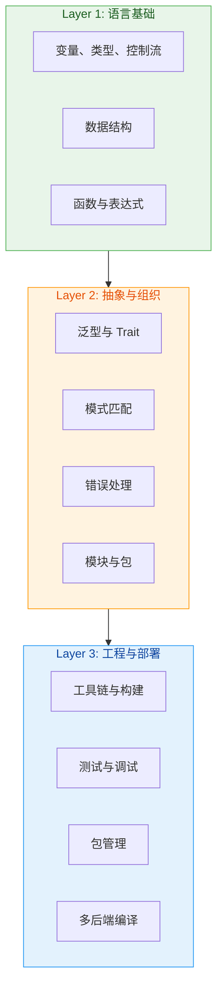
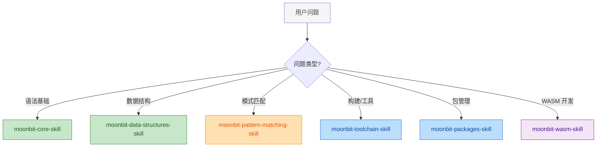
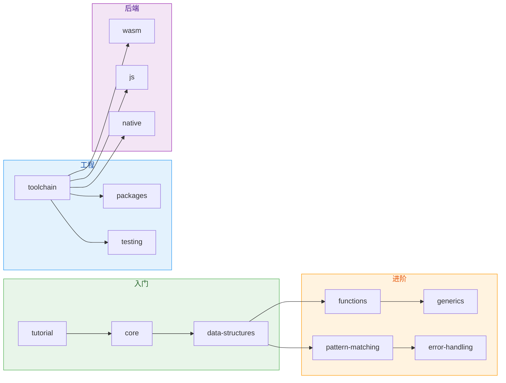

# MoonBit Skills 架构说明

## 设计哲学

MoonBit Skills 采用分层技能架构，参考 Rust Skills 的元认知框架，但针对 MoonBit 的语言特性进行了调整：

- MoonBit 没有所有权/借用检查器（有 GC），因此不需要所有权相关的复杂技能分层
- MoonBit 强调多后端编译，因此增加后端领域技能
- MoonBit 有强大的模式匹配和函数式特性，需要专门的技能覆盖

## 技能分层

## 与 Rust Skills 的对比

| 维度 | Rust Skills | MoonBit Skills |
|------|------------|----------------|
| 内存管理 | 所有权系统（核心） | GC（无需所有权技能） |
| 编程范式 | 命令式为主 | 函数式+命令式融合 |
| 后端支持 | 单一原生后端 | wasm/js/native 多后端 |
| 错误处理 | Result + panic | Option + Result + raise |
| 模式匹配 | 支持 | 更强大，核心特性 |

## 技能触发规则

| 用户信号 | 推荐技能 |
|---------|---------|
| "如何声明变量" | moonbit-core-skill |
| "模式匹配怎么用" | moonbit-pattern-matching-skill |
| "如何构建项目" | moonbit-toolchain-skill |
| "怎么发布包" | moonbit-packages-skill |
| "编译到 WASM" | moonbit-wasm-skill |
| "数组/Map 用法" | moonbit-data-structures-skill |
| "函数式编程" | moonbit-functions-skill |
| "泛型和 Trait" | moonbit-generics-skill |
| "错误处理" | moonbit-error-handling-skill |

## 四维分类

根据 skill-factory 分类体系，moonbit-skills 属于 **Type 4 (重+厚)**：

| 维度 | 类型 | 说明 |
|------|------|------|
| 功能维度 | **重** | 13 个子技能，覆盖完整语言生态 |
| 内容维度 | **厚** | 包含 references/ 目录、详细示例、图表 |
| 输出结构 | skills/ + references/ | 混合模式 |
| 复杂度评估 | 高 | 覆盖语法、工具链、多后端 |

## 子技能依赖关系

