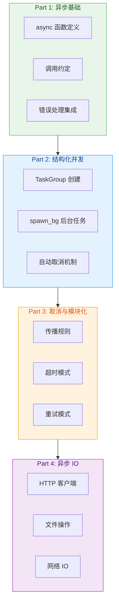

# MoonBit 异步编程（实验性）⚡

## 任务目标

- 本 Skill 用于：掌握 MoonBit 的**异步编程与结构化并发**（实验性功能）
- 能力包含：**异步函数、任务组、取消机制、异步 IO**
- 触发条件：编写高性能并发应用、处理异步 IO、实现可取消的操作

## 技能架构



**预计时间**: 3 小时 | **前置要求**: error-handling (raise/try/catch), devtools (测试)

**⚠️ 实验性警告**: 此功能仍在开发中，API 可能变动。

---

## Part 1: 异步基础

### 1.1 环境准备

#### 安装依赖

```bash
moon add moonbitlang/async@0.17.0
```

在 `moon.mod.json` 中添加：
```json
{
  "preferred-target": "native"
}
```

在 `moon.pkg` 的 `import` 中添加：
```
import {
  "moonbitlang/async",
  // 其他需要的子包...
}
```

### 1.2 异步函数定义

使用 `async` 关键字定义异步函数：

```moonbit
async fn my_async_function() -> String {
  let (response, body) = @http.get("https://www.moonbitlang.cn")
  guard response.code is (200..<300) else {
    fail("server responded with \(response.code) \(response.reason)")
  }
  body.text()
}
```

**关键特性**：
- 异步函数**隐式抛出错误**（无需显式标注 `raise`）
- 如果不抛出错误，需显式声明 `noraise`
- 编译器会跟踪异步调用，IDE 用不同样式高亮显示

### 1.3 调用约定

```moonbit
// 异步函数只能在异步函数中调用
async fn caller() {
  let result = my_async_function()
  // 调用会阻塞并等待返回，类似 await
}

// 异步程序入口
async fn main { ... }

// 异步测试
async test "my_async_test" { ... }
```

**注意**：使用 `async fn main` 或 `async test` 需要在 `moon.pkg` 中添加 `moonbitlang/async` 作为依赖。

---

## Part 2: 结构化并发 ⭐

### 2.1 核心理念

MoonBit 采用**结构化并发**范式管理并发任务：

> **孤儿任务不可能存在** - 所有任务都在任务组的管理之下

### 2.2 TaskGroup（任务组）

新任务只能通过 `@async.with_task_group` 创建：

```moonbit
async fn[Result] with_task_group(
  f : async (@async.TaskGroup[Result]) -> Result,
) -> Result
```

**铁律**：只有当任务组中的**所有任务都结束了**，`with_task_group` 才会返回

#### 基本用法

```moonbit
async test "with_task_group" {
  let log = []
  @async.with_task_group(group => {
    group.spawn_bg(() => {
      for _ in 0..<3 {
        log.push("task #1 tick")
        @async.sleep(200)
      }
    })
    group.spawn_bg(() => {
      @async.sleep(100)
      for _ in 0..<3 {
        log.push("task #2 tick")
        @async.sleep(200)
      }
    })
  })
  json_inspect(log, content=[
    "task #1 tick", "task #2 tick",
    "task #1 tick", "task #2 tick",
    "task #1 tick",
  ])
}
```

#### 创建后台任务

```moonbit
fn[Result] @async.TaskGroup::spawn_bg(
  group : TaskGroup[Result],
  f : async () -> Unit,
  // 其他参数...
) -> Unit
```

**参数说明**：
- `group`: 任务组实例
- `f`: 要在后台运行的异步函数
- `no_wait`: 如果为 true，父任务不会等待此任务完成

### 2.3 自动取消机制

当 `with_task_group` 需要提前结束时（如某个任务失败）：
- 自动**取消所有还在运行的任务**
- 等待清理工作完成
- 保证**没有孤儿任务**

---

## Part 3: 取消与模块化 ⭐

### 3.1 取消机制概览

MoonBit 的异步操作**默认都是可取消的**：

- 取消信号变成从代码中断处**抛出的错误**
- 通过**错误处理机制**自动传播
- 触发 `defer` 表达式和 `catch` 中的清理代码

**优势**：使异步程序高度模块化

### 3.2 超时模式示例

```moonbit
async fn with_timeout(timeout : Int, f : async () -> Unit) -> Unit {
  @async.with_task_group(group => {
    group.spawn_bg(no_wait=true, () => {
      @async.sleep(timeout)
      raise Failure::Failure("timeout!")
    })
    f()
  })
}
```

**保证正确性的边界情况**：
1. ✅ `f` 在超时前顺利返回 → 计时任务被立即取消
2. ✅ `f` 失败 → 计时任务也被自动取消
3. ✅ `f` 超时 → `f` 被自动取消，无资源泄漏

### 3.3 重试模式示例

结合超时和重试的完整 HTTP 请求：

```moonbit
async fn make_request() -> String {
  @async.retry(Immediate, max_retry=3, () => {
    @async.with_timeout(1000, () => {
      let (response, body) = @http.get("https://www.moonbitlang.com")
      guard response.code is (200..<300) else {
        fail("the HTTP request is not successful")
      }
      body.text()
    })
  })
}
```

---

## Part 4: 异步 IO

### 4.1 IO 概述

`moonbitlang/async` 提供：
- **性能优秀的 IO 事件循环**
- 丰富的异步 IO 操作 API

**覆盖范围**：
- HTTP/HTTPS 客户端
- 文件 IO
- 网络 IO
- 外部进程创建

### 4.2 流式文件下载示例

```moonbit
async fn download_file(url : String, file_name : String) -> Unit {
  // 流式处理以节省内存
  let (_response, body) = @http.get_stream(url)
  defer body.close()

  let out_file = @fs.create(file_name, permission=0o644)
  defer out_file.close()

  out_file.write_reader(body)
}
```

**关键点**：
- 使用 `defer` 确保资源释放
- 流式处理避免大文件内存问题

### 4.3 JavaScript 支持

虽然 native 后端支持最好，但对 JS 有基本支持：

| 功能 | Native | JavaScript |
|------|--------|------------|
| 任务组/超时等 | ✅ 完整支持 | ✅ 支持 |
| IO 操作 (HTTP/文件/网络) | ✅ 完整支持 | ❌ 不支持 |
| Promise 互操作 | N/A | ✅ 通过 `js_async` 包 |

**JavaScript 互操作**：
```javascript
// 使用 js_async 包等待 JS promise
let result = await_js_promise(jsPromise)
// 将 MoonBit async 函数包装成 JS promise
let moonbitFnAsJsPromise = to_js_promise(moonbitAsyncFn)
```

---

## 最佳实践

✅ **推荐做法**：

1. **始终使用结构化并发**
   - 通过 `with_task_group` 管理所有并发任务
   - 避免手动管理任务生命周期

2. **善用取消机制**
   - 所有异步操作默认可取消
   - 利用取消实现超时、重试等模式

3. **资源管理**
   - 使用 `defer` 确保释放
   - 流式处理大文件/大数据

4. **错误处理**
   - 异步函数隐式抛出错误
   - 使用 `try/catch` 处理异步错误

5. **测试策略**
   - 使用 `async test` 编写异步测试
   - 默认并行运行多个异步测试

⚠️ **常见陷阱与限制**：

1. **实验性 API**
   - ⚠️ API 可能在未来版本变动
   -密切关注官方更新日志

2. **后端支持差异**
   - Native: 最佳支持
   - JavaScript: 仅支持非 IO 操作
   - WebAssembly: **暂不支持**

3. **性能考虑**
   - 异步有额外开销
   - 简单计算任务可能不需要异步
   - IO 密集型任务收益最大

4. **调试难度**
   - 并发 bug 较难复现
   - 充分利用日志和测试

---

## 决策指南：何时使用？

| 场景 | 推荐技术 | 示例 |
|------|---------|------|
| 简单 IO | 同步函数 + 阻塞调用 | 读取配置文件 |
| 高并发服务器 | TaskGroup + spawn_bg | HTTP 服务器 |
| 需要超时控制 | with_timeout | API 调用 |
| 需要容错 | retry + with_timeout | 网络请求 |
| 大文件处理 | 流式 IO + defer | 文件下载/上传 |
| 长运行任务 | 可取消的异步操作 | 批量数据处理 |

---

## 资源索引

### 官方文档

- [MoonBit 异步编程文档](https://docs.moonbitlang.com/zh-cn/latest/language/async-experimental.html) ⭐⭐ **唯一来源**
- [moonbitlang/async API 文档](https://mooncakes.io/docs/moonbitlang/async)
- [GitHub 示例仓库](https://github.com/moonbitlang/async/tree/main/examples)

### 相关技能

- `moonbit-error-handling`: 错误处理（异步函数隐式抛错）
- `moonbit-devtools`: 测试（async test）
- `moonbit-ffi`: 与外部世界交互

---

*版本: v1.0.0 | 类别: Domain Expertise (Layer 3) | 状态: 实验性*
*架构位置: skills/layer3-domain-expertise/moonbit-async/SKILL.md*
*整合来源: async-experimental.html 官方文档*
