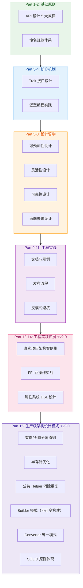
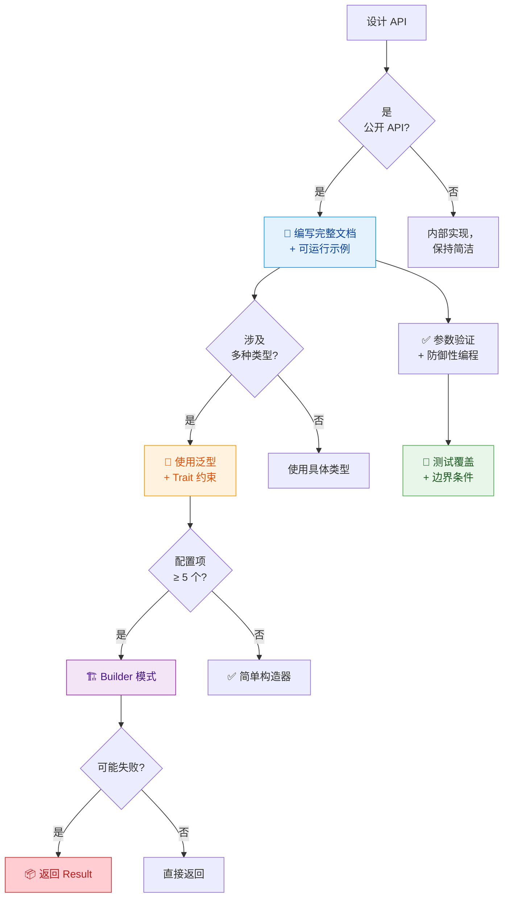

# MoonBit 软件库设计最佳实践 📚

> **来源**: `moonbit-library-design/SKILL.md` (v3.0.0)
> **迁移时间**: 2026-05-17
> **说明**: 本文件为知识迁移参考文档，包含完整的 15 个 Part 内容

## 任务目标

- 本 Skill 用于：掌握 **MoonBit 软件库设计的核心原则和最佳实践**
- 能力包含：**API 设计、命名规范、Trait/泛型工程、Builder 模式、可靠性设计、文档规范、发布流程**
- 触发条件：设计公开 API、实现 Trait/泛型、编写可复用库、准备发布到 mooncakes.io

## 技能架构



**预计时间**: 4 小时 | **前置要求**: error-handling (Result/Option), data-types (类型系统)

---

## Part 1: API 设计 5 大戒律 ⭐

> 来自 [yourbasic.org](https://yourbasic.org/golang/api-design/) 经典原则，适用于所有编程语言

### 1.1 Tell me what this thing is（README 第一句说明）

```markdown
# moonbit-http

A high-performance HTTP client for MoonBit with automatic retry and timeout support.
```

✅ **推荐**：第一句话清晰说明**这是什么**
❌ **避免**：`# My Library` 或 `# A cool project`

### 1.2 Tell me what it does（清晰描述功能）

```moonbit
/// Creates a new HTTP client with default configuration.
///
/// The client uses connection pooling and supports automatic
/// gzip decompression. Default timeout is 30 seconds.
fn Client::new() -> Client { ... }
```

✅ **推荐**：文档描述**做什么**，而非**怎么做**
❌ **避免**：暴露内部实现细节

### 1.3 Don't tell me how it works（封装实现）

```moonbit
// ✅ 推荐：简洁的公共 API
pub fn parse_json(input: String) -> Result[Value, ParseError] {
  internal_parser::parse(input)
}

// ❌ 避免：暴露内部实现
pub fn parse_json(input: String) -> Result[Value, ParseError] {
  let tokens = lexer::tokenize(input)
  let ast = parser::parse_tokens(tokens)
  optimizer::optimize(ast)
}
```

### 1.4 Grant me the right to use it（许可证）

在 `moon.mod.json` 或 README 中明确声明：

```json
{
  "license": "MIT",
  "repository": "https://github.com/user/moonbit-http"
}
```

### 1.5 Don't change it（API 稳定性）

遵循 **Semver 版本控制**：

| 变更类型 | 版本升级 | 示例 |
|---------|---------|------|
| Bug 修复 | Patch (1.0.→1.0.1) | 修复边界条件 |
| 新功能 | Minor (1.0→1.1) | 添加新方法 |
| 破坏性变更 | Major (1.0→2.0) | 重命名或删除 API |

---

## Part 2: 命名规范体系 📝

### 2.1 基本规则

| 类别 | 规范 | 示例 |
|------|------|------|
| 类型/Trait | PascalCase | `HttpClient`, `JsonParser`, `Iterable` |
| 函数/方法/变量 | snake_case | `parse_json`, `get_user_id`, `max_value` |
| 常量 | SCREAMING_SNAKE_CASE | `MAX_RETRY_COUNT`, `DEFAULT_TIMEOUT` |
| 模块名 | snake_case | `http_client`, `json_parser` |

### 2.2 转换前缀约定（按成本递增）

```moonbit
// as_: 零成本转换（reinterpret）
fn Int::as_bits(self: Int) -> UInt { ... }

// to_: 低成本转换（可能分配内存）
fn String::to_bytes(self: String) -> Array[Byte] { ... }

// into_: 高成本转换（消耗原值）
fn Result::into_ok(self: Result[T, E]) -> T raise E { ... }
```

### 2.3 构造器命名约定

```moonbit
// ::new - 默认构造器
fn HttpClient::new() -> HttpClient { ... }

// ::make - 工厂方法（可能有副作用）
fn HttpClient::make(config: Config) -> HttpClient { ... }

// ::with_xxx - Builder 风格链式调用
fn HttpClient::with_timeout(self: HttpClient, timeout: Int) -> HttpClient { ... }
fn HttpClient::with_retry(self: HttpClient, max_retries: Int) -> HttpClient { ... }
```

### 2.4 MoonBit 特有：点语法调用

```moonbit
// 使用 TypeName::method_name 点语法
let client = HttpClient::new()
let response = client.get("https://api.example.com")

// 等价于函数式调用
let response = HttpClient::get(client, "https://api.example.com")
```

---

## Part 3: Trait/接口设计黄金法则 🎯

### 3.1 小而聚焦原则（单一职责）

```moonbit
// ✅ 推荐：单一职责的 Trait
trait Show {
  show(self: Self) -> String
}

trait Eq {
  eq(self: Self, other: Self) -> Bool
}

// ❌ 避免：God Trait（职责过多）
trait SuperTrait {
  show(self: Self) -> String
  eq(self: Self, other: Self) -> Bool
  hash(self: Self) -> UInt
  clone(self: Self) -> Self
  serialize(self: Self) -> Array[Byte]
}
```

### 3.2 组合优于继承（Trait 组合模式）

```moonbit
// 定义基础 Traits
trait Clone {
  clone(self: Self) -> Self
}

trait Debug {
  debug(self: Self) -> String
}

// 组合使用
struct User {
  id: Int
  name: String
} derive(Clone, Debug)

impl Clone for User with clone(self) -> User {
  User { id: self.id, name: self.name.clone() }
}

impl Debug for User with debug(self) -> String {
  "User { id: \(self.id), name: \(self.name) }"
}
```

### 3.3 可见性 4 级控制

```moonbit
// priv: 完全私有（默认）
fn internal_helper(x: Int) -> Int { x * 2 }

// trait: 仅在 Trait 实现中可见
trait InternalTrait {
  hidden_method(self: Self) -> Unit
}

// pub(readonly): 只读访问（不可修改）
pub(readonly) struct Config {
  host: String
  port: Int
}

// pub(open): 完全公开（可修改、可实现）
pub(open) trait PublicInterface {
  public_method(self: Self) -> String
}
```

### 3.4 默认实现的使用场景

```moonbit
trait Iterable[T] {
  // 抽象方法：必须实现
  iter(self: Self) -> Iterator[T]

  // 默认方法：提供通用实现
  fn map[U](self: Self, f: (T) -> U) -> Array[U] {
    let mut result = []
    for item in self.iter() {
      result.push(f(item))
    }
    result
  }

  fn filter(self: Self, predicate: (T) -> Bool) -> Array[T] {
    let mut result = []
    for item in self.iter() {
      if predicate(item) {
        result.push(item)
      }
    }
    result
  }
}
```

### 3.5 孤立规则 (Orphan Rule) 及解决方案

**问题**：不能为外部类型实现外部 Trait

```moonbit
// ❌ 错误：Orphan Rule 违规
// impl Display for Vec[Int] { ... }

// ✅ 解决方案 1：Newtype 包装
struct IntVec(inner: Array[Int])

impl Display for IntVec with display(self) -> String {
  "Array[\(self.inner.length())]"
}

// ✅ 解决方案 2：扩展方法（如果语言支持）
fn Array[Int]::display_formatted(self: Array[Int]) -> String {
  "[\(self.map(x => x.to_string()).join(", "))]"
}
```

---

## Part 4: 泛型编程最佳实践 🔧

### 4.1 约束选择策略

```moonbit
// ✅ 场景 1：真正需要泛型时
fn find_max[T: Compare](arr: Array[T]) -> Option[T] {
  if arr.is_empty() { return None }
  let mut max_val = arr[0]
  for item in arr[1:] {
    if item.compare(max_val) > 0 {
      max_val = item
    }
  }
  Some(max_val)
}

// ✅ 场景 2：具体类型足够时
fn find_max_int(arr: Array[Int]) -> Option[Int] {
  if arr.is_empty() { return None }
  let mut max_val = arr[0]
  for item in arr[1:] {
    if item > max_val {
      max_val = item
    }
  }
  Some(max_val)
}
```

**决策标准**：
- 需要 ≥ 2 种类型实现 → 用泛型
- 只有 1 种类型 → 直接用具体类型
- 未来可能扩展 → 提供泛型版本

### 4.2 类型参数命名惯例

```moonbit
// 单个类型参数
fn identity[T](value: T) -> T { value }

// 多个类型参数（按字母顺序）
fn pair[T, U](first: T, second: U) -> Pair[T, U] { ... }

// 键值对（Map 场景）
fn create_map[K, V]() -> Map[K, V] { ... }

// 函数类型参数
fn apply[T, R](f: (T) -> R, value: T) -> R { f(value) }

// 错误类型参数
fn unwrap_or_default[T](result: Result[T, Error], default: T) -> T { ... }
```

### 4.3 YAGNI 原则（不过度抽象）

```moonbit
// ❌ 过度抽象（YAGNI 违反）
trait Repository[T, Id, Error, Connection] {
  fn find_by_id(conn: Connection, id: Id) -> Result[T, Error]
  fn save(conn: Connection, entity: T) -> Result[T, Error]
  fn delete(conn: Connection, id: Id) -> Result[Unit, Error]
  fn find_all(conn: Connection) -> Result[Array[T], Error]
}

// ✅ 从简单开始
fn find_user_by_id(db: DbConnection, id: UserId) -> Result[User, DbError] {
  db.query_one("SELECT * FROM users WHERE id = ?", [id])
}
```

### 4.4 泛型约束实战

#### 通用排序

```moonbit
fn sort[T: Compare + Clone](mut arr: Array[T]) -> Array[T] {
  quick_sort(arr, 0, arr.length() - 1)
  arr
}

fn quick_sort[T: Compare](mut arr: Array[T], low: Int, high: Int) -> Unit {
  if low < high {
    let pivot_index = partition(arr, low, high)
    quick_sort(arr, low, pivot_index - 1)
    quick_sort(arr, pivot_index + 1, high)
  }
}
```

#### 容器类型

```moonbit
struct Stack[T] {
  mut items: Array[T]
}

impl[T] Stack[T] {
  pub fn new() -> Stack[T] {
    Stack { items: [] }
  }

  pub fn push(mut self: Stack[T], item: T) -> Unit {
    self.items.push(item)
  }

  pub fn pop(mut self: Stack[T]) -> Option[T] {
    if self.items.is_empty() {
      None
    } else {
      Some(self.items.pop())
    }
  }
}
```

#### 策略模式

```moonbit
trait Comparator[T] {
  compare(a: T, b: T) -> Int
}

fn sort_with[T](mut arr: Array[T], cmp: Comparator[T]) -> Array[T] {
  // 使用自定义比较器排序
  merge_sort_impl(arr, cmp)
}

// 使用示例
struct AscendingComparator {}

impl Comparator[Int] for AscendingComparator {
  compare(a: Int, b: Int) -> Int {
    if a < b { -1 } else if a > b { 1 } else { 0 }
  }
}

let sorted = sort_with(my_array, AscendingComparator {})
```

### 4.5 避免泛型泛滥的信号

⚠️ **以下情况应考虑简化**：

1. 只有 1-2 个使用点
2. 类型参数从未被实际实例化为不同类型
3. 泛型代码比具体代码复杂 2 倍以上
4. 团队成员经常问"这个泛型参数是什么意思？"

---

## Part 5: 可预测性设计 🔮

### 5.1 构造器返回值约定

```moonbit
// ✅ 推荐：返回 Self 或 Result[Self, Error]
fn Config::new() -> Config {
  Config {
    host: "localhost"
    port: 8080
    timeout: 30000
  }
}

fn Config::from_file(path: String) -> Result[Config, ConfigError] {
  match read_config_file(path) {
    Ok(content) => parse_config(content)
    Err(e) => Err(ConfigError::IoError(e))
  }
}

// ❌ 避免：构造器可能 panic
fn BadConfig::new(host: String) -> BadConfig {
  assert!(host != "", "Host cannot be empty")
  BadConfig { host: host }
}
```

### 5.2 Builder 模式完整示例

```moonbit
struct HttpRequest {
  method: String
  url: String
  headers: Map[String, String]
  body: Option[String]
  timeout: Int
  follow_redirects: Bool
}

struct HttpRequestBuilder {
  method: String
  url: String
  headers: Map[String, String]
  body: Option[String]
  timeout: Int
  follow_redirects: Bool
}

impl HttpRequestBuilder {
  pub fn new(url: String) -> HttpRequestBuilder {
    HttpRequestBuilder {
      method: "GET"
      url: url
      headers: map![]
      body: None
      timeout: 30000
      follow_redirects: true
    }
  }

  pub fn method(mut self: HttpRequestBuilder, method: String) -> HttpRequestBuilder {
    self.method = method
    self
  }

  pub fn header(mut self: HttpRequestBuilder, key: String, value: String) -> HttpRequestBuilder {
    self.headers.insert(key, value)
    self
  }

  pub fn body(mut self: HttpRequestBuilder, body: String) -> HttpRequestBuilder {
    self.body = Some(body)
    self
  }

  pub fn timeout(mut self: HttpRequestBuilder, timeout_ms: Int) -> HttpRequestBuilder {
    assert!(timeout_ms > 0, "Timeout must be positive")
    self.timeout = timeout_ms
    self
  }

  pub fn build(self: HttpRequestBuilder) -> Result[HttpRequest, BuildError] {
    if self.url == "" {
      return Err(BuildError("URL cannot be empty"))
    }
    Ok(HttpRequest {
      method: self.method
      url: self.url
      headers: self.headers
      body: self.body
      timeout: self.timeout
      follow_redirects: self.follow_redirects
    })
  }
}

// 使用示例
let request = HttpRequestBuilder::new("https://api.example.com/users")
  .method("POST")
  .header("Content-Type", "application/json")
  .header("Authorization", "Bearer token123")
  .body("{\"name\":\"John\"}")
  .timeout(5000)
  .build()
```

### 5.3 参数验证策略

#### 编译时 Newtype

```moonbit
// 创建类型安全的包装器
struct NonEmptyString(inner: String)

fn NonEmptyString::new(s: String) -> Result[NonEmptyString, ValidationError] {
  if s == "" {
    Err(ValidationError("String cannot be empty"))
  } else {
    Ok(NonEmptyString(s))
  }
}

// 使用时保证非空
fn create_user(name: NonEmptyString) -> User {
  User { name: name.inner }
}
```

#### 运行时 Assert

```moonbit
fn divide(a: Int, b: Int) -> Int {
  assert!(b != 0, "Division by zero")
  a / b
}

// 更好的方式：返回 Result
fn safe_divide(a: Int, b: Int) -> Result[Int, DivisionError] {
  if b == 0 {
    Err(DivisionError("Cannot divide by zero"))
  } else {
    Ok(a / b)
  }
}
```

### 5.4 结构体字段私有化策略

```moonbit
// ✅ 推荐：字段私有，提供方法访问
pub struct User {
  id: Int           // 私有
  name: String      // 私有
  email: String     // 私有
  created_at: DateTime  // 私有
}

impl User {
  pub fn id(self: User) -> Int { self.id }
  pub fn name(self: User) -> String { self.name }
  pub fn email(self: User) -> String { self.email }

  // 受控修改
  pub fn update_email(mut self: User, new_email: String) -> Result[Unit, ValidationError] {
    if !is_valid_email(new_email) {
      return Err(ValidationError("Invalid email format"))
    }
    self.email = new_email
    Ok(())
  }
}

// ❌ 避免：字段完全公开
pub struct BadUser {
  pub id: Int
  pub name: String
  pub email: String  // 可以被任意修改！
}
```

### 5.5 一致的行为契约

```moonbit
// 所有集合类型都应遵循相同的行为契约
trait Collection[T] {
  // 所有操作都应该是可预测的
  is_empty(self: Self) -> Bool
  length(self: Self) -> Int
  contains(self: Self, item: T) -> Bool

  // 一致的错误处理
  get(self: Self, index: Int) -> Option[T]  // 越界返回 None，不 panic
  first(self: Self) -> Option[T]            // 空集合返回 None
  last(self: Self) -> Option[T]             // 空集合返回 None
}
```

---

## Part 6: 灵活性设计 🎨

### 6.1 泛型优于具体类型

```moonbit
// ❌ 不灵活：硬编码具体类型
fn process_users(users: Array[User]) -> Array[String] {
  users.map(u => u.name)
}

// ✅ 灵活：接受任何可迭代类型
fn process_items[T: Show](items: Array[T]) -> Array[String] {
  items.map(item => item.show())
}
```

### 6.2 接受 Trait 约束而非硬编码类型

```moonbit
// ❌ 不灵活：只接受特定类型
fn format_output(data: JsonValue) -> String {
  json_to_string(data)
}

// ✅ 灵活：接受任何实现了 Display 的类型
fn format_output[T: Display](data: T) -> String {
  data.display()
}
```

### 6.3 Builder 支持合理默认值

```moonbit
struct DatabaseConfig {
  host: String           // 默认: "localhost"
  port: Int              // 默认: 5432
  database: String       // 默认: "postgres"
  pool_size: Int         // 默认: 10
  connection_timeout: Int  // 默认: 5000ms
  ssl_enabled: Bool      // 默认: false
}

impl DatabaseConfigBuilder {
  pub fn new(database: String) -> DatabaseConfigBuilder {
    DatabaseConfigBuilder {
      host: "localhost"           // 合理默认值
      port: 5432                  // PostgreSQL 默认端口
      database: database          // 必须提供
      pool_size: 10               // 常用默认值
      connection_timeout: 5000    // 5秒超时
      ssl_enabled: false          // 开发环境通常不需要 SSL
    }
  }

  // 允许覆盖默认值
  pub fn port(mut self: DatabaseConfigBuilder, port: Int) -> DatabaseConfigBuilder {
    assert!(port > 0 && port <= 65535, "Port must be between 1-65535")
    self.port = port
    self
  }

  // ...
}
```

### 6.4 闭包/回调注入自定义行为

```moonbit
struct RetryPolicy {
  max_retries: Int
  should_retry: (Int, Error) -> Bool  // 自定义重试逻辑
  on_retry: (Int, Error) -> Unit      // 回调通知
}

impl RetryPolicy {
  pub fn new(max_retries: Int) -> RetryPolicy {
    RetryPolicy {
      max_retries: max_retries
      should_retry: (attempt, _error) => attempt < max_retries
      on_retry: (attempt, error) => println("Retry \(attempt): \(error)")
    }
  }

  pub fn with_should_retry(
    mut self: RetryPolicy,
    f: (Int, Error) -> Bool,
  ) -> RetryPolicy {
    self.should_retry = f
    self
  }

  pub fn with_on_retry(
    mut self: RetryPolicy,
    f: (Int, Error) -> Unit,
  ) -> RetryPolicy {
    self.on_retry = f
    self
  }
}

// 使用示例
let policy = RetryPolicy::new(3)
  .with_should_retry((attempt, error) => {
    match error {
      NetworkTimeout => attempt < 5  // 网络超时可以多重试几次
      _ => attempt < 3               // 其他错误只重试 3 次
    }
  })
  .with_on_retry((attempt, error) => {
    logger::warn("Attempt \(attempt) failed: \(error)")
  })
```

### 6.5 配置对象模式

```moonbit
struct AppConfig {
  server: ServerConfig
  database: DatabaseConfig
  logging: LoggingConfig
  features: FeatureFlags
}

impl AppConfig {
  pub fn from_env() -> Result[AppConfig, ConfigError] {
    Ok(AppConfig {
      server: ServerConfig {
        host: env::get_or_default("SERVER_HOST", "0.0.0.0")
        port: env::get_or_default_int("SERVER_PORT", 8080)
      }
      database: DatabaseConfig::from_env()?
      logging: LoggingConfig::from_env()?
      features: FeatureFlags::from_env()?
    })
  }

  pub fn from_file(path: String) -> Result[AppConfig, ConfigError] {
    let content = read_file(path)?
    parse_app_config(content)
  }
}
```

---

## Part 7: 可靠性设计 🛡️

### 7.1 错误处理策略

```moonbit
// ✅ 优先级 1：Option 用于可能缺失的值
fn find_user(id: Int) -> Option[User] {
  db.query(id).map(parse_user)
}

// ✅ 优先级 2：Result 用于可能失败的操作
fn read_config(path: String) -> Result[Config, IoError] {
  match open_file(path) {
    Ok(handle) => Ok(parse_config(read_to_string(handle)))
    Err(e) => Err(e)
  }
}

// ⚠️ 优先级 3：raise 用于不可恢复的系统错误
fn connect_database() -> Connection raise DbError {
  let conn = try! TcpConnection::new(db_host, db_port)
  try! conn.authenticate(db_user, db_password)
  conn
}

// ❌ 最后选择：panic 仅用于程序 bug
fn unreachable_code() -> Never {
  panic("This should never happen")
}
```

### 7.2 错误类型要有意义

```moonbit
// ❌ 无意义的错误
suberror Error { Error(String) }

fn bad_operation() -> Int raise Error {
  raise Error("Something went wrong")  // 什么错了？
}

// ✅ 有上下文的错误
suberror ConfigError {
  MissingField(String)            // 缺少哪个字段
  InvalidFormat(String, String)   // 字段名, 期望格式
  OutOfRange(String, Int, Int)    // 字段名, 最小值, 最大值
  IoError(IoError)                // 包装底层 IO 错误
  ParseError(String, Int)         // 错误信息, 行号
}

fn load_config(path: String) -> Config raise ConfigError {
  let content = match read_file(path) {
    Ok(c) => c
    Err(e) => raise ConfigError::IoError(e)
  }

  if content == "" {
    raise ConfigError::MissingField("config file is empty")
  }

  parse_config_with_context(content)
}
```

### 7.3 契约清晰（前置条件/后置条件文档化）

```moonbit
/// Divides two integers.
///
/// # Precondition
/// - divisor must not be zero
///
/// # Postcondition
/// - returns quotient of dividend / divisor
///
/// # Panics
/// - If divisor is zero (use safe_divide for checked version)
///
/// # Example
/// ```
/// let result = div(10, 3)
/// assert_eq(result, 3)
/// ```
fn div(dividend: Int, divisor: Int) -> Int {
  assert!(divisor != 0, "Divisor cannot be zero")
  dividend / divisor
}

/// Safe division that returns Result instead of panicking.
///
/// # Arguments
/// * dividend - The number to be divided
/// * divisor - The number to divide by
///
/// # Returns
/// - Ok(quotient) if divisor != 0
/// - Err(DivisionByZero) if divisor == 0
fn safe_divide(dividend: Int, divisor: Int) -> Result[Int, DivisionError] {
  if divisor == 0 {
    Err(DivisionError::DivisionByZero)
  } else {
    Ok(dividend / divisor)
  }
}
```

### 7.4 防御性编程（验证所有输入）

```moonbit
// ✅ 验证所有公共 API 的输入
pub fn create_user(
  name: String,
  email: String,
  age: Int,
) -> Result[User, ValidationError] {
  // 验证 name
  if name.trim() == "" {
    return Err(ValidationError::EmptyField("name"))
  }
  if name.length() > 100 {
    return Err(ValidationError::TooLong("name", 100))
  }

  // 验证 email
  if !is_valid_email_format(email) {
    return Err(ValidationError::InvalidFormat("email", "user@example.com"))
  }

  // 验证 age
  if age < 0 || age > 150 {
    return Err(ValidationError::OutOfRange("age", 0, 150))
  }

  // 所有验证通过，创建用户
  Ok(User {
    id: generate_id()
    name: name.trim()
    email: email.to_lower()
    age: age
    created_at: now()
  })
}
```

### 7.5 不变量维护

```moonbit
struct SortedArray[T: Compare] {
  mut inner: Array[T]
}

impl[T: Compare] SortedArray[T] {
  pub fn new() -> SortedArray[T] {
    SortedArray { inner: [] }
  }

  /// Insert while maintaining sorted invariant.
  /// Postcondition: array remains sorted after insertion.
  pub fn insert(mut self: SortedArray[T], value: T) -> Unit {
    self.inner.push(value)
    // 维护不变量：保持数组有序
    bubble_up(self.inner, self.inner.length() - 1)
  }

  /// Binary search (requires sorted invariant).
  /// Precondition: array must be sorted.
  pub fn binary_search(self: SortedArray[T], target: T) -> Option[Int] {
    binary_search_impl(self.inner, target)
  }
}

// 内部辅助函数
fn bubble_up[T: Compare](mut arr: Array[T], index: Int) -> Unit {
  var i = index
  while i > 0 && arr[i - 1].compare(arr[i]) > 0 {
    swap(arr, i - 1, i)
    i -= 1
  }
}
```

---

## Part 8: 面向未来设计 🔮

### 8.1 结构体字段私有化

```moonbit
// ✅ 字段私有，通过方法暴露
pub struct ApiClient {
  base_url: String           // 私有：未来可能变为 URL 对象
  api_key: String            // 私有：未来可能加密存储
  timeout: Int               // 私有：未来可能支持 per-request timeout
  rate_limiter: RateLimiter  // 私有：内部实现细节
}

impl ApiClient {
  // 公开的稳定 API
  pub fn base_url(self: ApiClient) -> String { self.base_url }
  pub fn set_timeout(mut self: ApiClient, ms: Int) -> ApiClient {
    assert!(ms > 0, "Timeout must be positive")
    self.timeout = ms
    self
  }
}

// 未来可以自由重构内部实现，
// 只要公共 API 保持兼容即可
```

### 8.2 版本化策略（Semver）

```json
{
  "name": "my-awesome-lib",
  "version": "1.2.3",
  "description": "An awesome MoonBit library"
}
```

**版本号含义**：
- **MAJOR** (1.x.x): 不兼容的 API 变更
- **MINOR** (x.2.x): 向后兼容的功能新增
- **PATCH** (x.x.3): 向后兼容的问题修复

### 8.3 向后兼容原则（只增不改删）

```moonbit
// v1.0.0
pub struct Point {
  x: Float
  y: Float
}

// v1.1.0 - 新增字段（向后兼容）
pub struct Point {
  x: Float
  y: Float
  z: Float  // 新增，提供默认值
}

// v2.0.0 - 破坏性变更（重命名）
// pub struct Point2D {  // 必须新类型名
//   x: Float
//   y: Float
// }
```

### 8.4 三级可见性控制

```moonbit
// priv（默认）- 内部实现
fn internal_helper() -> Unit { ... }

// pub(readonly) - 只读访问（不可变）
pub(readonly) struct ImmutableConfig {
  host: String
  port: Int
}

// pub(open) - 完全公开（可扩展）
pub(open) trait Extensible {
  fn extend(self: Self) -> String
}
```

### 8.5 废弃标记策略

```moonbit
/// @deprecated Use new_function() instead (since 2.0.0)
/// This function will be removed in version 3.0.0
#[deprecated(since = "2.0.0", note = "Use new_function() instead")]
pub fn old_function() -> Int {
  new_function()  // 内部转发到新实现
}

pub fn new_function() -> Int {
  // 新的实现
  42
}
```

**废弃流程**：
1. v2.0: 标记为 `deprecated`
2. v2.x: 保持可用但编译警告
3. v3.0: 正式移除

---

## Part 9: 文档与示例规范 📖

### 9.1 README 标准

```markdown
# moonbit-http-client ⭐

A high-performance HTTP client for MoonBit with automatic retry, timeout support, and connection pooling.

## Quick Start

\`\`\`moonbit
fn main {
  let client = HttpClient::new()
  let response = client.get("https://api.example.com/data")?
  println(response.body())
}
\`\`\`

## Features

- 🚀 High performance with connection pooling
- 🔄 Automatic retry with configurable policies
- ⏱️ Request timeout support
- 🔒 HTTPS/TLS encryption
- 📦 Zero-dependency core

## Installation

\`\`\`bash
moon add myorg/http-client@latest
\`\`\`

## Documentation

- [API Reference](docs/api.md)
- [Examples](examples/)
- [Migration Guide](docs/migration-guide.md)

## License

MIT
```

### 9.2 每个公开项都有可运行示例

```moonbit
/// A thread-safe counter with atomic operations.
///
/// # Example
/// Basic usage:
/// \`\`\`moonbit
/// let counter = AtomicCounter::new(0)
/// counter.increment()
/// counter.increment()
/// assert_eq(counter.get(), 2)
/// \`\`\`
///
/// # Example
/// With initial value:
/// \`\`\`moonbit
/// let counter = AtomicCounter::new(100)
/// assert_eq(counter.get(), 100)
/// \`\`\`
pub struct AtomicCounter {
  mut value: Int
}

impl AtomicCounter {
  /// Creates a new atomic counter with the given initial value.
  ///
  /// # Arguments
  /// * initial_value - The starting value for the counter
  ///
  /// # Returns
  /// A new AtomicCounter instance
  ///
  /// # Example
  /// \`\`\`moonbit
  /// let counter = AtomicCounter::new(42)
  /// assert_eq(counter.get(), 42)
  /// \`\`\`
  pub fn new(initial_value: Int) -> AtomicCounter {
    AtomicCounter { value: initial_value }
  }

  /// Increments the counter by 1.
  ///
  /// # Example
  /// \`\`\`moonbit
  /// let counter = AtomicCounter::new(0)
  /// counter.increment()
  /// assert_eq(counter.get(), 1)
  /// \`\`\`
  pub fn increment(mut self: AtomicCounter) -> Unit {
    self.value += 1
  }

  /// Gets the current value of the counter.
  ///
  /// # Returns
  /// The current counter value
  ///
  /// # Safety
  /// This operation is thread-safe.
  ///
  /// # Complexity
  /// O(1) - Constant time
  pub fn get(self: AtomicCounter) -> Int {
    self.value
  }
}
```

### 9.3 文档包含错误/panic/安全说明

```moonbit
/// Parses a JSON string into a Value.
///
/// # Errors
/// Returns ParseError when:
/// - Input is not valid JSON syntax
/// - String contains invalid unicode escape sequences
/// - Numbers are out of range (overflow)
///
/// # Panics
/// This function will panic if:
/// - Input string is extremely large (> 100MB) without streaming
///
/// # Security Considerations
/// ⚠️ Do NOT parse untrusted input without setting a maximum size limit.
/// Large inputs can cause memory exhaustion (DoS vulnerability).
///
/// # Example
/// Safe parsing with size limit:
/// \`\`\`moonbit
/// fn safe_parse(input: String) -> Result[Value, ParseError] {
///   if input.length() > MAX_INPUT_SIZE {
///     return Err(ParseError::InputTooLarge(input.length()))
///   }
///   parse_json(input)
/// }
/// \`\`\`
pub fn parse_json(input: String) -> Result[Value, ParseError] {
  if input.length() > MAX_UNLIMITED_SIZE {
    panic("Input too large for unlimited parsing")
  }
  json_parser::parse(input)
}
```

### 9.4 教程路径设计（简单 → 复杂）

```markdown
## Learning Path

### 1. Getting Started (5 minutes)
- [Installation](docs/getting-started/installation.md)
- [Hello World](docs/getting-started/hello-world.md)
- [Basic Concepts](docs/getting-started/concepts.md)

### 2. Core Features (15 minutes)
- [Making Requests](docs/core/requests.md)
- [Handling Responses](docs/core/responses.md)
- [Error Handling](docs/core/errors.md)

### 3. Advanced Topics (30 minutes)
- [Connection Pooling](docs/advanced/pooling.md)
- [Retry Strategies](docs/advanced/retry.md)
- [Custom Middleware](docs/advanced/middleware.md)

### 4. Real-world Examples (45 minutes)
- [Building a REST Client](examples/rest-client/)
- [File Upload/Download](examples/file-transfer/)
- [Authentication Flows](examples/auth/)
```

### 9.5 Show, Don't Tell 原则

```moonbit
// ❌ 糟糕的文档：只说不做
/// This function sorts an array in-place.
/// You can use it like this.

// ✅ 优秀的文档：展示完整示例
/// Sorts an array in ascending order using quicksort algorithm.
///
/// Time complexity: O(n log n) average case, O(n²) worst case
/// Space complexity: O(log n) due to recursion stack
///
/// # Example
/// Sort an array of integers:
/// \`\`\`moonbit
/// let mut numbers = [5, 2, 8, 1, 9]
/// sort_in_place(numbers)
/// // numbers is now [1, 2, 5, 8, 9]
/// \`\`\`
///
/// # Example
/// Sort an array of strings:
/// \`\`\`moonbit
/// let mut fruits = ["banana", "apple", "cherry"]
/// sort_in_place(fruits)
/// // fruits is now ["apple", "banana", "cherry"]
/// \`\`\`
///
/// # Stability
/// This sort is **not stable**. Equal elements may be reordered.
/// Use stable_sort() if stability is required.
pub fn sort_in_place[T: Compare](mut arr: Array[T]) -> Unit {
  quicksort(arr, 0, arr.length() - 1)
}
```

---

## Part 10: MoonBit 库发布流程 🚀

### 10.1 moon.mod.json 完整配置模板

```json
{
  "$schema": "https://raw.githubusercontent.com/moonbitlang/moon/main/packages/moon/mod.schema.json",
  "name": "@myorg/my-awesome-lib",
  "version": "1.0.0",
  "description": "A brief description of your library",
  "keywords": ["moonbit", "awesome", "library"],
  "license": "MIT",
  "author": "Your Name <email@example.com>",
  "repository": {
    "type": "git",
    "url": "https://github.com/myorg/my-awesome-lib.git"
  },
  "main": "src/index.mbt",
  "files": [
    "src/**/*.mbt",
    "README.md",
    "LICENSE"
  ],
  "scripts": {
    "build": "moon build",
    "test": "moon test",
    "lint": "moon fmt --check",
    "check": "moon check"
  },
  "dependencies": {
    "moonbitlang/core": "^0.4.0"
  },
  "devDependencies": {
    "moonbitlang/test": "^0.4.0"
  },
  "publishConfig": {
    "registry": "https://mooncakes.io",
    "access": "public"
  }
}
```

### 10.2 mooncakes.io 发布步骤

```bash
# 1. 确保代码质量
moon check
moon test
moon build --target wasm
moon build --target native

# 2. 更新版本号（遵循 semver）
# 手动编辑 moon.mod.json 中的 version 字段

# 3. 生成 changelog
moon changelog

# 4. 登录 mooncakes.io
moon login

# 5. 发布到 registry
moon publish

# 6. 打 git tag
git tag -a v1.0.0 -m "Release v1.0.0: Initial release"

# 7. 推送 tag 和代码
git push origin main
git push origin v1.0.0
```

### 10.3 版本管理（semver + git tag）

```bash
# Patch 版本：Bug 修复
git checkout -b fix/handle-null-input
# ... 修复 bug ...
moon run test
git commit -m "fix: handle null input gracefully"
# 编辑 moon.mod.json: "version": "1.0.0" → "1.0.1"
git tag -a v1.0.1 -m "Fix null input handling"
git push origin v1.0.1

# Minor 版本：新功能
git checkout -b feature/add-retry-support
# ... 添加新功能 ...
moon run test
git commit -m "feat: add retry support for network requests"
# 编辑 moon.mod.json: "version": "1.0.1" → "1.1.0"
git tag -a v1.1.0 -m "Add retry support"
git push origin v1.1.0

# Major 版本：破坏性变更
git checkout -b refactor/redesign-api
# ... 重构 API ...
moon run test
git commit -m "BREAKING CHANGE: redesign public API"
# 编辑 moon.mod.json: "version": "1.1.0" → "2.0.0"
git tag -a v2.0.0 -m "Redesign public API"
git push origin v2.0.0
```

### 10.4 依赖管理

```bash
# 添加生产依赖
moon add moonbitlang/core@^0.4.0

# 添加开发依赖
moon add --dev moonbitlang/test@^0.4.0

# 添加特定版本的依赖
moon add myorg/some-lib@1.2.3

# 更新所有依赖到最新版本
moon update

# 清理未使用的依赖
moon mod tidy

# 查看依赖树
moon deps tree

# 查看过时的依赖
moon deps outdated
```

### 10.5 CI/CD 基础配置

```yaml
# .github/workflows/ci.yml
name: CI

on:
  push:
    branches: [main]
  pull_request:
    branches: [main]

jobs:
  test:
    runs-on: ubuntu-latest
    steps:
      - uses: actions/checkout@v4

      - name: Setup MoonBit
        uses: moonbitlang/setup-moonbit@v1
        with:
          moonbit-version: 'latest'

      - name: Check formatting
        run: moon fmt --check

      - name: Type check
        run: moon check

      - name: Run tests
        run: moon test --target native

      - name: Build (WASM)
        run: moon build --target wasm

      - name: Build (Native)
        run: moon build --target native

  publish:
    needs: test
    if: github.event_name == 'push' && github.ref == 'refs/heads/main'
    runs-on: ubuntu-latest
    steps:
      - uses: actions/checkout@v4
        with:
          fetch-depth: 0

      - name: Setup MoonBit
        uses: moonbitlang/setup-moonbit@v1

      - name: Publish to mooncakes.io
        env:
          MOONCAKES_TOKEN: ${{ secrets.MOONCAKES_TOKEN }}
        run: |
          moon login --token $MOONCAKES_TOKEN
          moon publish
```

### 10.6 moon.pkg 发布配置最佳实践

#### 库发布的标准 moon.pkg 配置模板

```toml
# lib/moon.pkg — 库包的标准配置
import {
  "moonbitlang/core/builtin",
}

options(
  "supported-targets": "+all-js",  # 支持除 js 外的所有后端（库通常多后端）
  link: false,                     # 库包不需要链接（默认）
  formatter: {
    ignore: [ "generated.mbt" ],  # 排除生成文件
  },
)
```

**关键配置说明**：
- `supported-targets`: 库通常需要支持多个后端，`+all-js` 表示支持除 JavaScript 外的所有目标
- `link: false`: 库包默认不链接，避免产生可执行文件
- `formatter.ignore`: 排除自动生成的代码，避免格式化干扰

#### 可执行入口的 moon.pkg 配置模板

```toml
# cmd/main/moon.pkg — 可执行入口的标准配置
import {
  "mylib/lib",                      # 引入库包
  "moonbitlang/core/builtin",
}

options(
  "is-main": true,                  # 标记为主包
  link: {
    "js": {
      "exports": [ "main", "init" ],
      "format": "esm",
    },
    "wasm": {
      "exports": [ "main" ],
    },
  },
)
```

**配置要点**：
- `is-main: true`: 标识这是程序的入口点
- `link.exports`: 只暴露必要的公共 API，控制包的表面面积
- `link.format`: JS 后端支持 ESM/CJS 格式选择

#### 虚拟包设计模式（Virtual Package）

虚拟包允许定义接口声明和多个实现，是实现**策略模式**和**平台抽象**的高级技巧：

**步骤 1：定义虚拟包（声明接口）**

```toml
# interfaces/logger.moon.pkg
import {
  "moonbitlang/core/builtin",
}
options(
  "virtual": { "has-default": true },  // 是否有默认实现
)
```

```moonbit
// interfaces/logger.mbt — 定义 Trait 接口
pub(open) trait Logger {
  log(Self, String) -> Unit
}
```

**步骤 2：实现虚拟包**

```toml
# implementations/console_logger/moon.pkg
import {
  "../interfaces/logger",
}
options(
  overrides: [ "interfaces/logger/implement" ],  # 指向要实现的虚拟包
)
```

```moonbit
// implementations/console_logger.mbt — 提供具体实现
impl Logger for ConsoleLogger with log(self, msg) {
  println("[LOG] \(msg)")
}
```

**步骤 3：使用时选择实现**

```toml
# app/moon.pkg
import {
  "interfaces/logger",
  "implementations/console_logger",  # 或其他实现
}
options(
  overrides: [ "interfaces/logger/implement" ],  # 覆盖默认实现
)
```

**使用场景**：
- 日志框架：ConsoleLogger / FileLogger / RemoteLogger
- 存储后端：LocalStorage / SQLite / Redis
- 平台适配：Web API / Node.js API / Native API

#### 发布检查清单（moon.pkg 相关）

发布前务必逐项检查：

- [ ] `supported-targets` 正确声明了支持的后端
- [ ] 库包的 `link` 未设置为 true
- [ ] 入口包正确设置了 `is-main: true`
- [ ] 链接选项中的 exports 只暴露必要的公共 API
- [ ] `formatter.ignore` 排除了生成文件
- [ ] 条件编译 targets 正确隔离了平台特定代码
- [ ] 测试导入 (`for "test"`) 和白盒导入 (`for "wbtest"`) 配置正确

---

## Part 11: 常见反模式与避坑指南 ⚠️

### 反模式 1: 过度抽象（YAGNI 违反）

```moonbit
// ❌ 过度设计：为不存在的需求添加抽象层
trait DataSource[T, Query, Error] {
  query(self: Self, q: Query) -> Result[Array[T], Error]
  transaction(self: Self, f: (Transaction) -> Result[R, Error]) -> Result[R, Error]
}

trait Cache[K, V] {
  get(self: Self, key: K) -> Option[V]
  set(self: Self, key: K, value: V) -> Unit
  invalidate(self: Self, key: K) -> Unit
}

trait Repository[T, Id, Error] extends DataSource[T, Query, Error] {
  // ...
}

// ✅ 从简单开始，按需演进
fn get_user(id: Int) -> Result[User, DbError] {
  db.query_one("SELECT * FROM users WHERE id = ?", [id])
}
```

**何时抽象**：
- 有 3+ 个相似实现时
- 需要单元测试 mock 时
- 库的核心抽象时

### 反模式 2: God Trait 反模式

```moonbit
// ❌ God Trait：试图做所有事情
trait Entity {
  create(self: Self) -> Result<Self, Error]
  read(id: Id) -> Result<Self, Error>
  update(mut self: Self) -> Result<Self, Error>
  delete(self: Self) -> Result[Unit, Error]
  validate(self: Self) -> Result[Unit, ValidationError]
  serialize(self: Self) -> String
  deserialize(data: String) -> Result<Self, Error>
  clone(self: Self) -> Self
  eq(self: Self, other: Self) -> Bool
  hash(self: Self) -> UInt
  display(self: Self) -> String
}

// ✅ 拆分为小而聚焦的 Traits
trait Creatable[T] { create() -> Result[T, Error] }
trait Updatable[T] { update(mut self: T) -> Result[T, Error] }
trait Validatable { validate() -> Result[Unit, ValidationError] }
trait Serializable[T] { serialize(self: T) -> String }
// 用户按需组合
```

### 反模式 3: 缺少参数验证

```moonbit
// ❌ 信任所有输入
fn process_data(data: Array[Int]) -> Int {
  data[0] + data[1] + data[2]  // 可能越界！
}

// ✅ 防御性验证
fn process_data(data: Array[Int]) -> Result[Int, ProcessingError] {
  if data.length() < 3 {
    return Err(ProcessingError::InsufficientData(data.length(), 3))
  }
  Ok(data[0] + data[1] + data[2])
}
```

### 反模式 4: 公开内部实现细节

```moonbit
// ❌ 暴露内部结构
pub struct DatabasePool {
  pub connections: Array<Connection>  // 外部可直接操作！
  pub mutex: Mutex                    // 破坏封装！
}

// ✅ 封装内部实现
pub struct DatabasePool {
  connections: Array<Connection>  // 私有
  mutex: Mutex                    // 私有
}

impl DatabasePool {
  pub fn get_connection(mut self: DatabasePool) -> Result<Connection, PoolExhaustedError> {
    self.mutex.lock()
    if self.connections.is_empty() {
      self.mutex.unlock()
      return Err(PoolExhaustedError(self.connections.length()))
    }
    let conn = self.connections.pop()
    self.mutex.unlock()
    Ok(conn)
  }
}
```

### 反模式 5: 不一致的命名

```moonbit
// ❌ 混乱的风格
fn GetUser() -> User { ... }
fn create_user(user: User) -> User { ... }
fn DeleteUser(id: Int) -> Bool { ... }
fn updateUser(mut user: User) -> User { ... }

// ✅ 统一使用 snake_case
fn get_user() -> User { ... }
fn create_user(user: User) -> User { ... }
fn delete_user(id: Int) -> Bool { ... }
fn update_user(mut user: User) -> User { ... }
```

### 反模式 6: 忘记实现常见 Trait

```moonbit
// ❌ 只实现了基本功能
struct Point {
  x: Float
  y: Float
}

// 无法比较、无法打印、无法作为 Map 的 key！

// ✅ 自动派生常用 Trait
struct Point {
  x: Float
  y: Float
} derive(Eq, Hash, Debug, Clone, Compare)

// 或者手动实现关键 Trait
impl Eq for Point with eq(self, other: Point) -> Bool {
  self.x == other.x && self.y == other.y
}

impl Hash for Point with hash(self: Point) -> UInt {
  hash_combine(hash_float(self.x), hash_float(self.y))
}

impl Debug for Point with debug(self: Point) -> String {
  "Point(\(self.x), \(self.y))"
}
```

### 反模式 7: Builder 模式滥用

```moonbit
// ❌ 简单对象也用 Builder
struct SimpleConfig {
  host: String
  port: Int
}

struct SimpleConfigBuilder {
  mut host: String
  mut port: Int
}

impl SimpleConfigBuilder {
  pub fn new() -> SimpleConfigBuilder { ... }
  pub fn host(mut self: SimpleConfigBuilder, h: String) -> SimpleConfigBuilder { ... }
  pub fn port(mut self: SimpleConfigBuilder, p: Int) -> SimpleConfigBuilder { ... }
  pub fn build(self: SimpleConfigBuilder) -> SimpleConfig { ... }
}

// ✅ 简单对象直接构造
struct SimpleConfig {
  host: String
  port: Int
}

fn SimpleConfig::new(host: String, port: Int) -> SimpleConfig {
  SimpleConfig { host: host, port: port }
}

// 复杂对象才用 Builder（≥ 5 个可选参数）
```

### 反模式 8: 错误类型无意义

```moonbit
// ❌ 丢失所有上下文
fn do_something() -> Result[Int, String] {
  Err("error")  // 什么错误？在哪里？
}

// ✅ 结构化的错误类型
suberror DomainError {
  NotFound(String, String)  // resource_type, identifier
  PermissionDenied(UserId, ResourceId, String)  // who, what, why
  ValidationFailed(String, Array[ValidationError])  // field_name, errors
  ExternalServiceError(String, Int, String)  // service_name, status_code, message
}

fn do_something() -> Result[Int, DomainError] {
  match external_call() {
    Ok(result) => Ok(process(result))
    Err(status, msg) => Err(DomainError::ExternalServiceError("payment-api", status, msg))
  }
}
```

### 反模式 9: 文档缺失或过时

```moonbit
// ❌ 没有文档
pub fn complex_algorithm(input: Array[Int]) -> Array[Int] {
  // 200 行复杂的算法...
}

// ❌ 过时的文档
/// Returns the sum of all elements.
pub fn complex_algorithm(input: Array[Int]) -> Array[Int] {
  // 实际上是排序算法，不是求和！
}

// ✅ 完整且准确的文档
/// Sorts an array using a hybrid algorithm:
/// - Uses insertion sort for small arrays (≤ 16 elements)
/// - Switches to quicksort for larger arrays
/// - Falls back to heapsort if recursion depth exceeds threshold
///
/// Time complexity: O(n log n) average/worst case
/// Space complexity: O(log n) auxiliary space
///
/// # Stability
/// Not stable. Use stable_sort() if needed.
///
/// # Example
/// \`\`\`moonbit
/// let mut arr = [5, 2, 8, 1, 9, 3]
/// let sorted = complex_algorithm(arr)
/// // sorted = [1, 2, 3, 5, 8, 9]
/// \`\`\`
pub fn complex_algorithm(input: Array[Int]) -> Array[Int] {
  // 实现注释...
}
```

### 反模式 10: 破坏性 API 变更

```moonbit
// v1.0.0
pub fn get_user_name(user: User) -> String { user.name }

// v1.1.0 - ❌ 破坏性变更！
pub fn get_user_full_name(user: User) -> String {  // 重命名了！
  "\(user.first_name) \(user.last_name)"
}

// ✅ 正确的演进方式
// v1.0.0
pub fn get_user_name(user: User) -> String { user.name }

// v1.1.0 - 新增 API，保留旧的
pub fn get_user_name(user: User) -> String { user.name }  // 保持不变
pub fn get_user_display_name(user: User) -> String {      // 新增
  "\(user.first_name) \(user.last_name)"
}

// v2.0.0 - 才能移除旧 API
// #[deprecated(since="1.1.0", use="get_user_display_name")]
// pub fn get_user_name(user: User) -> String { ... }
```

### 反模式 11: 忽视性能契约

```moonbit
// ❌ 文档说 O(1)，实际是 O(n)
/// Gets the first element.
/// Time complexity: O(1)
pub fn first[T](list: LinkedList[T]) -> Option[T] {
  // 实现从头遍历... O(n)!
  traverse_from_head(list)
}

// ✅ 如实记录复杂度
/// Gets the first element.
/// Time complexity: O(n) - must traverse linked list
/// For O(1) access, use Array instead.
pub fn first[T](list: LinkedList[T]) -> Option[T] {
  traverse_from_head(list)
}
```

---

## Part 12: 真实项目架构案例集 ⭐v2.0新增

> 基于生产级 MoonBit 开源项目提取的真实架构模式和最佳实践

### 12.1 多层架构模式（来自 moon-lottie）

**项目地址**: https://github.com/cg-zhou/moon-lottie

moon-lottie 是一个复杂的 Lottie 动画渲染引擎，展示了如何组织大型项目：

```
moon-lottie/
├── lib/                          # 🔧 Core Engine（核心引擎）
│   ├── core/
│   │   ├── animation.mbt        # 动画数据模型
│   │   ├── layer.mbt            # 图层数据结构
│   │   ├── transform.mbt        # 变换计算
│   │   └── easing.mbt           # 缓动函数
│   ├── renderer/
│   │   ├── canvas.mbt           # Canvas 渲染器
│   │   ├── svg.mbt              # SVG 渲染器
│   │   └── context.mbt          # 渲染上下文
│   └── parser/
│       ├── lottie_json.mbt      # Lottie JSON 解析器
│       └── validator.mbt        # 数据验证
│
├── cmd/                          # 🚀 运行时 & 工具
│   ├── player_runtime/          # Wasm-GC / JS 运行时
│   │   ├── bridge.mbt           # 平台桥接层
│   │   └── event_loop.mbt       # 事件循环
│   └── svg_cli/                 # SVG 导出 CLI 工具
│       └── main.mbt
│
├── packages/                     # 📦 Frontend SDKs（语言绑定）
│   ├── js-binding/               # JavaScript 绑定
│   │   ├── package.json
│   │   └── src/index.ts
│   ├── react-lottie/             # React 组件封装
│   │   ├── package.json
│   │   └── src/LottiePlayer.tsx
│   └── web-component/            # Web Component 封装
│       ├── package.json
│       └── src/LottieElement.ts
│
└── demo/                         # 🎮 Playground（演示/测试）
    └── playground/
        ├── moon.pkg
        └── main.mbt
```

**架构原则**：
| 层次 | 职责 | 发布形式 |
|------|------|---------|
| `lib/core` | 纯算法和数据结构，无平台依赖 | mooncakes 库 |
| `lib/renderer` | 平台抽象接口 | mooncakes 库 |
| `cmd/*` | 平台特定实现 | 可执行程序 |
| `packages/*` | 生态集成（npm 包） | npm publish |
| `demo` | 验证和演示 | 不发布 |

**关键设计决策**：

1. **核心零依赖**：`lib/core` 不依赖任何平台 API，可跨后端编译

```moonbit
// lib/core/easing.mbt — 纯算法实现，无任何外部依赖
pub fn ease_in_out_cubic(t : Float) -> Float {
  if t < 0.5 {
    4.0 * t * t * t
  } else {
    1.0 - (-2.0 * t + 2.0).powi(3) / 2.0
  }
}

pub fn lerp(a : Float, b : Float, t : Float) -> Float {
  a + (b - a) * t
}
```

2. **渲染器抽象**：定义 `Renderer` Trait，各平台自由实现

```moonbit
// lib/renderer/context.mbt — 平台抽象接口
pub(open) trait Renderer {
  draw_rect(self : Self, x : Float, y : Float, w : Float, h : Float, color : Color) -> Unit
  draw_path(self : Self, points : Array[Point], stroke : StrokeStyle) -> Unit
  save(self : Self) -> Unit
  restore(self : Self) -> Unit
  set_transform(self : Self, matrix : Matrix) -> Unit
}
```

3. **包隔离**：每个 `cmd/` 和 `packages/` 是独立的 `moon.pkg` 单元

4. **双目标支持**：同一套 `lib/` 代码同时编译到 wasm-gc 和 js

### 12.2 解释器/编译器架构模式（来自 MoonBash）

**项目地址**: https://github.com/Haoxincode/MoonBash

MoonBash 展示了如何用 MoonBit 实现语言处理器：

```
MoonBash/
├── src/
│   ├── frontend/                  # 📖 前端（源码 → AST）
│   │   ├── lexer/
│   │   │   ├── token.mbt         # Token ADT 定义
│   │   │   └── lexer.mbt         # 词法分析器
│   │   ├── parser/
│   │   │   ├── ast.mbt           # AST 节点 ADT
│   │   │   └── parser.mbt        # 递归下降解析器
│   │   └── expand/
│   │       └── expander.mbt      # 变量/路径展开
│   │
│   ├── runtime/                   # ⚙️ 运行时（AST 执行）
│   │   ├── evaluator/
│   │   │   └── eval.mbt          # AST 求值器
│   │   ├── builtin/
│   │   │   ├── registry.mbt      # 命令注册表
│   │   │   ├── string_cmd.mbt    # 字符串命令
│   │   │   ├── file_cmd.mbt      # 文件操作命令
│   │   │   └── process_cmd.mbt   # 进程管理命令
│   │   └── filesystem/
│   │       ├── fs_trait.mbt      # 文件系统抽象 Trait
│   │       ├── memory_fs.mbt     # 内存文件系统
│   │       └── agent_fs.mbt      # Agent 文件系统
│   │
│   ├── vm/                        # 🤖 子组件虚拟机
│   │   ├── regex_vm.mbt          # ReDoS 免疫的正则 VM
│   │   ├── opcode.mbt            # 操作码定义
│   │   └── compiler.mbt          # 正则 → VM 编译器
│   │
│   └── api/                       # 🌐 公开 API 层
│       ├── types.mbt             # 公开类型导出
│       └── session.mbt           # 会话管理
│
├── cmd/
│   └── repl/                      # 交互式 REPL
│       └── main.mbt
│
├── bindings/                      # 🔗 语言绑定
│   └── typescript/
│       ├── index.ts              # TypeScript API
│       └── package.json
│
└── docs/
    ├── FFI.md                     # FFI 互操作指南
    └── commands.md                # 内置命令列表
```

**架构亮点**：

1. **ADT 驱动**：Token、AST Node 全部使用 enum + Pattern Matching

```moonbit
// src/frontend/lexer/token.mbt — Token 类型定义
enum Token {
  Word(String)
  Number(Int)
  StringLiteral(String)
  Pipe
  Semicolon
  AndIf
  OrIf
  RedirectIn
  RedirectOut
  AppendOut
  HereDoc
  EOF
}

// src/frontend/parser/ast.mbt — AST 节点定义
enum Command {
  SimpleCommand {
    name : String
    args : Array[String]
    redirects : Array[Redirect]
  }
  Pipeline {
    commands : Array[Command]
    negated : Bool
  }
  AndOrList {
    left : Command
    operator : AndOrOperator
    right : Command
  }
}
```

2. **命令注册表**：87 个内置命令通过统一接口注册

```moonbit
// src/runtime/builtin/registry.mbt — 命令注册表
struct BuiltinRegistry {
  mut commands : Map[String, BuiltinCommand]
}

impl BuiltinRegistry {
  pub fn new() -> BuiltinRegistry {
    let mut registry = BuiltinRegistry { commands: map![] }
    registry.register("echo", builtin_echo)
    registry.register("cd", builtin_cd)
    registry.register("export", builtin_export)
    // ... 更多命令
    registry
  }

  pub fn register(mut self : BuiltinRegistry, name : String, handler : BuiltinCommand) -> Unit {
    self.commands.insert(name, handler)
  }

  pub fn get(self : BuiltinRegistry, name : String) -> Option[BuiltinCommand] {
    self.commands.get(name)
  }
}
```

3. **VM 替代方案**：自研正则 VM 避免 ReDoS 攻击

```moonbit
// src/vm/opcode.mbt — 正则 VM 操作码
enum RegexOpCode {
  MatchChar(Char)
  MatchAny
  MatchRange(Char, Char)
  Jump(Int)
  Split(Int, Int)
  Save(Int)
  Accept
}

// src/vm/regex_vm.mbt — 基于 VM 的正则引擎（ReDoS 免疫）
pub struct RegexVM {
  program : Array[RegexOpCode]
}

impl RegexVM {
  pub fn execute(self : RegexVM, input : String) -> Bool {
    let mut vm_state = VMState::new(input)
    self.run(&mut vm_state)
  }
}
```

4. **FS 抽象**：Trait 抽象文件系统，支持内存/Agent 多后端

```moonbit
// src/runtime/filesystem/fs_trait.mbt — 文件系统抽象
pub(open) trait FileSystem {
  read_file(self : Self, path : String) -> Result[String, FsError]
  write_file(self : Self, path : String, content : String) -> Result[Unit, FsError]
  exists(self : Self, path : String) -> Bool
  list_dir(self : Self, path : String) -> Result(Array[String], FsError)
}
```

5. **TS 兼容层**：提供 TypeScript API 以便生态集成

### 12.3 属性驱动 DSL 架构模式（来自 morm）

**项目地址**: https://github.com/oboard/morm

morm 展示了如何用属性系统构建 DSL：

```
morm/
├── src/
│   ├── attributes/                # 🏷️ 属性定义层
│   │   └── morm_attrs.mbt        # #morm.* 属性宏定义
│   │
│   ├── generator/                 # ⚙️ 代码生成器
│   │   ├── schema_gen.mbt        # Schema 生成
│   │   ├── crud_gen.mbt          # CRUD 代码生成
│   │   └── migration_gen.mbt     # 迁移脚本生成
│   │
│   ├── engine/                    # 🔧 查询引擎
│   │   ├── query_builder.mbt     # 查询构建器
│   │   ├── executor.mbt          # 查询执行器
│   │   └── connection_pool.mbt   # 连接池
│   │
│   ├── dialect/                   # 🗣️ SQL 方言层
│   │   ├── dialect_trait.mbt     # SqlDialect Trait 定义
│   │   ├── sqlite.mbt            # SQLite 方言实现
│   │   ├── mysql.mbt             # MySQL 方言实现
│   │   └── postgresql.mbt        # PostgreSQL 方言实现
│   │
│   └── main/                      # 📢 公开 API
│       ├── entity.mbt            # 实体基类/接口
│       ├── repo.mbt              # Repository 模式
│       ├── query.mbt             # 查询类型定义
│       └── transaction.mbt       # 事务管理
│
├── cmd/
│   └── generator/                 # 代码生成命令
│       └── main.mbt              # `moon run generator -- example`
│
├── lib/                           # 🔗 FFI 绑定
│   └── sqlite3/                   # SQLite3 C FFI
│       ├── sqlite3.mbt           # FFI 声明
│       └── native_stub.c         # Native 存根
│
├── test/
│   ├── entity_test.mbt
│   ├── query_test.mbt
│   └── e2e_test.mbt
│
└── example/
    ├── user.mbt                   # 用户实体定义
    └── user.g.mbt                 # ✨ 自动生成的代码
```

**架构亮点**：

1. **属性即配置**：`#morm.entity` 等声明式属性替代 XML/JSON 配置
2. **代码生成**：`moon run generator` 从属性生成类型安全的 CRUD 代码
3. **方言抽象**：Trait + impl 实现多数据库支持
4. **关注点分离**：attributes/generator/engine/dialect/main 各司其职
5. **FFI 集成**：SQLite3 通过 C FFI 绑定集成

### 12.4 三种架构模式对比

| 维度 | 多层架构 (moon-lottie) | 解释器架构 (MoonBash) | DSL架构 (morm) |
|------|----------------------|---------------------|---------------|
| **适用场景** | 复杂渲染/工具链 | 语言处理器 | 框架/ORM/DSL |
| **核心抽象** | Renderer Trait | AST ADT | Attribute Macros |
| **扩展方式** | 实现 Trait 接口 | 注册内置命令 | 定义属性+方言 |
| **代码生成** | 无 | 无 | ✅ 核心 |
| **平台适配** | cmd/packages 分离 | FS Trait 抽象 | Dialect Trait |
| **复杂度** | ⭐⭐⭐⭐ 高 | ⭐⭐⭐ 中高 | ⭐⭐⭐ 中高 |
| **学习曲线** | 陡峭 | 中等 | 中等 |

---

## Part 13: FFI 互操作实战 ⭐v2.0新增

> 来自 MoonBash 的 docs/FFI.md 和 morm 的 SQLite3 集成经验

### 13.1 JavaScript FFI 模式（MoonBash 经验）

#### 基础 JS FFI 声明

```moonbit
extern "js" fn console_log(msg : String) -> Unit = "(msg) => console.log(msg)"

extern "js" fn json_parse(text : String) -> Dynamic = "(text) => JSON.parse(text)"

extern "js" fn json_stringify(obj : Dynamic, indent? : Int?) -> String =
  "(obj, indent) => JSON.stringify(obj, null, indent)"

extern "js" fn now_ms() -> Int = "() => Date.now()"

extern "js" fn read_file(path : String) -> String =
  "(path) => require('fs').readFileSync(path, 'utf-8')"

extern "js" fn write_file(path : String, content : String) -> Unit =
  "(path, content) => require('fs').writeFileSync(path, content)"
```

#### 异步 JS FFI

```moonbit
extern "js" fn fetch(url : String) -> JsPromise = "(url) => fetch(url)"

extern "js" fn setTimeout(cb : () -> Unit, ms : Int) -> Unit =
  "(cb, ms) => setTimeout(cb, ms)"

pub async fn http_get(url : String) -> Result[String, String] {
  try {
    let response = await fetch(url)
    if response.ok { Ok(await response.text()) }
    else { Err("HTTP " + response.status.to_string()) }
  } catch e : Error {
    Err(e.message())
  }
}
```

#### 对象创建 FFI

```moonbit
extern "js" fn new_map() -> JsMap = "() => new Map()"

extern "js" fn map_set(map : JsMap, key : String, value : Dynamic) -> Unit =
  "(map, key, value) => map.set(key, value)"

extern "js" fn map_get(map : JsMap, key : String) -> Option[Dynamic] =
  "(map, key) => { const v = map.get(key); return v === undefined ? undefined : some(v) }"
```

### 13.2 C FFI 模式（morm SQLite3 经验）

#### SQLite3 C FFI 声明

```moonbit
type OpaqueSqliteDb = Opaque
type OpaqueStmt = Opaque

extern "c" fn sqlite3_open(filename : CString, dbOut : Ptr[OpaqueSqliteDb]) -> Int

extern "c" fn sqlite3_close(db : OpaqueSqliteDb) -> Int

extern "c" fn sqlite3_exec(
  db : OpaqueSqliteDb,
  sql : CString,
  callback : Ptr[Unit],
  err_msg : Ptr[CString],
) -> Int

extern "c" fn sqlite3_prepare_v2(
  db : OpaqueSqliteDb,
  sql : CString,
  nByte : Int,
  stmtOut : Ptr[OpaqueStmt],
  tail : Ptr[CString],
) -> Int

extern "c" fn sqlite3_step(stmt : OpaqueStmt) -> Int

extern "c" fn sqlite3_finalize(stmt : OpaqueStmt) -> Int

extern "c" fn sqlite3_column_int(stmt : OpaqueStmt, idx : Int) -> Int

extern "c" fn sqlite3_column_text(stmt : OpaqueStmt, idx : Int) -> CString

extern "c" fn sqlite3_errmsg(db : OpaqueSqliteDb) -> CString
```

#### 类型安全包装

```moonbit
struct Database {
  handle : OpaqueSqliteDb
}

fn Database::open(path : String) -> Result[Database, String] {
  let cstr = path.to_cstring()
  let mut db_ptr : OpaqueSqliteDb = unsafe_zero()
  let rc = sqlite3_open(cstr, &mut db_ptr)

  if rc == 0 {
    Ok(Database::{ handle: db_ptr })
  } else {
    let errmsg = sqlite3_errmsg(db_ptr).to_string()
    sqlite3_close(db_ptr)
    Err("cannot open database: " + errmsg)
  }
}

fn Database::exec(self : Database, sql : String) -> Result[Unit, String] {
  let rc = sqlite3_exec(self.handle, sql.to_cstring(), ptr_null(), ptr_null())
  if rc == 0 { Ok(()) }
  else { Err(sqlite3_errmsg(self.handle).to_string()) }
}

fn Database::close(self : Database) -> Unit {
  sqlite3_close(self.handle)
}
```

#### RAII 守卫（自动释放资源）

```moonbit
struct QueryGuard {
  stmt : OpaqueStmt
}

fn QueryGuard::new(stmt : OpaqueStmt) -> QueryGuard {
  QueryGuard::{ stmt: stmt }
}

fn QueryGuard::drop(self : QueryGuard) -> Unit {
  sqlite3_finalize(self.stmt)
}
```

### 13.3 FFI 设计最佳实践

| 原则 | 说明 | 示例 |
|------|------|------|
| **最小化 FFI 边界** | 只在边界处做转换，内部保持纯 MoonBit | JSON parse 只在入口 |
| **类型安全包装** | 用 struct 包装 opaque 指针 | `Database{ handle }` |
| **RAII 资源管理** | 使用 defer/guard 确保释放 | `QueryGuard` + drop |
| **错误码翻译** | C 错误码 → MoonBit Result | `sqlite3_open` → `Result[Database, String]` |
| **异步桥接** | JS Promise ↔ MoonBit async | `fetch` → `async fn` |
| **字符串处理** | CString/String 双向转换 | `to_cstring()` / `.to_string()` |

---

## Part 14: 属性系统 DSL 设计指南 ⭐v2.0新增

> 来自 morm 的 #morm 属性系统设计经验

### 14.1 属性设计原则

| 原则 | 说明 | 反例 |
|------|------|------|
| **声明式意图** | 属性应表达"是什么"，而非"怎么做" | ❌ `#gen_sql("SELECT *")` |
| **组合优于配置** | 小属性组合，少参数 | ✅ `#morm.pk` + `#morm.auto_inc` |
| **合理默认值** | 常见场景零配置 | ✅ `#morm.entity` 推断表名 |
| **类型安全** | 属性参数应有类型约束 | ✅ `#morm.table_name("users")` |
| **可忽略性** | 提供 ignore 跳过无需处理的字段 | ✅ `#morm.ignore` |
| **生成可控** | 用户可控制生成内容和位置 | ✅ `moon run generator -- path` |

### 14.2 属性分类体系（以 morm 为例）

```
实体级属性（放在 struct 上）
├── #morm.entity              — 标记为 ORM 实体
├── #morm.table_name("name")  — 自定义表名
├── #morm.schema("schema")   — 数据库 schema
└── #morm.index(fields...)   — 定义索引

字段级属性（放在字段上）
├── #morm.primary_key        — 主键
├── #morm.auto_increment      — 自增主键
├── #morm.foreign_key("ref") — 外键引用
├── #morm.unique              — 唯一约束
├── #morm.not_null            — 非空约束
├── #morm.default(value)      — 默认值
├── #morm.column("name")      — 自定义列名
├── #morm.type_override(type) — 类型覆盖
├── #morm.max_length(n)       — 最大长度
└── #morm.ignore              — 忽略此字段
```

### 14.3 代码生成器架构

```moonbit
fn run_generator(config : GenConfig) -> Result[Unit, String] {

  let entities = collect_entities(config.source_dir)?

  let validated = validate_entities(entities)?

  for entity in validated {
    let schema_code = generate_schema(entity)
    let crud_code = generate_crud(entity)
    let repo_code = generate_repo(entity)

    write_file(config.output_dir + "/" + snake_case(entity.name) + ".g.mbt", schema_code)?
    write_file(config.output_dir + "/" + snake_case(entity.name) + "_repo.g.mbt", crud_code)?
    write_file(config.output_dir + "/" + snake_case(entity.name) + "_test_gen.mbt", repo_code)?
  }

  println("Generated " + validated.length.to_string() + " entities")
  Ok(())
}
```

---

## 决策速查表：我该如何设计？



### 快速对照表

| **决策点** | **推荐做法** | **避免做法** |
|-----------|------------|------------|
| 公开 API | 完整文档 + 示例 | 无文档或过时文档 |
| 多种类型 | 泛型 + Trait | 为每种类型复制代码 |
| 复杂配置 | Builder 模式 | 位置参数地狱 |
| 可能失败 | 返回 Result | panic 或忽略错误 |
| 数据验证 | 输入时验证 | 信任所有输入 |
| 字段访问 | 私有字段 + 方法 | 公开所有字段 |
| 命名风格 | 统一 snake_case | 混用多种风格 |
| 版本管理 | Semver + Git Tag | 随意更改 API |
| 错误信息 | 结构化 + 上下文 | 简单字符串 |
| 性能承诺 | 如实记录 | 虚假宣传 |

---

## 最佳实践总结

### ✅ 推荐清单

1. **API 设计**：遵循 5 大戒律，以用户为中心思考
2. **命名规范**：统一风格，语义清晰，见名知意
3. **Trait 设计**：小而聚焦，组合优于继承
4. **泛型使用**：YAGNI 原则，不过度抽象
5. **可预测性**：一致的行为契约，清晰的错误处理
6. **灵活性**：泛型 + Trait 约束 + Builder 模式
7. **可靠性**：防御性编程，丰富的错误上下文
8. **面向未来**：私有化实现，三级可见性控制
9. **文档质量**：Show Don't Tell，每个 API 有示例
10. **发布流程**：自动化 CI/CD，严格 Semver 管理

### ⚠️ 常见陷阱

1. **过早优化**：先让代码工作，再考虑性能
2. **过度工程**：为不存在的需求设计抽象
3. **忽视用户体验**：API 易用性 > 内部优雅性
4. **破坏性变更**：谨慎 Major 版本升级
5. **文档债务**：代码变更时同步更新文档

---

## 资源索引

### 核心参考

- [Rust API Guidelines](https://rust-lang.github.io/api-guidelines/) ⭐⭐ **核心理念来源**
- [yourbasic.org - Go API Design](https://yourbasic.org/golang/api-design/) ⭐ **5 大戒律来源**
- [MoonBit 官方文档](https://docs.moonbitlang.com/) ⭐ **语言特性参考**
- [mooncakes.io 包注册表](https://mooncakes.io) ⭐ **包发布平台**

### 设计原则

- [SOLID Principles](https://en.wikipedia.org/wiki/SOLID) - 面向对象设计原则
- [DRY Principle](https://en.wikipedia.org/wiki/Don%27t_repeat_yourself) - 不要重复自己
- [KISS Principle](https://en.wikipedia.org/wiki/KISS_principle) - 保持简单愚蠢
- [YAGNI](https://en.wikipedia.org/wiki/You_aren%27t_gonna_need_it) - 你不会需要它

### 相关技能

- `moonbit-error-handling`: 错误处理（Result/Option/raise）
- `moonbit-data-types`: 类型系统（结构体/枚举/Trait）
- `moonbit-devtools`: 开发工具（测试/lint/format）
- `moonbit-workflow`: 项目工作流（CI/CD/自动化）

### 工具链

- [MoonBit CLI](https://docs.moonbitlang.com/tools/cli.html) - 命令行工具
- [MoonBit VSCode 插件](https://marketplace.visualstudio.com/items?itemName=moonbit.moonbit-lang) - IDE 支持
- [mooncakes.io CLI](https://mooncakes.io/docs/publishing) - 发布工具
- [MoonBit 包配置文档](https://docs.moonbitlang.cn/toolchain/moon/package.html) - moon.pkg 配置参考 ⭐ **新增**

---

## 注意事项

### ⚠️ 语言特性限制

1. **Trait 系统仍在完善中**
   - 部分高级特性（关联类型、GATs）可能尚未支持
   - 关注官方更新日志，及时了解新特性

2. **泛型性能开销**
   - 泛型代码可能产生额外的运行时开销
   - 性能敏感路径考虑单态化（monomorphization）

3. **可见性控制差异**
   - MoonBit 的可见性与 Rust/Go 不同
   - 仔细阅读官方文档中的模块系统说明

4. **互操作性考量**
   - 如果需要 FFI，注意 ABI 兼容性
   - WASM 后端有特定限制

### 🔄 迭代建议

1. **第一次实现**：关注正确性，不要过度设计
2. **第二次迭代**：根据真实使用反馈优化 API
3. **第三次迭代**：考虑性能和扩展性
4. **持续维护**：文档同步更新，测试覆盖率提升

### 📊 质量指标

| 指标 | 目标值 | 检测方式 |
|-----|--------|---------|
| 文档覆盖率 | 100% 公开 API | `moon doc --coverage` |
| 测试覆盖率 | > 80% | `moon test --coverage` |
| Lint 通过 | 0 warnings | `moon fmt --check` |
| 类型检查 | 0 errors | `moon check` |
| 构建成功 | 双后端通过 | `moon build --target wasm && moon build --target native` |

---

## Part 15: 生产级架构设计模式 ⭐v3.0新增

> 来自 mbtgraph（MoonBit 图算法库）的真实架构决策记录——如何用 Trait 系统和数据结构设计构建可扩展的库

### 15.1 有向/无向分离原则（替代条件分支）

**❌ 旧方案：单一结构体 + 运行时标志**

```moonbit
// 一个结构体处理两种语义，每个方法都有 if 分支
impl GraphWritable for AdjListGraph with add_edge(self, from, to, data) {
  if self.directed {
    // 有向逻辑：adj[from] + rev_adj[to]
  } else {
    // 无向逻辑：半存储 adj[min(from,to)]
  }
}
```

**问题**：
- 代码臃肿（567 行），每个方法都有条件分支
- 语义不清晰：`is_directed()` 返回运行时值而非编译时保证
- 测试困难：需要同时覆盖有向和无向路径

**✅ 方案：独立双结构体 + Trait 多态**

```
src/storage/
├── directed_adj_list.mbt     ← DirectedAdjList (纯有向)
├── undirected_adj_list.mbt   ← UndirectedAdjList (纯无向)
├── directed_matrix.mbt        ← DirectedMatrix (纯有向)
├── undirected_matrix.mbt      ← UndirectedMatrix (纯无向)
├── edge_list.mbt              ← EdgeListGraph (纯有向)
└── csr.mbt                    ← CSRGraph (纯只读有向)
```

**Trait 实现对照**：

| 结构体 | GraphReadable | GraphWritable | GraphDirected | GraphEdgeIterable | GraphBatchReadable |
|--------|:---:|:---:|:---:|:---:|:---:|
| DirectedAdjList | ✅ | ✅ | ✅ | — | — |
| UndirectedAdjList | ✅ | ✅ | — | ✅ | — |
| DirectedMatrix | ✅ | ✅ | ✅ | — | — |
| UndirectedMatrix | ✅ | ✅ | — | — | — |
| EdgeListGraph | ✅ | ✅ | — | ✅ | — |
| CSRGraph | ✅ | — | — | — | ✅ |

**设计原则**：用**类型系统的力量**替代运行时条件分支，让编译器保证正确性。

### 15.2 半存储优化（空间换时间的权衡）

**问题**：无向图的对称存储导致 ~50% 空间浪费

```
全存:  边 (0,1) 存在 adj[0] 和 adj[1] 各一次 → 2E 条边记录
半存:  边 (0,1) 只存在 adj[0]（因为 0 < 1）→ E 条边记录
```

**规则**：对于无向边 (u, v, w)，如果 u < v → 存入 adj[u] 为 (v, w)，否则存入 adj[v]

**数据结构差异**：

```moonbit
// 有向版本：需要双向索引
pub struct DirectedAdjList {
  adj : Array[Array[(NodeId, Double)]]      // 出边
  rev_adj : Array[Array[(NodeId, Double)]]   // 入边
}

// 无向版本：单侧存储即可
pub struct UndirectedAdjList {
  adj : Array[Array[(NodeId, Double)]]      // 唯一邻接表，无 rev_adj
}
```

**复杂度权衡表**：

| 操作 | 全存（有向式） | 半存（优化后） |
|------|--------------|---------------|
| `add_edge(u,v)` | O(1) 双写 | O(1) 单写 |
| `contains_edge(u,v)` | O(deg(u)) | O(min(u,v)+deg) |
| `neighbors(u)` | **O(deg(u))** | O(u + deg(u)) |
| `degree(u)` | **O(1)** | O(u + deg(u)) |
| `remove_edge(u,v)` | 删两处 | 删一处 |
| **空间** | O(V + 2E) | **O(V + E)** |

**适用场景判断**：
- **稀疏图**（E ≈ V）：`neighbors()` 的扫描开销可接受，优先用半存
- **稠密图 / 频繁邻居查询**：考虑维护额外索引或使用矩阵格式
- **有向图**：不需要此优化，必须保留双向信息

### 15.3 公共 Helper 消除重复

**问题**：多个存储实现的重复代码

```moonbit
// 每个 .mbt 文件都复制了一遍相同的辅助函数
fn dal_has_node(nodes, idx) -> Bool { ... }
fn ual_has_node(nodes, idx) -> Bool { ... }
fn el_has_node(nodes, idx) -> Bool { ... }
```

**方案**：同包内的 shared_helpers.mbt

```moonbit
// shared_helpers.mbt — 所有存储实现共用
pub fn has_node(nodes : Array[Node?], idx : Int) -> Bool { ... }
pub fn find_slot(nodes : Array[Node?], i : Int, n : Int) -> Int { ... }
pub fn remove_from_list(list, target) -> (Bool, Array[...]) { ... }
pub fn bubble_sort_by_weight(edges) -> Array[...] { ... }
```

**调用方式**：同包内直接调用，无需模块前缀。

```moonbit
// directed_adj_list.mbt 中
has_node(self.nodes, idx)          // ✅ 直接调用
find_slot(self.nodes, 0, len)      // ✅ 直接调用
```

### 15.4 Builder 模式（不可变构建）

CSR 是**只读**格式（符合 LSP 原则，不实现 GraphWritable）。但构建 CSR 需要逐步添加节点和边。解决方案是 Builder 模式：

```moonbit
pub struct CSRBuilder {
  nodes : Array[Node]
  edges : Array[(NodeId, NodeId, Double)]
}

pub fn CSRBuilder::new() -> CSRBuilder { ... }
pub fn CSRBuilder::add_node(self, id, data) -> CSRBuilder { ... }   // 返回新 builder
pub fn CSRBuilder::add_edge(self, from, to, w) -> CSRBuilder { ... }  // 返回新 builder
pub fn CSRBuilder::build(self) -> CSRGraph { ... }                    // 构建最终结果
```

**使用方式**：

```moonbit
let graph = CSRBuilder::new()
  .add_node(NodeId(0), 1.0)
  .add_node(NodeId(1), 2.0)
  .add_edge(NodeId(0), NodeId(1), 3.14)
  .build()
```

**关键设计决策**：
- Builder 方法返回 **新的 CSRBuilder**（函数式链式调用）
- `build()` 执行排序和 CSR 结构构建（一次性 O(E log E)）
- 最终的 `CSRGraph` 是不可变的纯数据结构

### 15.5 Converter 统一模式

所有转换函数遵循相同模板：

```moonbit
pub fn[G : GraphReadable] to_xxx(g : G) -> TargetType {
  let r = new_target_constructor()       // 1. 创建目标实例
  for nid in g.node_ids() {               // 2. 复制所有节点
    match g.get_node(nid) {
      Some(data) => GraphWritable::add_node(r, data) |> ignore
      None => ()
    }
  }
  for triple in g.edges() {                // 3. 复制所有边
    match triple {
      (f, t, w) => GraphWritable::add_edge(r, f, t, w) |> ignore
      _ => ()
    }
  }
  r                                       // 4. 返回目标实例
}
```

**转换函数清单**：

| 函数 | 源约束 | 目标类型 |
|------|--------|---------|
| `to_directed_adj_list[G]` | GraphReadable | DirectedAdjList |
| `to_undirected_adj_list[G]` | GraphReadable | UndirectedAdjList |
| `to_directed_matrix[G, cap]` | GraphReadable | DirectedMatrix |
| `to_undirected_matrix[G]` | GraphReadable | UndirectedMatrix |
| `to_csr[G]` | GraphReadable | CSRGraph |
| `to_edge_list[G]` | GraphReadable | EdgeListGraph |

### 15.6 SOLID 原则在 MoonBit 中的体现

**里氏替换原则 (LSP)**：

> 子类型可以替换父类型使用，而不破坏程序正确性。

- `GraphReadable` 是基础 trait（所有存储都实现）
- `GraphWritable` 扩展了写入能力
- **CSR 是只读存储**，故意不实现 `GraphWritable`
  - 如果实现了 `add_node` 但抛出 "不支持" 异常，就违反了 LSP
  - **不实现 = 编译期保证，比运行时异常更安全**

**接口隔离原则 (ISP)**：

> 不应该强迫客户端依赖它不使用的接口。

- `GraphEdgeIterable` 是独立的 trait（只有 `edges_sorted`）
- 只有需要排序功能的存储才实现它
- `GraphBatchReadable` 也是独立 trait（批量查询优化）
- 只有 CSR 这种适合批量的格式才实现它

---

*版本: v3.0.0 | 类别: Domain Expertise (Layer 3) | 状态: Stable*
*架构位置: skills/layer3-domain-expertise/moonbit-library-design/SKILL.md*
*核心理念: Rust API Guidelines + yourbasic.org 5 戒律 + MoonBit 语言特性 + 真实项目最佳实践*
*v3.0.0 更新: 新增 Part 15 生产级架构设计模式（来自 mbtgraph 项目——有向/无向分离原则、半存储优化、公共 Helper、Builder 模式、Converter 统一模式、SOLID 原则体现）*
*v2.0.0 更新: 新增 Part 12 真实项目架构案例集（moon-lottie/MoonBash/morm）、Part 13 FFI 互操作实战、Part 14 属性系统 DSL 设计指南*
*v1.1.0 更新: 新增 moon.pkg 发布配置最佳实践（库包/可执行入口/虚拟包模式/发布检查清单）*