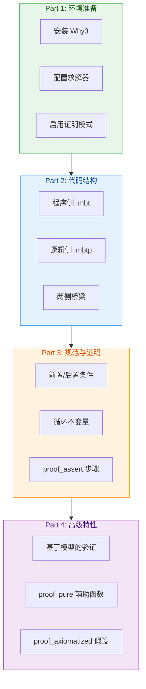

# MoonBit 形式化验证（实验性）🔬

## 任务目标

- 本 Skill 用于：掌握 MoonBit 的**形式化验证**（实验性功能）
- 能力包含：**契约规范、证明注解、循环不变量、SMT 求解器、基于模型的验证**
- 触发条件：编写需要强正确性保证的关键代码、验证算法正确性、证明数据结构不变量

## 技能架构



**预计时间**: 5+ 小时 | **前置要求**: functional (高级泛型/Trait)

**⚠️ 实验性警告**：表面语法和证明器集成仍在快速演进。

---

## Part 1: 环境准备

### 1.1 安装 Why3

MoonBit 的形式化验证依赖 **Why3** 验证工具链：

```bash
# 推荐通过 opam 安装
opam install why3.1.7.2
```

**Why3 的作用**：
- 将 MoonBit 代码转换为 Why3 格式
- 将证明任务分派给外部 SMT 求解器

### 1.2 安装外部求解器

至少安装一个（推荐多个以提高覆盖率）：

| 求解器 | 安装命令 | 特点 |
|--------|---------|------|
| **Z3** | 系统包管理器 | 微软开发，性能优秀 |
| **CVC5** | 系统包管理器 | 广泛支持 |
| **Alt-Ergo** | `opam install alt-ergo` | 法国开发，擅长算术 |

### 1.3 在包中启用证明

在 `moon.pkg` 中添加：

```
options(
  "proof-enabled": true,
)
```

启用后，该包可以同时包含：
- 普通的 `.mbt` 源文件
- 面向证明的 `.mbtp` 文件

---

## Part 2: 包含验证的代码结构 ⭐

### 2.1 两层分离

面向验证的包通常分为两层：

| 层级 | 文件类型 | 内容 | 用途 |
|------|---------|------|------|
| **程序侧** | `.mbt` | 可执行代码 + 契约 + 局部证明步骤 | 运行时使用 |
| **逻辑侧** | `.mbtp` | 谓词 + 抽象模型 + 引理 + 不变量 | 证明时使用 |

**优势**：
- 保持运行时代码可读性
- 让证明结构更明确

### 2.2 程序侧 vs 逻辑侧

#### 程序侧 (.mbt)

- 可执行的 MoonBit 代码
- 契约和证明注解是**逻辑侧推理嵌入的位置**

#### 逻辑侧 (.mbtp)

- 用于编写规范与证明
- 可能不对应任何运行时代码
- 定义谓词、抽象模型、引理

**关键分离原则**：
- 程序侧定义可被调用
- 逻辑侧定义用于规范
- 两者通过狭窄桥梁连接

### 2.3 桥梁：#proof_pure

当某个定义需要在**两侧都可见**时使用：

```moonbit
#proof_pure
fn height(t : Tree) -> Int {
  match t {
    Empty => 0
    Node(_, _, _, h) => h
  }
}
```

**用途**：
- 树的高度这类结构度量
- 排序函数、汇总函数
- 应像数学函数一样工作的计算

---

## Part 3: 编写规范与证明

### 3.1 函数契约 (where 子句)

使用 `where { ... }` 为函数附加规范：

```moonbit
pub fn binary_search(
  xs : FixedArray[Int],
  key : Int,
) -> Int? where {
  proof_require: sorted(xs),                    // 前置条件
  proof_ensure: result => binary_search_ok(xs, key, result),  // 后置条件
} {
  // ... 实现 ...
}
```

**关键字说明**：
- `proof_require`: 函数执行前必须满足的条件
- `proof_ensure`: 函数返回后必须满足的条件（`result` 指代返回值）

### 3.2 循环不变量

通过循环的 `where { ... }` 块添加证明注解：

```moonbit
for i = 0, j = xs.length(); i < j; {
  // ... 循环体 ...
} where {
  proof_invariant: 0 <= i,                          // 不变量 1
  proof_invariant: i <= j,                          // 不变量 2
  proof_invariant: j <= xs.length(),                // 不变量 3
  proof_yield: res => binary_search_ok(xs, key, res), // break 时成立
  proof_reasoning: (
    #| The loop maintains a candidate window `[i, j)`.
    #| Every index before `i` holds a value `< key`,
    #| and every index from `j` onward holds a value `> key`.
  ),
}
```

**常用注解**：

| 注解 | 用途 |
|------|------|
| `proof_invariant` | 每次迭代边界必须成立的事实 |
| `proof_yield` | 对 break 产出的值必须成立的事实 |
| `proof_reasoning` | 面向证明的结构化文字说明 |

### 3.3 proof_assert 中间步骤

在实现内部记录中间事实，帮助证明器：

```moonbit
if xs[h] < key {
  proof_assert ∀ idx : Int,
    (0 <= idx) && (idx < h + 1) → xs[idx] < key
  continue h + 1, j
}
```

### 3.4 完整示例：二分查找

参见 [官方文档概览示例](https://docs.moonbitlang.com/zh-cn/latest/language/verification.html#overview-example-binary-search)

核心要点：
- **前置条件**：输入数组已排序
- **后置条件**：结果要么是匹配索引，要么确认不存在
- **循环不变量**：搜索窗口 `[i, j)` 的性质逐步收缩
- **proof_assert**：每次分支提供局部事实

---

## Part 4: 高级特性

### 4.1 #proof_pure (纯函数标记)

将辅助函数标记为纯函数，供程序和证明共同使用：

```moonbit
#proof_pure
fn height(t : Tree) -> Int { ... }

// 现在可以在规范中使用 height
predicate cached_height_ok(t : Tree, result : Int) {
  result == height(t)
}
```

### 4.2 proof_decrease (终止度量)

为递归定义提供终止度量：

```moonbit
pub fn countdown(n : Int) -> Int where {
  proof_decrease: n,          // 度量：n 必须递减
  proof_require: 0 <= n,
  proof_ensure: result => 0 <= result,
} {
  if n <= 0 { 0 } else { countdown(n - 1) }
}
```

### 4.3 proof_axiomatized (假设标记)

将函数或引理标记为"假定成立"（不实际证明）：

```moonbit
pub fn assumed_nonnegative(x : Int) -> Int where {
  proof_axiomatized: true,  // 验证器会直接假定契约成立
  proof_require: 0 <= x,
  proof_ensure: result => 0 <= result,
} { x }
```

**用途**：
- 证明开发过程中的临时桥梁
- 明确设定的可信边界
- 外部依赖的接口规范

### 4.4 基于模型的验证 ⭐

对于数据结构和有状态系统的推荐模式：

1. **定义抽象模型** (`model()`)
2. **定义表示不变量** (`*_inv`)
3. **针对抽象模型编写操作规范**

#### AVL 树示例

```moonbit
// 抽象模型：树 → 元素集合
fn Tree::model(self : Tree) -> Fset[Int] {
  match self {
    Empty => Fset::empty()
    Node(l, x, r, _) => l.model().union(r.model()).add(x)
  }
}

// 表示不变量
predicate avl_inv(t : Tree) {
  match t {
    Empty => true
    Node(l, x, r, h) =>
      avl_inv(l) && avl_inv(r) &&
      (∀ y : Int, l.model().mem(y) → y < x) &&  // 搜索顺序
      (∀ y : Int, r.model().mem(y) → x < y) &&   // 搜索顺序
      h == 1 + max2(height(l), height(r)) &&     // 缓存高度正确
      -1 <= height(l) - height(r) &&              // 平衡因子
      height(l) - height(r) <= 1                   // 平衡因子
  }
}
```

**优势**：
- 每个操作基于抽象模型和不变量编写规范
- 实现通过证明局部事实推出具名后置条件
- 可扩展性好，避免大型内联公式

---

## 运行验证

### moon prove 会检查什么？

运行 `moon prove` 会要求验证器证明：

✅ **函数前置条件**足以保证函数体安全执行  
✅ **后置条件**在每条返回路径上成立  
✅ **proof_assert** 语句有效  
✅ **循环不变量**初始成立且保持  
✅ **终止度量**递减（如适用）  
✅ **边界检查和安全性质**

### 运行命令

```bash
# 验证当前模块所有启用了证明的包
moon prove

# 仅验证指定包
moon prove path/to/package
```

**注意**：
- 定向模式下，依赖被当作假设
- `moon check` vs `moon prove` 职责不同：
  - `moon check`: 类型检查
  - `moon prove`: 消解证明义务

---

## 可信模型与限制 ⚠️

### 受信假设（可信边界）

任何验证系统都有无法在用户代码内证明的假设：

| 假设 | 说明 |
|------|------|
| 数学整数 | 证明推理的是无界整数，非机器整数 |
| 算术溢出 | 目前不建模运行时溢出 |
| proof_axiomatized | 用户标记的假设项 |

**重要**：一个程序可能在证明模型中正确，但实际执行时仍需显式范围约束。

### 当前状态与限制

**实验性阶段**：表面语法、证明器集成、易用性快速演进。

**推荐风格**：
- ✅ 函数式证明风格
- ✅ 基于模型的规范
- ⚠️ 局部可变状态（应保持局部使用）
- ⚠️ FixedArray 逃逸式使用（目前不支持）
- ❌ 当两种写法都可行时，优先选择函数式风格

### 进一步阅读

查看已验证程序和可复用的面向证明的库：
- [moonbit-community/verified](https://github.com/moonbit-community/verified)

---

## 最佳实践

✅ **推荐做法**：

1. **分层组织**
   - 程序逻辑放 `.mbt`
   - 证明逻辑放 `.mbtp`
   - 使用 `#proof_pure` 连接两侧

2. **小而稳定的不变量**
   - 使用命名谓词（如 `*_inv`, `*_post`）
   - 避免大型内联公式
   - 描述当前搜索窗口/前缀/已处理区域

3. **渐进式证明**
   - 从简单算法开始
   - 逐步过渡到数据结构验证
   - 充分利用 `proof_assert` 引导证明器

4. **谨慎设计递归**
   - 使用 `#proof_pure` 和 `proof_decrease`
   - 这两个往往决定证明是否易于维护

5. **善用 proof_axiomatized**
   - 作为开发中的临时桥梁
   - 明确标记可信边界
   - 不要过度使用（减少信任基）

⚠️ **常见陷阱**：

1. **过度证明**
   - 不是所有代码都需要形式化验证
   - 关键路径和不变量优先

2. **忽略机器整数问题**
   - 证明模型使用数学整数
   - 实际代码仍需范围检查

3. **不变量过强/过弱**
   - 过强：难以证明
   - 过弱：无法推出所需结论

4. **可变状态逃逸**
   - FixedArray 逃逸目前不支持
   - 保持可变性局部化

---

## 决策指南：何时使用？

| 场景 | 推荐 | 示例 |
|------|------|------|
| 关键算法 | 形式化验证 | 排序/搜索算法 |
| 数据结构 | 基于模型的验证 | AVL 树/红黑树 |
| 安全关键代码 | 完整契约规范 | 加密/认证 |
| 学习理解 | 编写不变量 | 理解复杂算法 |
| 普通业务代码 | 测试足够 | CRUD 操作 |

---

## 资源索引

### 官方文档

- [MoonBit 形式化验证文档](https://docs.moonbitlang.com/zh-cn/latest/language/verification.html) ⭐⭐ **唯一来源**

### 外部工具

- [Why3 官网](http://why3.lri.fr/)
- [Z3 求解器](https://github.com/Z3Prover/z3)
- [CVC5 求解器](https://cvc5.github.io/)

### 相关资源

- [moonbit-community/verified](https://github.com/moonbit-community/verified): 已验证示例库

### 相关技能

- `moonbit-functional`: 泛型/Trait（前置要求）
- `moonbit-devtools`: 测试（配合验证测试）
- `moonbit-error-handling`: 错误处理（契约中的错误）

---

*版本: v1.0.0 | 类别: Domain Expertise (Layer 3) | 状态: 实验性*
*架构位置: skills/layer3-domain-expertise/moonbit-verification/SKILL.md*
*整合来源: verification.html 官方文档*
