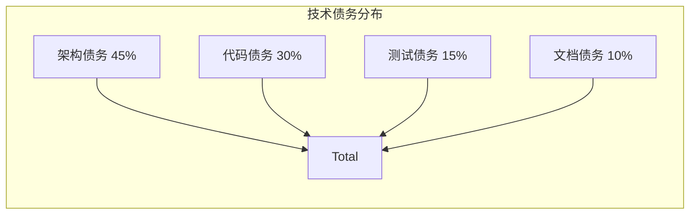
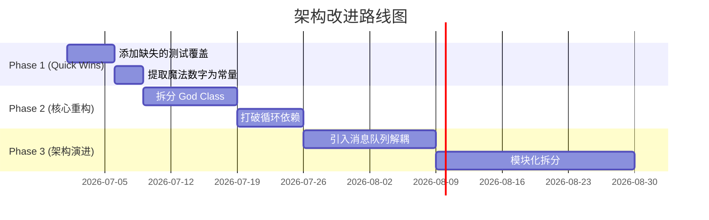

# 架构评估与改进 (Architecture Evaluator)

## 任务目标

本子技能帮助用户评估现有系统架构的质量，识别问题根因，并提供可执行的重构或改进建议。覆盖反模式检测、质量指标打分、技术债务评估和演进路线图制定。

---

## 四阶段评估流程

```
数据收集 → 多维评分 → 问题诊断 → [用户确认] → 改进方案 → 路线图
```

### 阶段 1: 数据收集

**必填信息**：
- 当前系统的核心业务目标（原始文档或口头描述）
- 代码库概况（语言、框架、代码行数、模块数量）
- 当前遇到的具体痛点（性能瓶颈？维护困难？bug 频发？）

**选填信息**（缺失则基于代码分析推断）：
- 架构文档 / 设计文档（如有）
- 测试覆盖率数据
- 线上监控数据（延迟、错误率、资源使用）
- 团队规模和开发流程

---

### 阶段 2: 多维评分

按 P0-P4 优先级对现有架构进行评分（1-10 分）：

| 维度 | 权重 | 评分 | 说明 |
|------|------|------|------|
| **业务对齐度** | P0 | ?/10 | 代码是否仍反映原始业务目标？ |
| **可维护性** | P1 | ?/10 | 模块独立性、重复代码、圈复杂度 |
| **可扩展性** | P1 | ?/10 | 新增需求是否需要大改？OCP 遵从度 |
| **性能** | P2 | ?/10 | 慢查询、资源瓶颈、缓存命中率 |
| **安全性** | P3 | ?/10 | OWASP Top 10 风险 |
| **成本效率** | P4 | ?/10 | 资源利用率、云成本 |

**评分说明**：
- 1-3：严重问题，需立即处理
- 4-6：需改进，计划内修复
- 7-8：较好，有优化空间
- 9-10：优秀

---

### 阶段 3: 问题诊断

#### 3.1 反模式检测清单

| 类别 | 反模式 | 检测线索 | 严重度 |
|------|--------|---------|--------|
| **架构级** | 上帝类 (God Class) | 单个类 > 1000 行 | 🔴 P0 |
| **架构级** | 循环依赖 | A→B→A 的模块依赖链 | 🔴 P0 |
| **架构级** | 散弹式修改 | 改一个需求需要改 N 个文件 | 🟠 P1 |
| **架构级** | 依恋情结 | 一个方法过度依赖另一个类的数据 | 🟡 P2 |
| **代码级** | 过长函数 | 单个函数 > 50 行 | 🟡 P2 |
| **代码级** | 过多参数 | 函数参数 > 4 个 | 🟢 P3 |
| **代码级** | 魔法数字 | 硬编码 0.8、3600 等无解释常量 | 🟢 P3 |
| **代码级** | 重复代码 | 相同逻辑出现 3+ 处 | 🟠 P1 |

#### 3.2 技术债务评估



评估维度：
- **修复所需人天**：估算
- **风险等级**：低 / 中 / 高 / 危急
- **对业务的影响**：阻塞新功能？降低开发速度？

---

### 阶段 4: 改进方案与路线图

#### 4.1 改进建议（每个建议必须包含权衡分析）

**示例**：

| 建议 | 将 God Class 拆分为多个单一职责类 |
|------|----------------------------------|
| **优点** | 可维护性提升 60%，新增功能无需修改核心类 |
| **缺点 / 成本** | 需要 3-5 人天，可能影响现有功能稳定性 |
| **前置条件** | 需要有足够的测试覆盖（当前覆盖率 30%，建议先补测试） |
| **不适用场景** | 系统即将重写或废弃时，不值得投入 |

#### 4.2 分阶段演进路线图



---

## 输出模板

### 高层执行摘要（默认必显）

```
# 架构评估报告：{项目名称}

## 总体评分
可维护性: 5/10 | 性能: 7/10 | 安全性: 6/10 | 成本: 8/10

## 核心发现
🔴 严重: God Class `OrderManager` 1200 行，修改风险极高
🟠 警告: 模块间存在循环依赖 (A→B→C→A)
🟢 建议: 多处魔法数字需提取

## 推荐动作
1. [立即] 拆分 OrderManager (5 人天)
2. [短期] 打破循环依赖 (7 人天)
3. [中期] 补测试覆盖至 80% (10 人天)

## 风险提示
如果不对 God Class 进行处理，每新增一个功能将增加 2-3 天的修改成本。
```
