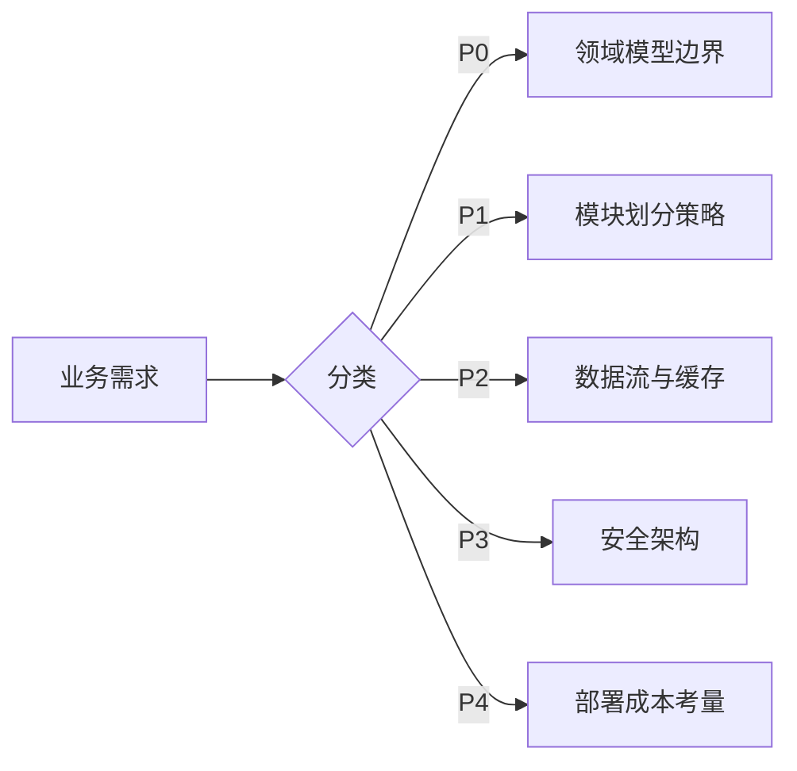
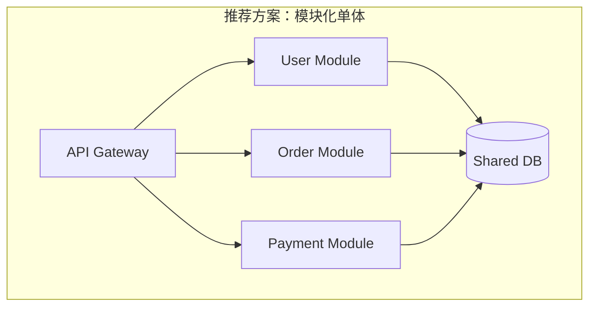
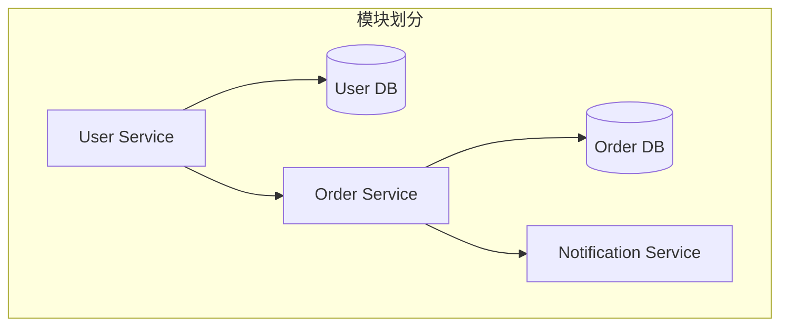

# 初始架构设计 (Design Initiator)

## 任务目标

本子技能帮助用户在项目启动阶段，从零开始设计一套清晰、可演进的系统架构。涵盖需求解析、架构风格推荐、技术选型、模块划分和接口设计。

---

## 五阶段设计流程

```
信息收集 → 需求分析 → 架构素描 → [用户确认] → 详细设计 → 自审 → [用户审查]
```

### 阶段 1: 信息收集

使用 `pre_check_hook.py` 的逻辑，逐项确认：

**必填项（缺失则必须反问）**：
- 项目的核心业务目标是什么？（1-2 句话）
- 当前有哪些功能需求？（列表或描述）
- 目标用户和预期的使用规模？

**选填项（缺失则在报告中标注默认假设）**：
- 非功能需求：性能（TPS/延迟）、可用性（SLA）、安全合规等级
- 技术栈偏好或限制（现存系统、组织标准）
- 预算与时间约束
- 部署环境（云 / 裸机 / 边缘 / 混合）

---

### 阶段 2: 需求分析

将收集到的信息按 P0-P4 优先级分类（见主 SKILL.md 的优先级体系）：



---

### 阶段 3: 架构素描

输出 2-3 个候选架构方案，**先推荐最佳方案**，再列备选。

每个方案必须包含：
1. **架构风格**（微服务 / 模块化单体 / 分层 / 事件驱动 / CQRS 等）
2. **高层架构图**（Mermaid）
3. **技术栈候选**（含版本倾向）
4. **权衡分析表**



**权衡分析表示例**：

| 维度 | 模块化单体 | 微服务 |
|------|-----------|--------|
| 开发速度 | ✅ 快，单一代码库 | ❌ 慢，需基础设施 |
| 扩展性 | ❌ 垂直扩展 | ✅ 水平扩展 |
| 运维复杂度 | ✅ 低 | ❌ 高 |
| 适用条件 | 团队 < 10 人，初期快速验证 | 团队 > 20 人，多独立域 |
| 不适用 | 需要独立扩缩子模块 | 团队小或时间紧 |

---

### 阶段 4: 详细设计（用户确认后展开）

#### 4.1 模块分解图



#### 4.2 接口契约建议（示例）

```
POST /api/v1/users         # 创建用户
GET  /api/v1/users/{id}    # 获取用户
POST /api/v1/orders        # 创建订单
```

#### 4.3 技术选型对比矩阵

| 维度 | 方案 A | 方案 B | 评分 |
|------|--------|--------|------|
| 语言 | Go 3.0 | Java 21 | A: 8, B: 7 |
| 框架 | Gin | Spring Boot | A: 7, B: 8 |
| 数据库 | PostgreSQL | MySQL 8.0 | A: 9, B: 7 |
| 消息队列 | RabbitMQ | Kafka | A: 7, B: 8 |

---

### 阶段 5: 自审

检查清单：
- [ ] 是否有明确的业务目标对齐？
- [ ] 每个模块的职责是否单一？
- [ ] 是否包含了权衡分析表？
- [ ] 技术选型是否提供了备选方案？
- [ ] 是否标注了"基于默认假设"的部分？
- [ ] 没有过度设计？（YAGNI）

---

## 反模式提醒

| 你可能会想 | 真相 |
|-----------|------|
| "先选技术栈再想业务" | 技术栈应由业务需求驱动，而非反过来 |
| "微服务就是最好的" | 微服务增加复杂度。单体起步、按需拆分更务实 |
| "这个模式看起来很酷，用上" | 问题不存在时引入模式 = 增加不必要的复杂度 |
| "给个通用方案就好" | 通用方案 ≈ 没有方案。必须贴合用户上下文 |

---

## 输出示例

**用户**: "我要做一个电商平台，预计初期 5 万用户，团队 6 人，3 个月上线"

**输出摘要**:
1. 推荐架构：**模块化单体**（理由：团队小、时间紧、用户量可控）
2. 技术栈：Python (FastAPI) + PostgreSQL + Redis
3. 阶段二演进：用户量到 50 万后拆分为微服务
4. 权衡分析：速度 vs 扩展性，当前阶段速度优先
