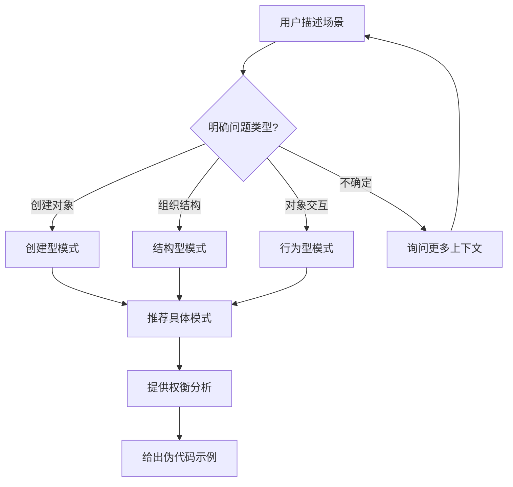

# 设计模式顾问 (Pattern Advisor)

## 任务目标

本子技能帮助用户选择合适的设计模式来解决具体问题。提供模式识别、场景匹配、优劣对比和代码示例。

---

## 使用流程



---

## 模式速查

详见 [references/design_patterns_slim.md](../references/design_patterns_slim.md)，按意图分类的精简设计模式库（8-10 个核心模式）。

---

## 推荐逻辑

### 问题类型到模式映射

| 问题类型 | 推荐模式 | 优先级 |
|---------|---------|--------|
| 需要根据不同条件选择算法 | **策略模式** | ⭐ 首选 |
| 需要通知多个对象状态变化 | **观察者模式** | ⭐ 首选 |
| 需要创建复杂对象，步骤固定 | **建造者模式** | ⭐ 首选 |
| 需要隔离创建逻辑与使用逻辑 | **工厂方法 / 抽象工厂** | ⭐ 首选 |
| 需要将一个接口转为另一个接口 | **适配器模式** | ⭐ 首选 |
| 需要动态给对象添加职责 | **装饰器模式** | ⭐ 首选 |
| 需要控制对对象的访问 | **代理模式** | ⭐ 首选 |
| 需要定义算法骨架，子类实现细节 | **模板方法模式** | ⭐ 首选 |
| 需要将请求封装为对象 | **命令模式** | ⭐ 首选 |
| 需要一对多依赖通知（高级） | **观察者模式** | 备选 |

---

## 输出格式

### 推荐示例

**用户**: "我需要实现多种支付方式，未来还可能扩展"

**输出**:

```markdown
## 推荐方案：策略模式

### 为什么
- 每种支付方式是一个独立的算法
- 新增支付方式无需修改现有代码（开闭原则）
- 各策略之间完全解耦

### 权衡分析
| 维度 | 内容 |
|------|------|
| 优点 | 扩展性好、符合 OCP、各支付方式独立测试 |
| 缺点 | 类数量增多、调用方需知道有哪些策略 |
| 适用条件 | 算法族固定且互相可替换 |
| 不适用 | 支付方式间有复杂的状态转换（应使用状态模式） |

### 伪代码
```
interface PaymentStrategy {
    pay(amount): Result
}

class AlipayStrategy implements PaymentStrategy { ... }
class WechatPayStrategy implements PaymentStrategy { ... }

class PaymentContext {
    constructor(strategy: PaymentStrategy)
    executePay(amount): Result {
        return this.strategy.pay(amount)
    }
}
```
```
