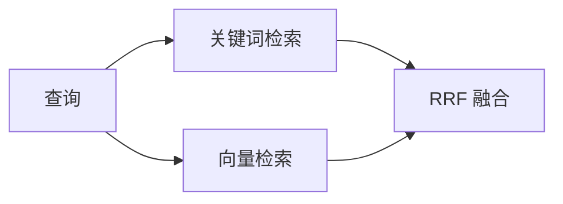

# 🏗️ Tutorial Writer Build — 内容优先架构构建指南 v2.0

> **父技能**: [tutorial-writer](../SKILL.md)
> **独立可用**: ✅ 可通过 `/build` 或 `/tutorial-writer/build` 直接触发（L1 直达）
> **架构**: L1 独立子技能 — 基于**「内容优先 + 增强层分离」**架构模式
> **基于版本**: Astro 6.3（2026年5月最新版）+ Starlight 最新版
> **使用频率**: 🔴 **高频** — 开发过程中反复迭代调用
> **架构来源**: [tutorial-writer-suggest.md](../../../../.trae/documents/tutorial-writer-suggest.md)

---

## 🎯 核心架构理念：「内容优先 + 增强层分离」

### 为什么采用这种架构？

| 传统做法 | 本架构 |
|---------|--------|
| 内容藏在 `site/src/content/docs/` 深处 | **内容在根目录 `content/`，一目了然** |
| 可能维护 book/ 和 site/ 两份内容 | **只有一份内容源，通过管道生成多形态产物** |
| 文件名随意，URL 丑陋（中文编码） | **英文 slug 文件名 + 中文标题，URL 干净** |
| 组件和样式混杂 | **增强层分离：components/scripts/styles 各司其职** |
| 仅能生成网站 | **天然支持网站 + PDF/EPUB + 其他格式** |

### 架构总览

```
tutorial-project/
├── content/                       ← 📝 内容层（唯一真相源）
│   ├── chapters/
│   │   ├── 01-rag-overview.md     ← 英文 slug 文件名
│   │   ├── 02-rag-evolution.md
│   │   └── ...
│   ├── index.mdx                  ← 首页（唯一需要组件的地方）
│   └── config.ts                  ← Content Collections schema
├── src/                           ← 🔧 代码/增强层
│   ├── components/                ← 交互组件（按功能分组）
│   │   ├── interactive/          ← 3D、可视化、沙盒
│   │   ├── charts/               ← 图表、仪表盘
│   │   └── code/                 ← 代码演示、对比
│   ├── layouts/                   ← 布局
│   ├── styles/                    ← 样式
│   └── scripts/                   ← 构建时脚本
│       └── enhance-content.mts    ← 可选：内容增强管道
├── reference/                     ← 📚 参考资料
├── astro.config.mjs
└── package.json
```

---

## 🎯 职责范围

| ✅ 负责 | ❌ 不负责 |
|---------|----------|
| Astro 项目创建与初始化（内容优先架构） | 部署配置 → `/publish` |
| Starlight 主题配置与定制 | GitHub Actions 工作流 → `/publish` |
| Content Collections 内容管理（扁平结构） | CI/CD 流水线 → `/publish` |
| 组件开发（Islands + 静态，按功能分组） | 域名/DNS 配置 → `/publish` |
| **内容增强管道**（Mermaid 预渲染、组件注入） | 生产环境监控 → `/publish` |
| **文件命名规范**（英文 slug + 中文标题） | 发布后验证 → `/publish` |
| 性能优化（构建时） | 多格式发布配置 → 可选 |

**设计理念**: 本技能是 Tutorial Writer 流程中**调用频率最高**的子技能之一。Agent 在构建教程网站时会反复调用此技能进行配置、开发和调试。

---

## 🚀 快速启动：5 步构建教程网站（内容优先架构）

### Step 1: 项目初始化

#### 方式 A：交互式创建（推荐新手）

```bash
# 使用 npm（Node.js 包管理器）
npm create astro@latest my-tutorial

# 使用 bun（高性能包管理器，速度更快 ⚡）
bun create astro@latest my-tutorial

# 使用 pnpm（磁盘效率高）
pnpm create astro@latest my-tutorial
```

**交互式提示选择**：
```
tmpl   How would you like to start your new project?
       > A basic, helpful starter project (recommended)  ← 普通项目
       — Use blog template                               ← 博客模板
       — Use docs (Starlight) template                   ← ✅ 教程文档（推荐！）
       — Use minimal (empty) template                    ← 空白项目（高级用户）
```

> **推荐**: 选择 **"Use docs (Starlight) template"** 用于教程/文档类项目

#### 方式 B：一键非交互创建（推荐自动化/CI）

```bash
# ✅ Starlight 模板 + 自动安装依赖 + 初始化 Git + 跳过所有提示
bun create astro@latest my-tutorial \
  --template starlight \
  --install \
  --git \
  --yes

# 或使用 npm
npm create astro@latest my-tutorial -- \
  --template starlight \
  --install \
  --git \
  --yes

# 或使用 pnpm
pnpm create astro@latest my-tutorial \
  --template starlight \
  --install \
  --git \
  --yes
```

#### CLI Flags 完整参考

| Flag | 简写 | 说明 | 推荐值 |
|------|------|------|--------|
| `--template <name>` | -t | 指定模板 | `starlight` / `blog` / `minimal` |
| `--install` | -i | 自动安装依赖 | ✅ 推荐 |
| `--no-install` | -I | 不安装依赖 | 仅生成脚手架时 |
| `--git` | -g | 初始化 Git 仓库 | ✅ 推荐 |
| `--no-git` | -G | 不初始化 Git | 特殊需求 |
| `--yes` | -y | 接受所有默认值 | ✅ 推荐（自动化）|
| `--no` | -n | 拒绝所有默认值 | 需要自定义配置 |
| `--dry-run` | - | 模拟运行不执行 | 测试用 |
| `--skip-houston` | - | 跳过 Houston 动画 | CI 环境推荐 |
| `--fancy` | - | 启用 Windows Unicode 支持 | Windows 用户 |

#### 创建后的目录结构（Starlight 模板默认）

```
my-tutorial/
├── .github/                       ← GitHub 配置
├── astro.config.mjs               ← Astro 配置（⚠️ 需修改为 Content-First）
├── public/                        ← 静态资源
├── src/
│   ├── content.config.ts          ← Content Collections 定义
│   └── content/                   ← ⚠️ 默认位置：src/content/docs/
│       └── docs/                  ← 需要迁移到根目录 content/chapters/
├── tsconfig.json
└── package.json
```

#### 进入项目并启动开发服务器

```bash
cd my-tutorial

# 启动开发服务器（根据包管理器选择）
npm run dev        # http://localhost:4321
# 或
bun run dev        # http://localhost:4321（更快 ⚡）
# 或
pnpm run dev       # http://localhost:4321
```

> **首次启动提示**: Astro 会询问是否启用遥测数据收集（匿名统计），按需选择 Y/N 即可。

### Step 2: 采用内容优先目录结构

**重构为扁平结构**（关键差异点）：

```
my-tutorial/
├── content/                       ← 📝 内容在根目录！（不是 src/content/）
│   ├── chapters/                  ← 教程章节
│   │   ├── 01-overview.md         ← 英文 slug 文件名
│   │   ├── 02-setup.md
│   │   ├── 03-core-concepts.md
│   │   └── ...
│   ├── index.mdx                  ← 首页（可包含组件）
│   └── config.ts                  ← Content Collections 定义
│
├── src/                           ← 🔧 增强层
│   ├── components/
│   │   ├── interactive/           ← 3D 组件、交互式图表
│   │   ├── charts/                ← 数据可视化
│   │   └── code/                  ← 代码沙盒、对比工具
│   ├── layouts/
│   ├── styles/
│   └── scripts/
│       └── enhance-content.mts    ← 构建时增强管道
│
├── public/                        ← 静态资源
├── astro.config.mjs
└── package.json
```

**为什么这样更好？**

| 对比项 | 旧结构 (`src/content/docs/`) | 新结构 (`content/chapters/`) |
|-------|---------------------------|---------------------------|
| **路径深度** | 4 层 | **2 层** ✨ |
| **Git 关注点** | 难以聚焦 | **content/ 就是全部** ✨ |
| **写作入口** | 不清楚该写哪边 | **只写 content/** ✨ |
| **URL 结构** | `/docs/ch06-xxx` | `/chapters/xxx` 更简洁 ✨ |

### 📋 模板选择指南

| 模板 | 命令参数 | 适用场景 | Content-First 迁移难度 |
|------|---------|---------|---------------------|
| **Starlight** (推荐) | `--template starlight` | ✅ 教程/技术文档/API 文档 | ⭐ 简单（仅需移动 content/）|
| **Basic** | (默认) | 通用网站/着陆页 | ⭐⭐ 中等（需手动添加 Starlight）|
| **Blog** | `--template blog` | 个人博客/文章列表 | ⭐⭐⭐ 复杂（架构差异大）|
| **Minimal** | `--template minimal` | 完全从零开始 | ⭐⭐⭐⭐ 最复杂（全部手写）|

> **为什么推荐 Starlight?**
> - 内置文档专用功能：侧边栏、搜索、i18n、页面导航
> - 自动生成 SEO 友好的 URL 结构
> - 内置代码高亮、表格 of contents
> - 与 Content-First 架构完美契合

### 🚀 一键迁移脚本（Starlight → Content-First）

创建 `scripts/migrate-to-content-first.sh`：

```bash
#!/bin/bash
set -e

echo "🔄 开始迁移到 Content-First v2 架构..."

# 1. 创建根目录 content/chapters/
mkdir -p content/chapters

# 2. 迁移内容文件（从 src/content/docs/ 到 content/chapters/）
if [ -d "src/content/docs" ]; then
  echo "📝 迁移内容文件..."
  cp -r src/content/docs/* content/chapters/
  echo "✅ 内容已复制到 content/chapters/"
else
  echo "⚠️ 未找到 src/content/docs/，跳过迁移"
fi

# 3. 创建 content/config.ts（如果不存在）
if [ ! -f "content/config.ts" ]; then
  echo "📄 创建 content/config.ts..."
  cat > content/config.ts << 'EOF'
import { defineCollection, z } from 'astro:content';
import { docsLoader, docsSchema } from '@astrojs/starlight/loaders';

const chapters = defineCollection({
  loader: docsLoader(),
  schema: docsSchema({
    schema: z.object({
      tags: z.array(z.string()).default([]),
      difficulty: z.enum(['beginner', 'intermediate', 'advanced']).optional(),
      readingTime: z.number().optional(),
      hasInteractive: z.boolean().default(false),
      hasMermaid: z.boolean().default(false),
      hasMath: z.boolean().default(false),
    }),
  }),
});

export const collections = { chapters };
EOF
  echo "✅ content/config.ts 已创建"
fi

# 4. 创建组件目录结构
echo "🎨 创建组件目录..."
mkdir -p src/components/{interactive,charts,code,ui}
mkdir -p src/scripts
echo "✅ 组件目录已创建"

# 5. 创建增强管道脚本（可选）
if [ ! -f "src/scripts/enhance-content.mts" ]; then
  echo "⚡ 创建增强管道模板..."
  cat > src/scripts/enhance-content.mts << 'EOF'
import type { AstroConfig } from 'astro/config';

export default function enhanceContent(astroConfig: AstroConfig) {
  return {
    name: 'content-enhancer',
    hooks: {
      'astro:build:start': () => {
        console.log('🔄 开始内容增强...');
      },
      'astro:build:done': ({ dir }) => {
        console.log('✅ 内容增强完成:', dir);
      },
    },
  };
}
EOF
  echo "✅ 增强管道模板已创建"
fi

# 6. 更新 astro.config.mjs（提示手动修改）
echo ""
echo "📌 下一步："
echo "   1. 手动编辑 astro.config.mjs，更新以下配置："
echo "      - starlight.sidebar.autogenerate.directory 改为 'chapters'"
echo "      - 确保 site 和 base 配置正确"
echo "   2. 删除旧目录（确认迁移成功后）：rm -rf src/content/"
echo ""
echo "🎉 Content-First v2 架构迁移准备完成！"
```

**使用方法**：

```bash
chmod +x scripts/migrate-to-content-first.sh
./scripts/migrate-to-content-first.sh
```

### Step 3: Content Collections 配置（扁平化）

**content/config.ts**：

```typescript
import { defineCollection, z } from 'astro:content';
import { docsLoader, docsSchema } from '@astrojs/starlight/loaders';

const chapters = defineCollection({
  loader: docsLoader(),
  schema: docsSchema({
    schema: z.object({
      // 扩展自定义字段（按需添加）
      tags: z.array(z.string()).optional(),
      difficulty: z.enum(['beginner', 'intermediate', 'advanced']).optional(),
      readingTime: z.number().optional(),
      coverImage: z.string().optional(),
    }),
  }),
});

export const collections = { chapters };
```

### Step 4: 文件命名规范（英文 slug + 中文标题）

**核心原则**：
- ✅ **文件名** = 英文 slug（用于 URL 和 Git）
- ✅ **Frontmatter title** = 中文（用于显示）

**示例**：

```markdown
---
title: "RAG 概述与核心价值"        # 显示名称 = 中文
slug: "rag-overview"              # URL = /chapters/rag-overview
tags: [入门, RAG]
difficulty: beginner
readingTime: 15
---

# RAG 概述与核心价值

本章将介绍...
```

**命名规则速查**：

| 类型 | 规范 | 示例 |
|------|------|------|
| 章节文件 | 数字前缀 + 英文 kebab-case | `01-rag-overview.md` |
| 组件文件 | PascalCase | `RAGArchitecture3D.tsx` |
| 样式文件 | kebab-case | `theme.css` |
| 目录名 | kebab-case | `interactive/` |

**好处**：
- ✅ URL 干净：`/chapters/rag-overview` 而非 `/chapters/RAG%E6%A6%82%E8%BF%B0`
- ✅ Git 友好：无编码问题、无大小写混乱
- ✅ SEO 友好：slug 可自定义优化
- ✅ 显示层中文：读者看到的是中文标题，不影响体验

### Step 5: 开发与验证

```bash
npm run dev                      # http://localhost:4321
npm run build                    # 输出到 dist/
npm run preview                  # http://localhost:4321
```

---

## 🔧 核心配置

### astro.config.mjs（内容优先架构版）

```javascript
import { defineConfig } from 'astro/config';
import starlight from '@astrojs/starlight';

export default defineConfig({
  site: 'https://username.github.io',
  base: '/repo-name/',
  trailingSlash: 'always',

  integrations: [
    starlight({
      title: '教程标题',
      description: '教程描述',

      social: {
        github: 'https://github.com/username/repo',
      },

      sidebar: [
        { label: '首页', slug: 'index' },
        {
          label: '章节',
          autogenerate: { directory: 'chapters' },  // 指向 content/chapters/
        },
      ],

      editLink: {
        baseUrl: 'https://github.com/username/repo/edit/main/',
      },
      lastUpdated: true,
      pagination: true,
      search: { mode: 'auto' },
    }),
  ],
});
```

**关键配置项说明**：

| 配置项 | 值 | 说明 |
|--------|-----|------|
| `site` | 完整 URL | 影响 SEO、sitemap、OG 图片路径 |
| `base` | `'/repo-name/'` | GitHub Pages 项目站点必填 |
| `trailingSlash` | `'always'` | 避免 GitHub Pages 404 |
| `autogenerate.directory` | `'chapters'` | 指向 `content/chapters/` 目录 |

---

## 🎨 组件组织：按功能分组

### 推荐的组件目录结构

```
src/components/
├── interactive/              ← 🎮 3D、可视化、交互式组件
│   ├── Architecture3D.tsx    # 3D 架构展示
│   ├── DataPipeline3D.tsx    # 数据流 3D 动画
│   ├── ChunkComparison3D.tsx # 分块策略对比 3D
│   └── KnowledgeGraph3D.tsx  # 知识图谱 3D
│
├── charts/                   ← 📊 图表、仪表盘、指标
│   ├── PerformanceDashboard.tsx
│   ├── MetricGauge.tsx
│   └── ComparisonChart.tsx
│
├── code/                     ← 💻 代码相关组件
│   ├── InteractiveCodeDemo.tsx  # 运行时代码沙盒
│   ├── CodeComparison.tsx      # 代码对比展示
│   └── TerminalEmulator.tsx     # 终端模拟器
│
└── ui/                        ← 🎨 通用 UI 组件
    ├── FeatureGrid.astro
    ├── DifficultyBadge.astro
    └── ReadingTime.astro
```

**分组原则**：

| 分组 | 包含 | 使用频率 |
|------|------|---------|
| `interactive/` | 3D、动画、复杂可视化 | 中（特定章节使用）|
| `charts/` | 图表、数据展示 | 中（数据密集章节）|
| `code/` | 代码演示、沙盒 | 高（技术章节常用）|
| `ui/` | 通用 UI 元素 | 高（全局复用）|

---

## ⚡ 内容增强管道（Build-time Enhancement）

### 什么是增强管道？

在构建时自动处理 Markdown 内容，注入交互组件、预渲染图表等。

### 核心功能 1：插槽标记系统

**在 Markdown 中使用标记**：

```markdown
<!-- content/chapters/06-retrieval-optimization.md -->

# 第六章：检索质量优化

## 分块策略对比

| 策略 | Token 数 | 召回率 |
|-------|---------|--------|
| 固定 512 | 512 | **78%** |
| 语义分块 | ~43 | **70%** |

<!-- @interactive: ChunkComparison3D -->
<!-- 同步后此处自动插入 3D 对比可视化组件 -->

## RRF 公式

$$ \text{RRF}(d) = \sum_{i=1}^{k} \frac{1}{k + r_i(d)} $$

<!-- @mermaid -->

<!-- @mermaid-end -->
```

**构建时处理** (`src/scripts/enhance-content.mts`)：

```typescript
// src/scripts/enhance-content.mts
import type { AstroConfig } from 'astro/config';

export default function enhanceContent(astroConfig: AstroConfig) {
  return {
    name: 'content-enhancer',
    hooks: {
      'astro:build:start': () => {
        console.log('🔄 开始内容增强...');
      },
      'astro:build:done': ({ dir }) => {
        console.log('✅ 内容增强完成:', dir);
      },
    },
  };
}
```

### 核心功能 2：Mermaid 预渲染

**为什么需要预渲染？**
- ❌ 浏览器端渲染 mermaid.js 会增加加载时间
- ✅ 构建时预渲染为 SVG，零运行时开销

**实现方式**：

```bash
# 安装 mermaid CLI
npm install -D @mermaid-js/mermaid-cli

# 在 package.json 中添加脚本
{
  "scripts": {
    "enhance": "mmd2svg -i content/chapters -o .enhanced",
    "prebuild": "npm run enhance && npm run build"
  }
}
```

### 核心功能 3：组件自动注入

**布局级别处理** (`src/layouts/BaseLayout.astro`)：

```astro
---
// 自动检测并替换插槽标记
import ChunkComparison3D from '../components/interactive/ChunkComparison3D.tsx';
---

<!doctype html>
<html>
  <head><title>{title}</title></head>
  <body>
    <!-- 使用 slot 渲染原始内容 -->
    <slot />

    <!-- 后处理：查找并替换插槽标记为实际组件 -->
    <script define:vars={{}} is:inline>
      document.querySelectorAll('[data-enhance-slot]').forEach(el => {
        const componentName = el.dataset.enhanceSlot;
        // 动态导入并渲染对应组件
      });
    </script>
  </body>
</html>
```

---

## 📖 Content Collections 最佳实践

### 查询内容（扁平化版本）

```astro
---
import { getCollection } from 'astro:content';

// 获取所有章节
const allChapters = await getCollection('chapters');

// 过滤：排除草稿
const publishedChapters = allChapters.filter(ch => !ch.data.draft);

// 排序：按文件名数字前缀
const sortedChapters = publishedChapters.sort((a, b) => {
  const numA = parseInt(a.slug.split('-')[0]) || 999;
  const numB = parseInt(b.slug.split('-')[0]) || 999;
  return numA - numB;
});
---

<h2>所有章节 ({sortedChapters.length})</h2>
{sortedChapters.map(chapter => (
  <article>
    <h3><a href={chapter.slug}>{chapter.data.title}</a></h3>
    <p>{chapter.data.description}</p>
    {chapter.data.difficulty && (
      <span class={`badge badge--${chapter.data.difficulty}`}>
        {chapter.data.difficulty}
      </span>
    )}
  </article>
))}
```

### Frontmatter Schema 扩展

```typescript
// content/config.ts
const chapters = defineCollection({
  loader: docsLoader(),
  schema: docsSchema({
    schema: z.object({
      // 基础字段（Starlight 自动处理）
      // title, description, slug, draft, sidebar

      // 教程特有扩展
      tags: z.array(z.string()).default([]),           // 标签分类
      difficulty: z.enum(['beginner', 'intermediate', 'advanced'])
        .optional(),                                    // 难度等级
      readingTime: z.number().optional(),              // 预估阅读时间（分钟）
      coverImage: z.string().optional(),               // 封面图片
      prerequisites: z.array(z.string()).optional(),     // 前置知识
      updatedAt: z.coerce.date().optional(),            // 最后更新日期

      // 增强管道支持
      hasInteractive: z.boolean().default(false),       // 是否含交互组件
      hasMermaid: z.boolean().default(false),           // 是否含 Mermaid 图表
      hasMath: z.boolean().default(false),             // 是否含数学公式
    }),
  }),
});

export const collections = { chapters };
```

---

## 🌐 i18n 多语言配置（可选）

如果需要多语言支持：

```
content/
├── chapters/                     ← 默认语言（如中文）
│   ├── 01-overview.md
│   └── ...
└── en/                          ← 英文版本
    ├── chapters/
    │   ├── 01-overview.md
    │   └── ...
    └── index.mdx
```

**astro.config.mjs**：

```javascript
starlight({
  locales: {
    root: {
      label: '简体中文',
      lang: 'zh-CN',
    },
    en: {
      label: 'English',
      lang: 'en',
    },
  },
  defaultLocale: 'root',
}),
```

---

## 📚 多形态发布支持（可选）

### 从单一内容源生成多种输出

```
content/chapters/*.md
       │
       ├──→ Astro 构建 → 交互式网站（GitHub Pages）
       ├──→ Pandoc      → PDF / EPUB / Word
       ├──→ mdbook      → 备用静态站
       └──→ Notion API  → 协作平台同步
```

### Pandoc 集成示例（PDF 输出）

```bash
# 安装 pandoc
# Windows: choco install pandoc
# Mac: brew install pandoc

# 创建 PDF 生成脚本
# scripts/generate-pdf.sh
#!/bin/bash
pandoc content/chapters/*.md \
  --from markdown \
  --to pdf \
  --output output/tutorial.pdf \
  --pdf-engine=xelatex \
  --metadata title="教程标题" \
  --toc \
  --highlight-style=tango
```

**package.json 脚本**：

```json
{
  "scripts": {
    "build:web": "astro build",
    "build:pdf": "./scripts/generate-pdf.sh",
    "build:all": "npm run build:web && npm run build:pdf"
  }
}
```

---

## 📂 项目最佳实践总结

### ✅ 项目启动检查清单

- [ ] 采用 `content/` 根目录结构（不是 `src/content/`）
- [ ] 文件名使用英文 slug + 中文标题
- [ ] 组件按功能分组（interactive/charts/code/ui）
- [ ] 配置 Content Collections schema
- [ ] 设置 `base` 和 `trailingSlash`（GitHub Pages 必填）
- [ ] 启用增强管道（可选但推荐）

### ✅ 写作流程

1. **只写 `content/chapters/`** — 这是唯一的真相源
2. **遵循命名规范** — `01-chapter-slug.md`
3. **使用 Frontmatter** — 定义元数据（title/difficulty/tags 等）
4. **需要交互时** — 使用 `<!-- @interactive: XXX -->` 标记
5. **需要图表时** — 使用 `<!-- @mermaid -->` 块
6. **定期构建验证** — `npm run build` 检查错误

### ⚠️ 常见陷阱

| 陷阱 | 解决方案 |
|------|---------|
| 文件名使用中文 | 改用英文 slug，标题放 Frontmatter |
| 内容放在 `src/content/` 太深 | 移到根目录 `content/` |
| 组件全部平铺 | 按功能分组到子目录 |
| Mermaid 浏览器渲染慢 | 启用构建时预渲染 |
| 维护两份内容（book + site）| 只维护 `content/`，通过管道生成其他格式 |

### 📦 包管理器选择指南

| 包管理器 | 安装速度 | 磁盘占用 | 兼容性 | 推荐场景 |
|---------|---------|---------|--------|---------|
| **Bun** ⚡ | ⭐⭐⭐⭐⭐ 最快 | ⭐⭐⭐ 最小 | ✅ 完全兼容 Node.js | **推荐**：新项目/追求性能 |
| **pnpm** | ⭐⭐⭐⭐ 快 | ⭐⭐⭐⭐ 小 | ✅ 完全兼容 | 单仓/monorepo /磁盘敏感 |
| **npm** | ⭐⭐⭐ 标准 | ⭐⭐ 标准大小 | ✅ 官方默认 | 传统项目/团队统一 |

**Bun 优势（为什么推荐？）**：
- 🚀 安装依赖速度比 npm 快 **10-20 倍**
- 💾 全局缓存，跨项目共享（节省 50%+ 磁盘空间）
- 🔧 内置 TypeScript 支持（无需额外配置）
- ⚡ 原生运行 JavaScript/TypeScript（无需编译步骤）

**切换包管理器**：

```bash
# 从 npm 切换到 bun
rm -rf node_modules package-lock.json
bun install

# 从 pnpm 切换到 bun
rm -rf node_modules pnpm-lock.yaml
bun install

# 反向：从 bun 切换到 npm
rm -rf node_modules bun.lockb
npm install
```

> **注意**: 切换包管理器后，建议运行 `npm run build` 验证构建正常。

---

## 🔗 与发布阶段的衔接

构建完成后，进入 **发布阶段** → 调用 `/publish`

**构建阶段交付物**：

| 交付物 | 说明 | 验证方式 |
|--------|------|---------|
| ✅ `content/` 目录 | 所有章节 Markdown | Git 已提交 |
| ✅ `dist/` 目录 | 构建产物（HTML/CSS/JS） | `npm run build` 成功 |
| ✅ 无构建错误 | 终端返回 exit 0 | CI 自动检查 |
| ✅ 无内部死链 | 所有页面可互相访问 | Starlink links-validator |
| ✅ 响应式布局 | 375px / 768px / 1280px 可用 | 浏览器 DevTools |
| ✅ Lighthouse 评分 | Perf ≥ 90, A11y ≥ 90 | Chrome DevTools |

**触发发布的条件**：

```bash
# 本地验证通过后
npm run build           # ✅ 成功
npm run preview         # ✅ 预览正常

# 准备就绪，调用发布技能
→ /publish               # 进入 GitHub Pages 部署流程
```

---

## 📂 本子技能结构

```
skills/tutorial-writer-build/
├── SKILL.md                              ← 本文件（~450行）
└── references/
    └── astro-development.md              ← Astro 6.x 深度开发指南
```

---

## 📚 参考文档索引

| 文档 | 内容 | 何时读取 |
|------|------|---------|
| [astro-development.md](references/astro-development.md) | Astro 6.x 新特性、API 参考、调试技巧 | 需要高级功能或排查问题时 |
| [tutorial-writer-suggest.md](../../../../.trae/documents/tutorial-writer-suggest.md) | 内容优先架构设计理念、完整文件树、迁移步骤 | 需要深入理解架构设计时 |

---

## 🔗 相关资源

| 资源 | 路径/链接 | 用途 |
|------|----------|------|
| 父技能 | [../SKILL.md](../SKILL.md) | Tutorial Writer 主路由器 |
| 发布子技能 | [../skills/tutorial-writer-publish/SKILL.md](../skills/tutorial-writer-publish/SKILL.md) | GitHub Pages 发布流程 |
| 架构设计文档 | [.trae/documents/tutorial-writer-suggest.md](.trae/documents/tutorial-writer-suggest.md) | 内容优先架构完整设计 |
| Astro 官方文档 | https://docs.astro.build/ | 框架权威指南 |
| Starlight 文档 | https://starlight.astro.build/ | 主题完整参考 |

---

## 版本历史

| 版本 | 日期 | 变更 |
|------|------|------|
| **2.1.0** | 2026-05-31 | **🚀 项目创建优化**: Step 1 全面重写，支持多包管理器（npm/bun/pnpm）；新增交互式创建 vs 一键非交互创建两种方式；新增完整 CLI Flags 参考表（12 个参数）；新增模板选择指南（Starlight/Basic/Blog/Minimal 对比 + 迁移难度评估）；**新增一键迁移脚本** `migrate-to-content-first.sh`（自动化 Starlight → Content-First v2 迁移）；新增包管理器选择指南（Bun/pnpm/npm 性能对比 + 切换命令）；所有示例代码增加 bun 支持；创建后目录结构说明标注迁移要点 |
| **2.0.0** | 2026-05-30 | **🎯 架构升级**: 基于「内容优先 + 增强层分离」模式全面重构；采用 `content/` 根目录扁平结构；新增英文 slug + 中文标题命名规范；新增组件按功能分组组织；新增内容增强管道（Mermaid 预渲染、组件插槽系统）；新增多形态发布支持（Pandoc/PDF）；更新所有示例代码和配置；与 v1.0 的主要区别是架构理念的升级 |
| **1.0.0** | 2026-05-30 | 初始版本：从 publish/skills/website-build 提升为 L1 独立子技能（传统 src/content/ 结构）|
