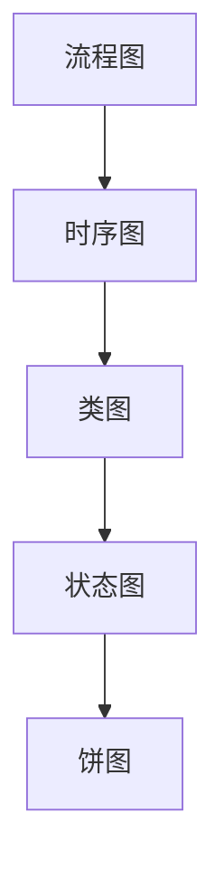

# Tutorial Writer — 📁 内容数据管理员 v1.0.0

> **定位**: 教程内容的数据层管理者
> **核心价值**: 统一的内容组织标准，确保所有格式输出一致
> **角色**: data-layer — 被 web/book 技能消费的数据源

## 技能概述

本子技能负责教程创作体系中的 **内容数据管理** 职责，回答核心问题：**"内容放在哪？什么格式？如何组织？"**

作为 Tutorial Writer v1.0.0 架构中的 **第④号子技能**，content 承担着数据层的核心角色：

```
packages/
├── content/ (数据层) ← 唯一真相源
├── web/     (表示层 A): 消费 content 数据构建网站
└── book/    (表示层 B): 消费 content 数据生成电子书

依赖方向: content ← web, content ← book
```

**关键职责边界**:

| 职责 | 属于 content ✅ | 不属于 content ❌ |
|------|----------------|------------------|
| 文件目录结构定义 | ✅ | |
| 文件命名规范制定 | ✅ | |
| Frontmatter Schema 定义 | ✅ | |
| Content Collections 配置 | ✅ | |
| 内容增强管道配置 | ✅ | |
| **写什么内容** (写作流程) | | ❌ → writing 技能 |
| **怎么写** (文风规范) | | ❌ → writing 技能 |
| **质量检查** (校对审核) | | ❌ → review 技能 |
| **如何构建网站** | | ❌ → web 技能 |
| **如何生成 PDF** | | ❌ → book 技能 |

## 快速启动

## 前置条件

- [ ] 已使用官方工具创建 Monorepo 项目
  - 推荐命令: `bunx create-turbo@latest <project-name>`
  - 或手动创建（详见根路由器 SKILL.md 的 **"🚀 项目初始化"** 章节 Step 0-1）
- [ ] 已添加 content 包:
  `turbo gen workspace --name @repo/content --type package`
  详见根路由器 Step 2
- [ ] `packages/content/src/` 目录存在
- [ ] Node.js >= 18 已安装

> **重要**: 本子技能假设 `packages/content/` 已经存在。
> 如果还没有，请先执行根路由器中的 **Step 0-2**。

### 第一个 Chapter 的 Frontmatter 示例

创建你的第一个章节文件 `packages/content/src/chapters/introduction.md`:

```markdown
---
title: "教程简介"
slug: "introduction"
description: "本教程将带你从零开始掌握 RAG 技术，涵盖原理、实践到生产部署"
draft: false
date: 2026-05-31

tags:
  - "RAG"
  - "向量数据库"
  - "LLM"
difficulty: "beginner"
readingTime: 10
prerequisites:
  - "Python 基础知识"
  - "了解基本的机器学习概念"

hasInteractive: false
hasMermaid: true
hasMath: false
---

# 教程简介

欢迎来到 RAG 实战教程！
```

**字段说明**:

| 字段 | 类型 | 必填 | 说明 |
|------|------|------|------|
| `title` | string | ✅ | 章节标题（中文） |
| `slug` | string | ✅ | URL 友好的标识符（英文） |
| `description` | string | ❌ | 章节描述（用于 SEO 和列表展示） |
| `draft` | boolean | ❌ | 是否为草稿（默认 false） |
| `date` | string | ❌ | 创建日期（ISO 8601 格式） |
| `tags` | string[] | ❌ | 标签列表（用于分类和搜索） |
| `difficulty` | enum | ❌ | 难度等级 |
| `readingTime` | number | ❌ | 预估阅读时间（分钟） |
| `prerequisites` | string[] | ❌ | 前置知识要求 |
| `hasInteractive` | boolean | ❌ | 是否包含交互组件 |
| `hasMermaid` | boolean | ❌ | 是否包含 Mermaid 图表 |
| `hasMath` | boolean | ❌ | 是否包含数学公式 |

---

## 1. 文件组织规范

### 1.1 目录结构约定

content 包采用 **扁平化章节存储** 结构：

```
packages/content/
├── src/
│   ├── chapters/                    ← 🎯 核心目录：所有章节 Markdown 文件
│   │   ├── .gitkeep                 ← 占位文件（保持目录结构）
│   │   ├── introduction.md          ← 第 1 章
│   │   ├── getting-started.md       ← 第 2 章
│   │   ├── core-concepts.md         ← 第 3 章
│   │   └── ...                      ← 更多章节
│   │
│   └── config.ts                    ← ⚙️ Content Collections Schema 定义
│
├── package.json                     ← {"name": "@repo/content"}
├── tsconfig.json                    ← TypeScript 配置
└── README.md                        ← 包说明文档（可选）
```

**设计原则**:

1. **单一职责**: `chapters/` 只存放 `.md` 章节文件
2. **扁平结构**: 不使用子目录嵌套（避免路径复杂度）
3. **显式排序**: 通过 Frontmatter 的 `order` 字段或文件名前缀控制顺序
4. **Git 友好**: 使用 `.gitkeep` 保持空目录在版本控制中

### 1.2 文件命名规则

#### 基本规则：英文 slug + 语义化名称

```
{英文 slug}.md
```

**示例**:

```bash
✅ 正确的命名:
├── introduction.md          # 简介
├── getting-started.md       # 快速开始
├── core-concepts.md         # 核心概念
├── installation-guide.md    # 安装指南
├── api-reference.md         # API 参考
└── troubleshooting.md       # 故障排查

❌ 错误的命名:
├── 第一章.md                # 不能使用中文
├── 01-introduction.md       # 不需要数字前缀（除非有特殊需求）
├── GettingStarted.md        # 不能使用驼峰或 PascalCase
├── intro.md                 # 避免过度缩写
└── my-first-chapter.md      # 避免无意义的名称
```

#### Slug 命名规范

**规则清单**:

1. ✅ 全小写字母
2. ✅ 使用连字符 `-` 分隔单词
3. ✅ 只允许 `[a-z0-9-]` 字符
4. ✅ 语义清晰，见名知意
5. ✅ 长度建议 10-30 个字符
6. ❌ 不以下划线 `_` 开头或结尾
7. ❌ 不使用连续连字符 `--`
8. ❌ 不包含特殊字符

**转换示例**:

| 中文标题 | 推荐 Slug | 不推荐 |
|---------|----------|--------|
| 快速开始 | `getting-started` | `quick-start`, `ks` |
| 安装与配置 | `installation-setup` | `install-config` |
| API 参考文档 | `api-reference` | `api-doc`, `api-ref` |
| 常见问题解答 | `faq` | `common-problems` |
| 高级用法进阶 | `advanced-usage` | `adv-usage`, `pro-tips` |

### 1.3 .gitkeep 策略

**为什么需要 .gitkeep?**

Git 不会跟踪空目录。为了确保 `chapters/` 目录在 clone 后存在，需要占位文件。

**标准做法**:

```bash
# 创建 .gitkeep 文件（内容为空）
touch packages/content/src/chapters/.gitkeep

# 或添加注释说明用途
echo "# Tutorial chapters directory" > packages/content/src/chapters/.gitkeep
```

**Git 配置**:

在 `.gitignore` 中确保不忽略 `.gitkeep`:

```gitignore
# 不忽略 .gitkeep
!.gitkeep
```

### 1.4 多语言支持结构（可选）

如果教程需要支持多语言，推荐使用 **目录分离** 策略：

```
packages/content/src/
├── chapters/
│   ├── en/                    ← 英文版本
│   │   ├── introduction.md
│   │   └── getting-started.md
│   ├── zh/                    ← 中文版本
│   │   ├── introduction.md
│   │   └── getting-started.md
│   └── .gitkeep
└── config.ts                  ← 需要配置多语言 loader
```

**多语言注意事项**:

1. 每个语言的 slug 保持一致（便于对照）
2. Frontmatter 中添加 `lang: "en" | "zh"` 字段
3. Starlight 支持通过 i18n 配置自动处理
4. 默认单语言场景不需要此结构

---

## 2. Frontmatter Schema 定义 ⭐ 核心

### 2.1 Schema 概述

Frontmatter Schema 是内容的 **元数据契约**，定义了每个章节必须和可以包含的字段。本技能使用 **Zod** 进行运行时验证，确保数据一致性。

**完整 Zod Schema** (来自 `packages/content/src/config.ts`):

```typescript
import { defineCollection, z } from 'astro:content';
import { docsLoader, docsSchema } from '@astrojs/starlight/loaders';

const chapters = defineCollection({
  loader: docsLoader(),
  schema: docsSchema({
    schema: z.object({
      // ===== 基础字段 =====
      title: z.string(),
      description: z.string().optional(),
      draft: z.boolean().default(false),

      // ===== 教程扩展字段 =====
      tags: z.array(z.string()).default([]),
      difficulty: z.enum(['beginner', 'intermediate', 'advanced']).optional(),
      readingTime: z.number().optional(),
      prerequisites: z.array(z.string()).default([]),

      // ===== 增强管道支持字段 =====
      hasInteractive: z.boolean().default(false),
      hasMermaid: z.boolean().default(false),
      hasMath: z.boolean().default(false),
    }),
  }),
});

export const collections = { chapters };
```

### 2.2 基础字段详解

#### title (必填)

```yaml
title: "章节标题"
```

- **类型**: `string`
- **必填**: ✅ 是
- **说明**: 章节的显示标题，支持中文
- **用途**: 导航栏、面包屑、页面 `<title>`、SEO
- **最佳实践**: 简洁明了，20 字以内

**示例**:

```yaml
title: "快速开始"              # ✅ 好
title: "如何在 5 分钟内快速开始安装并配置我们的 RAG 系统"  # ❌ 太长
```

#### description (可选)

```yaml
description: "本章将介绍..."
```

- **类型**: `string`
- **必填**: ❌ 否
- **说明**: 章节简短描述
- **用途**: 搜索引擎描述、卡片摘要、列表预览
- **最佳实践**: 100-200 字符，包含关键词

#### draft (可选)

```yaml
draft: true  # 或 false
```

- **类型**: `boolean`
- **默认值**: `false`
- **说明**: 标记为草稿的章节不会出现在生产构建中
- **用途**: 工作进行中的章节、未完成的内容
- **最佳实践**: 开发阶段设为 `true`，完成后改为 `false`

#### date (可选)

```yaml
date: 2026-05-31
```

- **类型**: `string` (ISO 8601)
- **必填**: ❌ 否（但强烈推荐）
- **说明**: 章节创建或最后更新日期
- **用途**: 排序、时间线显示、RSS/Sitemap
- **格式**: `YYYY-MM-DD` 或 `YYYY-MM-DDTHH:mm:ssZ`

### 2.3 教程扩展字段详解

#### tags (可选)

```yaml
tags:
  - "RAG"
  - "向量数据库"
  - "LLM"
  - "实战"
```

- **类型**: `string[]`
- **默认值**: `[]`
- **说明**: 用于分类和搜索的标签
- **用途**: 相关文章推荐、标签云、筛选器
- **最佳实践**: 3-5 个标签，混合技术和业务词汇

**标签规范**:

1. ✅ 使用中文或英文（保持一致性）
2. ✅ 首字母大写（专有名词除外）
3. ❌ 避免过长的标签（< 20 字符）
4. ❌ 避免过于宽泛的标签（如 "教程"、"技术"）

#### difficulty (可选)

```yaml
difficulty: "beginner"  # 或 "intermediate" / "advanced"
```

- **类型**: `enum ('beginner' | 'intermediate' | 'advanced')`
- **必填**: ❌ 否（但强烈推荐）
- **说明**: 章节难度等级
- **用途**: 学习路径规划、难度筛选、进度跟踪

**难度定义**:

| 等级 | 目标读者 | 典型内容 | 前置时间 |
|------|---------|---------|---------|
| `beginner` | 初学者 | 概念介绍、Hello World、基础安装 | 0 小时 |
| `intermediate` | 有经验者 | 实战案例、性能优化、架构设计 | 10-50 小时 |
| `advanced` | 专家级 | 源码分析、底层原理、极限优化 | 100+ 小时 |

#### readingTime (可选)

```yaml
readingTime: 15
```

- **类型**: `number`
- **单位**: 分钟
- **必填**: ❌ 否
- **说明**: 预估阅读时间
- **用途**: 阅读时间显示、学习计划估算

**计算公式** (参考):

```
readingTime = ⌈(中文字数 / 400) + (英文单词数 / 200)⌉
```

**示例**:
- 2000 字中文 ≈ 5 分钟
- 500 个代码块 ≈ +5 分钟
- 10 张图片 ≈ +3 分钟

#### prerequisites (可选)

```yaml
prerequisites:
  - "Python 3.8+ 基础"
  - "了解 HTTP 协议"
  - "有 Docker 使用经验"
```

- **类型**: `string[]`
- **默认值**: `[]`
- **说明**: 学习本章需要的前置知识
- **用途**: 学习路径提示、前置检查、技能树可视化
- **最佳实践**: 2-5 条，具体明确

### 2.4 增强管道支持字段详解

这三个字段用于标记章节是否包含特殊内容，便于 web/book 技能进行相应的增强处理。

#### hasInteractive (可选)

```yaml
hasInteractive: true
```

- **类型**: `boolean`
- **默认值**: `false`
- **说明**: 是否包含交互式组件
- **触发条件**: 章节中使用 `<!-- @interactive: XXX -->` 标记
- **消费者**: web 技能（加载交互组件 JS/CSS）

**交互组件类型**:

| 标记示例 | 组件类型 | 说明 |
|---------|---------|------|
| `<!-- @interactive: code-playground -->` | 代码沙盒 | 可运行的代码编辑器 |
| `<!-- @interactive: quiz -->` | 测验组件 | 选择题/填空题 |
| `<!-- @interactive: interactive-diagram -->` | 交互图解 | 可拖拽/缩放的图表 |
| `<!-- @interactive: step-by-step -->` | 步骤演示 | 分步引导式操作 |

#### hasMermaid (可选)

```yaml
hasMermaid: true
```

- **类型**: `boolean`
- **默认值**: `false`
- **说明**: 是否包含 Mermaid 图表
- **触发条件**: 章节中含有 ```mermaid 代码块
- **消费者**: web 技能（加载 Mermaid 渲染库）、book 技能（预渲染为 SVG/PNG）

**支持的 Mermaid 图表类型**:



#### hasMath (可选)

```yaml
hasMath: true
```

- **类型**: `boolean`
- **默认值`: `false`
- **说明**: 是否包含数学公式
- **触发条件**: 章节中含有 `$...$` 或 `$$...$$` LaTeX 公式
- **消费者**: web 技能（加载 KaTeX/MathJax）

**公式示例**:

行内公式: $E = mc^2$

块级公式:
$$
\sum_{i=1}^{n} x_i = x_1 + x_2 + \cdots + x_n
$$

### 2.5 自定义字段扩展指南

虽然标准 Schema 已经覆盖大部分需求，但某些场景可能需要自定义字段。

#### 扩展方法

**步骤 1**: 在 `config.ts` 的 schema 中添加新字段

```typescript
schema: z.object({
  // ... 标准字段 ...

  // 自定义字段示例
  version: z.string().optional(),           // 章节针对的技术版本
  author: z.string().optional(),            // 作者信息
  lastUpdated: z.date().optional(),         // 最后更新时间
  order: z.number().optional(),             // 显式排序权重
  relatedChapters: z.array(z.string()).default([]),  // 关联章节 slugs
}),
```

**步骤 2**: 在 Frontmatter 中使用

```markdown
---
title: "API 更新日志"
version: "v2.5.0"
author: "张三"
lastUpdated: 2026-05-31
order: 10
relatedChapters:
  - "installation-guide"
  - "migration-guide"
---
```

**步骤 3**: 在模板/组件中访问

```astro
---
const { frontmatter } = Astro.props;
---

<div class="chapter-meta">
  <span>版本: {frontmatter.version}</span>
  <span>作者: {frontmatter.author}</span>
</div>
```

#### 扩展原则

1. ✅ **必要性优先**: 只在确实需要时才扩展
2. ✅ **向后兼容**: 新字段必须有默认值或 optional
3. ✅ **文档同步**: 更新此文档和 references/frontmatter-schema.md
4. ❌ **避免冗余**: 不要添加可通过计算得出的字段
5. ❌ **避免过度设计**: 保持 Schema 简洁

#### 常见扩展场景

| 场景 | 推荐字段名 | 类型 | 说明 |
|------|-----------|------|------|
| 多作者教程 | `authors` | `string[]` | 作者列表 |
| 视频配套 | `videoUrl` | `string` | 视频链接 |
| 代码仓库 | `repoUrl` | `string` | 示例代码地址 |
| 系列教程 | `partOfSeries` | `string` | 所属系列标识 |
| 付费墙 | `isPremium` | `boolean` | 是否为付费内容 |

---

## 3. Content Collections 配置

### 3.1 配置文件位置与作用

**文件路径**: `packages/content/src/config.ts`

这是 Astro Content Collections 的 **核心配置文件**，定义了：
- 如何加载内容（loader）
- 数据结构约束（schema）
- 可导出的集合（collections）

### 3.2 完整配置模板

```typescript
/**
 * @repo Content Collections Configuration
 * @description 定义教程章节的数据结构和验证规则
 * @version 1.0.0
 */

import { defineCollection, z } from 'astro:content';
import { docsLoader, docsSchema } from '@astrojs/starlight/loaders';

/**
 * 章节集合定义
 *
 * 使用 docsLoader() 加载 Markdown 文件
 * 继承 Starlight 的标准字段（title, description 等）
 * 扩展自定义字段以满足教程需求
 */
const chapters = defineCollection({
  loader: docsLoader(),
  schema: docsSchema({
    schema: z.object({
      // 基础字段
      title: z.string({
        required_error: "标题不能为空",
        invalid_type_error: "标题必须是字符串",
      }),
      description: z.string({
        invalid_type_error: "描述必须是字符串",
      }).optional(),
      draft: z.boolean().default(false),

      // 教程扩展字段
      tags: z.array(z.string()).default([]),
      difficulty: z.enum(['beginner', 'intermediate', 'advanced']).optional(),
      readingTime: z.number({
        invalid_type_error: "阅读时间必须是数字",
      }).optional(),
      prerequisites: z.array(z.string()).default([]),

      // 增强管道支持
      hasInteractive: z.boolean().default(false),
      hasMermaid: z.boolean().default(false),
      hasMath: z.boolean().default(false),
    }),
  }),
});

export const collections = { chapters };
```

### 3.3 Zod Schema 验证规则详解

#### 运行时验证行为

Astro 在开发模式和构建时都会执行 Schema 验证：

**开发模式**:
- 启动时验证所有 `.md` 文件的 Frontmatter
- 修改文件后自动重新验证
- 错误信息显示在终端和浏览器 overlay

**构建模式**:
- `astro build` 时严格验证
- 验证失败会中断构建
- 输出详细的错误报告

#### 错误处理示例

**缺少必填字段**:

```bash
Error: Field "title" is required in file: src/chapters/introduction.md
  at Object.parse (zod/lib/types.ts:XXX:XX)
```

**类型错误**:

```bash
Error: Expected string, received number for field "readingTime" in file: src/chapters/core-concepts.md
```

**枚举值错误**:

```bash
Error: Invalid enum value. Expected 'beginner' | 'intermediate' | 'advanced', received 'expert'
```

#### 验证最佳实践

1. ✅ 为所有字段提供清晰的错误消息（如上例）
2. ✅ 设置合理的默认值减少必填字段
3. ✅ 使用 `.optional()` 标记真正可选的字段
4. ✅ 在 CI 中运行 `astro build` 强制验证
5. ❌ 不要在生产环境禁用验证

### 3.4 与 Starlight 的集成点

#### 自动继承的标准字段

使用 `docsSchema()` 包装后，自动获得 Starlight 标准字段：

| 字段 | 来源 | 说明 |
|------|------|------|
| `title` | 标准 + 自定义 | 页面标题 |
| `description` | 标准 + 自定义 | SEO 描述 |
| `draft` | 标准 + 自定义 | 草稿标记 |
| `editUrl` | 标准 | 编辑链接 |
| `head` | 标准 | 自定义 `<head>` 内容 |
| `sidebar` | 标准 | 侧边栏配置 |
| `prev` / `next` | 标准 | 上下页导航 |
| `tableOfContents` | 标准 | 目录生成配置 |
| `template` | 标准 | 页面布局选择 |

**重要**: 我们的自定义字段与标准字段 **合并**，不会冲突。

#### Sidebar 集成

Starlight 会根据 `chapters/` 目录自动生成侧边栏：

```javascript
// apps/tutorial/astro.config.mjs
starlight({
  sidebar: [
    {
      label: '教程',
      autogenerate: {
        directory: 'chapters',
      },
    },
  ],
})
```

**排序控制**:

方式 1: 文件名前缀（不推荐，违反命名规范）
```
01-introduction.md
02-getting-started.md
```

方式 2: Frontmatter 中的 `order` 字段（需扩展 Schema）
```yaml
order: 1
```

方式 3: **推荐**: 在 sidebar 配置中手动指定顺序
```javascript
sidebar: [
  {
    label: '教程',
    items: [
      { label: '简介', link: '/chapters/introduction' },
      { label: '快速开始', link: '/chapters/getting-started' },
    ],
  },
],
```

### 3.5 类型安全导出示例

Astro Content Collections 提供完整的 TypeScript 类型支持：

```typescript
// 获取章节的类型定义
import { getCollection, getEntry } from 'astro:content';

// 类型安全的集合查询
export async function getStaticPaths() {
  const chapters = await getCollection('chapters');

  return chapters.map((chapter) => ({
    params: { slug: chapter.slug },
    props: { chapter },
  }));
}

// chapter 对象具有完整的类型推断
// chapter.data.title -> string
// chapter.data.tags -> string[]
// chapter.data.difficulty -> 'beginner' | 'intermediate' | 'advanced' | undefined
// chapter.data.hasMermaid -> boolean
```

**自定义类型导出** (可选):

如果需要在包外部使用类型：

```typescript
// packages/content/src/types.ts
import { z } from 'astro:content';

export type ChapterFrontmatter = z.infer<typeof chapterSchema>;

export interface ChapterEntry {
  id: string;
  slug: string;
  body: string;
  data: ChapterFrontmatter;
  collection: 'chapters';
}
```

---

## 4. 内容增强管道（可选）

内容增强管道是一套 **可选的** 内容后处理机制，用于在构建时自动增强 Markdown 内容。

### 4.1 Mermaid 预渲染配置

#### 为什么需要预渲染？

Mermaid 图表在服务端渲染（SSR）场景下可能失败，预渲染可确保兼容性。

#### 配置方法

**方案 A: 使用 astro-mermaid 集成** (推荐)

```bash
cd apps/tutorial && bun add astro-mermaid
```

```javascript
// apps/tutorial/astro.config.mjs
import mermaid from 'astro-mermaid';

export default defineConfig({
  integrations: [
    mermaid({
      // 配置项
      theme: 'dark',
      startOnLoad: true,
    }),
  ],
});
```

**方案 B: 构建时预渲染为 SVG** (适合 PDF/静态输出)

```typescript
// scripts/pre-render-mermaid.ts
import { mermaid } from 'mermaid';

async function preRenderMermaid(markdown: string): Promise<string> {
  const mermaidRegex = /```mermaid\n([\s\S]*?)```/g;

  return markdown.replace(mermaidRegex, (match, code) => {
    const { svg } = await mermaid.render(`mermaid-${Date.now()}`, code);
    return svg;
  });
}
```

**方案 C: 条件渲染** (基于 Frontmatter 标记)

```typescript
// 仅当 hasMermaid=true 时加载 Mermaid 库
if (chapter.data.hasMermaid) {
  loadMermaidLibrary();
}
```

### 4.2 组件插槽标记系统

#### 标记语法

在 Markdown 中使用 HTML 注释标记交互组件插入点：

```markdown
<!-- @interactive: {component-type} [{options}] -->

<!-- 示例 -->
<!-- @interactive: code-playground language="python" -->
<!-- @interactive: quiz topic="rag-basics" difficulty="beginner" -->
<!-- @interactive: interactive-diagram type="architecture" width="800" -->
```

#### 支持的组件类型

| 组件类型 | 标记语法 | 说明 | 依赖资源 |
|---------|---------|------|---------|
| 代码沙盒 | `@interactive: code-playground` | 可运行代码编辑器 | Monaco Editor, iframe |
| 测验组件 | `@interactive: quiz` | 选择题/填空题 | 自定义 Quiz 组件 |
| 交互图解 | `@interactive: interactive-diagram` | 可视化图表 | D3.js, Three.js |
| 步骤演示 | `@interactive: step-by-step` | 引导式操作 | 自定义 Stepper 组件 |
| 代码对比 | `@interactive: code-diff` | Diff 展示 | react-diff-viewer |
| 实时预览 | `@interactive: live-preview` | 结果实时预览 | Sandpack |

#### 处理流程

```
Markdown 文件
    ↓
Astro Content Loader 加载
    ↓
正则匹配 <!-- @interactive: XXX --> 标记
    ↓
替换为 Astro 组件 <InteractiveComponent />
    ↓
构建时注入对应的 JS/CSS 资源
    ↓
最终输出 HTML
```

#### 实现示例

```astro
---
// apps/tutorial/src/components/InteractiveSlot.astro
interface Props {
  type: string;
  options?: Record<string, string>;
}

const { type, options = {} } = Astro.props;

// 动态导入对应组件
const componentMap = {
  'code-playground': () => import('./CodePlayground.astro'),
  'quiz': () => import('./Quiz.astro'),
  'interactive-diagram': () => import('./InteractiveDiagram.astro'),
};

const Component = componentMap[type];
---

{Component ? (
  <Component client:load options={options} />
) : (
  <div class="error">Unknown interactive component: {type}</div>
)}
```

### 4.3 自动化增强脚本框架

#### 脚本位置

```
scripts/
├── enhance-content.mjs          ← 主脚本入口
├── processors/
│   ├── mermaid-renderer.mjs     ← Mermaid 处理器
│   ├── math-renderer.mjs        ← 数学公式处理器
│   ├── link-checker.mjs         ← 链接检查器
│   └── image-optimizer.mjs      ← 图片优化器
└── utils/
    ├── markdown-parser.mjs      ← Markdown 解析工具
    └── frontmatter-validator.mjs ← Frontmatter 验证工具
```

#### 主脚本框架

```javascript
#!/usr/bin/env node
// scripts/enhance-content.mjs

import fs from 'fs/promises';
import path from 'path';
import { glob } from 'fs/promises';

const CHAPTERS_DIR = 'packages/content/src/chapters';

async function enhanceContent() {
  console.log('🚀 开始内容增强...\n');

  const files = await glob('**/*.md', { cwd: CHAPTERS_DIR });

  for (const file of files) {
    const filePath = path.join(CHAPTERS_DIR, file);
    const content = await fs.readFile(filePath, 'utf-8');

    console.log(`📝 处理: ${file}`);

    let enhanced = content;

    // 根据 Frontmatter 决定应用哪些增强
    if (content.includes('hasMermaid: true')) {
      enhanced = await processMermaid(enhanced);
    }

    if (content.includes('hasMath: true')) {
      enhanced = await processMath(enhanced);
    }

    if (content.includes('hasInteractive: true')) {
      enhanced = await processInteractive(enhanced);
    }

    await fs.writeFile(filePath, enhanced);
  }

  console.log('\n✅ 内容增强完成!');
}

enhanceContent().catch(console.error);
```

### 4.4 构建时钩子集成

#### Astro 集成钩子

```typescript
// apps/tutorial/src/enhance-plugin.ts
import type { AstroIntegration } from 'astro';

export function createEnhancePlugin(): AstroIntegration {
  return {
    name: 'content-enhancer',
    hooks: {
      'astro:build:start': async ({ logger }) => {
        logger.info('开始内容增强预处理...');
        await runEnhancementPipeline();
      },
      'astro:build:done': async ({ logger }) => {
        logger.info('内容增强完成');
      },
    },
  };
}
```

#### Turborepo 任务集成

```json
{
  "$schema": "https://turbo.build/schema.json",
  "tasks": {
    "enhance": {
      "cache": false,
      "dependsOn": []
    },
    "build:web": {
      "cache": false,
      "dependsOn": ["@repo/content#build", "enhance"]
    }
  }
}
```

**使用方式**:

```bash
# 先增强内容，再构建（需在 turbo.json 中定义 enhance 任务）
bunx turbo run enhance build:web
```

---

## 5. 内容质量工具

### 5.1 Frontmatter 验证脚本

#### 目的

在提交前或 CI 中自动验证所有章节的 Frontmatter 符合 Schema。

#### 脚本实现思路

```javascript
// scripts/validate-frontmatter.mjs
import { readFileSync, readdirSync } from 'fs';
import { join } from 'path';
import yaml from 'yaml';
import { z } from 'zod';

const chapterSchema = z.object({
  title: z.string(),
  description: z.string().optional(),
  draft: z.boolean().default(false),
  tags: z.array(z.string()).default([]),
  difficulty: z.enum(['beginner', 'intermediate', 'advanced']).optional(),
  readingTime: z.number().optional(),
  prerequisites: z.array(z.string()).default([]),
  hasInteractive: z.boolean().default(false),
  hasMermaid: z.boolean().default(false),
  hasMath: z.boolean().default(false),
});

function validateFile(filePath) {
  const content = readFileSync(filePath, 'utf-8');
  const frontmatterMatch = content.match(/^---\n([\s\S]*?)\n---/);

  if (!frontmatterMatch) {
    throw new Error(`Missing frontmatter in ${filePath}`);
  }

  const frontmatter = yaml.parse(frontmatterMatch[1]);
  return chapterSchema.parse(frontmatter);
}

function main() {
  const chaptersDir = 'packages/content/src/chapters';
  const files = readdirSync(chaptersDir).filter(f => f.endsWith('.md'));

  let errors = 0;

  for (const file of files) {
    try {
      validateFile(join(chaptersDir, file));
      console.log(`✅ ${file}`);
    } catch (error) {
      console.error(`❌ ${file}: ${error.message}`);
      errors++;
    }
  }

  process.exit(errors > 0 ? 1 : 0);
}

main();
```

#### 使用方式

```bash
# 手动执行
node scripts/validate-frontmatter.mjs

# npm script
npm run validate:frontmatter

# Git hook (husky)
npx husky add .pre-commit "npm run validate:frontmatter"
```

### 5.2 断链检测方法

#### 内部链接检测

检测 Markdown 中指向其他章节的链接是否有效：

```javascript
// scripts/check-links.mjs
import { glob } from 'fs/promises';

async function checkInternalLinks() {
  const files = await glob('packages/content/src/chapters/**/*.md');
  const validSlugs = new Set(
    files.map(f => f.replace(/\.md$/, '').split('/').pop())
  );

  const linkRegex = /\]\(\/chapters\/([^)]+)\)/g;

  for (const file of files) {
    const content = await readFile(file, 'utf-8');
    let match;

    while ((match = linkRegex.exec(content)) !== null) {
      const targetSlug = match[1].replace(/\/$/, '');

      if (!validSlugs.has(targetSlug)) {
        console.warn(`⚠️ 断链: ${file} → /chapters/${targetSlug}`);
      }
    }
  }
}
```

#### 外部链接检测 (可选)

使用 [broken-link-checker](https://github.com/stevenvachon/broken-link-checker) 等工具：

```bash
npm install -D broken-link-checker

blc https://your-tutorial.com -ro
```

### 5.3 图片路径检查

#### 检查规则

1. 所有相对路径图片引用必须指向存在的文件
2. 不允许使用绝对路径（除 CDN 外）
3. 图片格式限制：PNG, JPG, JPEG, GIF, WebP, SVG

#### 实现思路

```javascript
// scripts/check-images.mjs
import { existsSync } from 'fs';
import { join, dirname } from 'path';

const imageRegex = /!\[([^\]]*)\]\(([^)]+)\)/g;
const allowedFormats = ['.png', '.jpg', '.jpeg', '.gif', '.webp', '.svg'];

function validateImagePath(imagePath, sourceFile) {
  if (imagePath.startsWith('http')) return true; // CDN 图片

  const absolutePath = join(dirname(sourceFile), imagePath);

  if (!existsSync(absolutePath)) {
    throw new Error(`Image not found: ${imagePath}`);
  }

  const ext = imagePath.toLowerCase();
  if (!allowedFormats.some(fmt => ext.endsWith(fmt))) {
    throw new Error(`Unsupported format: ${ext}`);
  }

  return true;
}
```

### 5.4 内容统计工具

#### 统计指标

| 指标 | 计算方法 | 用途 |
|------|---------|------|
| 总章节数 | `chapters/*.md` 文件数 | 进度追踪 |
| 总字数 | 所有文件字数之和 | 工作量评估 |
| 平均阅读时间 | ΣreadingTime / 章节数 | 课程时长估计 |
| 草稿章节数 | `draft: true` 的数量 | 发布准备度 |
| 含交互组件章节数 | `hasInteractive: true` 数量 | 丰富度评估 |
| 含 Mermaid 章节数 | `hasMermaid: true` 数量 | 可视化程度 |
| 标签覆盖率 | 有 tags 的章节占比 | 元数据完整性 |

#### 实现示例

```javascript
// scripts/content-stats.mjs
import { glob } from 'fs/promises';
import { readFileSync } from 'fs';
import yaml from 'yaml';

async function generateStats() {
  const files = await glob('packages/content/src/chapters/**/*.md');

  let totalWords = 0;
  let totalReadingTime = 0;
  let draftCount = 0;
  let interactiveCount = 0;
  let mermaidCount = 0;
  let withTagsCount = 0;

  for (const file of files) {
    const content = readFileSync(file, 'utf-8');
    const frontmatter = extractFrontmatter(content);

    totalWords += countWords(content);
    totalReadingTime += frontmatter.readingTime || 0;

    if (frontmatter.draft) draftCount++;
    if (frontmatter.hasInteractive) interactiveCount++;
    if (frontmatter.hasMermaid) mermaidCount++;
    if (frontmatter.tags?.length > 0) withTagsCount++;
  }

  const stats = {
    totalChapters: files.length,
    totalWords,
    avgReadingTime: Math.round(totalReadingTime / files.length),
    draftCount,
    draftPercentage: Math.round((draftCount / files.length) * 100),
    interactiveCount,
    mermaidCount,
    tagsCoverage: Math.round((withTagsCount / files.length) * 100),
  };

  console.table(stats);
  return stats;
}
```

**输出示例**:

```
┌─────────────────────┬─────────┐
│ 指标                │ 值      │
├─────────────────────┼─────────┤
│ totalChapters       │ 12      │
│ totalWords          │ 45680   │
│ avgReadingTime      │ 15      │
│ draftCount          │ 3       │
│ draftPercentage     │ 25      │
│ interactiveCount    │ 5       │
│ mermaidCount        │ 8       │
│ tagsCoverage        │ 92      │
└─────────────────────┴─────────┘
```

---

## 6. 与其他子技能的关系 ⭐ 重要

### 6.1 角色：被依赖的数据层

content 技能在 Tutorial Writer 架构中扮演 **数据提供者** 的角色：

```
┌─────────────────────────────────────────────────────┐
│                   Tutorial Writer v1.0.0            │
│                                                     │
│  ┌──────────┐                                       │
│  │ research │ ──→ 规划章节结构                       │
│  └──────────┘         ↓                             │
│              ┌─────────────────┐                    │
│              │   writing ✍️   │ ← 写什么（内容创作）  │
│              └────────┬────────┘                    │
│                       ↓                             │
│  ════════════════════════════════════════           │
│  ║           content 📁 (我)         ║ ← 怎么存      │
│  ║   • 文件组织                           ║           │
│  ║   • Schema 定义                       ║           │
│  ║   • 命名规范                           ║           │
│  ═════════════════════╤═════════════════           │
│                       ↓                             │
│         ┌─────────────┴─────────────┐               │
│         ↓                           ↓               │
│  ┌──────────┐                ┌──────────┐          │
│  │ web 🌐   │                │ book 📚  │          │
│  │ (消费方) │                │ (消费方) │          │
│  └──────────┘                └──────────┘          │
│                                                     │
│  ┌──────────┐                ┌──────────┐          │
│  │ review ✓ │                │ github-  │          │
│  │ (质检方) │                │ pages 🚀 │          │
│  └──────────┘                └──────────┘          │
└─────────────────────────────────────────────────────┘
```

### 6.2 与 writing 的协作边界 ⭐ 关键

这是最容易混淆的地方，必须清晰界定：

#### writing 负责（写什么）

| writing 的职责 | 示例 |
|---------------|------|
| ✅ 写作流程管理 | 草稿 → 初稿 → 审稿 → 定稿 |
| ✅ 语言表达规范 | 中文技术写作风格、术语统一 |
| ✅ 代码示例编写 | 代码块内容、注释规范 |
| ✅ 图表使用指导 | 截图规范、Mermaid 语法 |
| ✅ 内容质量控制 | 逻辑性、准确性、完整性 |

#### content 负责（怎么存）

| content 的职责 | 示例 |
|----------------|------|
| ✅ 文件存放位置 | `packages/content/src/chapters/` |
| ✅ 文件命名规则 | `getting-started.md` |
| ✅ Frontmatter 结构 | Schema 字段定义和验证 |
| ✅ 数据格式约定 | YAML 格式、日期格式 |
| ✅ 目录组织策略 | 扁平结构 vs 嵌套结构 |

#### 协作流程示例

```
① research 规划出章节列表
    ↓
② writing 开始撰写第一章
    │
    ├─ writing 问："这一章叫什么名字？"
    │  content 答："用 slug: getting-started，title: 快速开始"
    │
    ├─ writing 问："需要哪些元数据？"
    │  content 答："按 Schema 填写：tags, difficulty, readingTime..."
    │
    ├─ writing 完成初稿，保存到：
    │  content 指定的位置：packages/content/src/chapters/getting-started.md
    │
    └─ content 验证文件的 Frontmatter 符合 Schema ✅
         ↓
③ review 检查内容质量和元数据完整性
    ↓
④ web 读取 content 数据，构建网站
```

**关键原则**:
- **writing 关注内容本身**（文字、逻辑、表达）
- **content 关注数据容器**（文件、格式、结构）
- **两者互补但不重叠**

### 6.3 与 review 的数据接口

review 技能需要检查的内容维度：

#### review 从 content 获取的信息

| 检查项 | 数据来源 | content 提供的支持 |
|-------|---------|-------------------|
| Schema 合规性 | Frontmatter | Zod 验证规则 |
| 文件命名规范性 | 文件名 | naming-conventions.md |
| 必填字段完整性 | Frontmatter | Schema 定义 |
| 字段值有效性 | Frontmatter | 枚举范围、类型约束 |
| 目录结构正确性 | 文件系统 | 组织规范文档 |

#### content 为 review 提供的工具

1. **validate-frontmatter.mjs**: 自动化验证脚本
2. **check-links.mjs**: 断链检测
3. **check-images.mjs**: 图片路径检查
4. **content-stats.mjs**: 内容统计报告

**review 可以直接调用这些工具**，无需重复实现。

### 6.4 被 web 和 book 依赖的方式

#### web 技能如何使用 content

```javascript
// apps/tutorial/astro.config.mjs
import { defineConfig } from 'astro/config';
import starlight from '@astrojs/starlight';

export default defineConfig({
  integrations: [
    starlight({
      // 直接引用 content 包的章节
      contentDir: '../../packages/content',
      
      sidebar: [{
        label: '教程',
        autogenerate: { directory: 'chapters' },
      }],
    }),
  ],
});
```

**依赖关系** (package.json):
```json
{
  "dependencies": {
    "@repo/content": "workspace:*"
  }
}
```

#### book 技能如何使用 content

```bash
# packages/book/scripts/generate-pdf.sh

CONTENT_DIR="../../content/src/chapters"
OUTPUT_DIR="./dist"

# 遍历所有章节 Markdown
for chapter in "$CONTENT_DIR"/*.md; do
  # 使用 Pandoc 转换每个章节
  pandoc "$chapter" \
    --from markdown \
    --to pdf \
    --output "$OUTPUT_DIR/$(basename "$chapter" .md).pdf"
done
```

**依赖关系** (package.json):
```json
{
  "dependencies": {
    "@repo/content": "workspace:*"
  }
}
```

### 6.5 依赖方向约束 ⭐ 禁止事项

**绝对禁止的反向依赖**:

```text
❌ content 不应该：
   - 导入 web 的组件
   - 依赖 book 的 Pandoc 配置
   - 引用 github-pages 的部署设置
   
❌ web 不应该：
   - 定义新的 Frontmatter 字段
   - 修改 content 的文件命名规则
   - 绕过 Schema 直接读取文件

✅ 正确的做法：
   - content 定义标准，web/book 遵守
   - 需要新字段 → 向 content 提交请求
   - 发现 Schema 问题 → 修复 config.ts
```

---

## 7. 常见问题

### Q1: 为什么需要单独的 content 子技能？

**A**: 在旧架构（v6.x）中，内容管理逻辑分散在 writing 和 build 中：
- writing 混合了"怎么写"和"文件怎么命名"
- build 混合了"项目初始化"和"Schema 定义"

这导致：
1. 职责不清，不知道去哪里找规范
2. 重复定义，两处规范可能不一致
3. Monorepo 下无法统一管理数据层

新架构将所有 **数据相关职责** 集中到 content，实现单一数据源。

### Q2: 可以自定义 Frontmatter 字段吗？

**A**: 可以！参见 [2.5 自定义字段扩展指南](#25-自定义字段扩展指南)。但需遵循：
1. 在 `config.ts` 中更新 Schema
2. 提供合理的默认值
3. 同步更新文档

**注意**: 尽量使用标准字段，避免过度定制。

### Q3: 文件命名必须用英文吗？

**A**: 是的。原因：
1. URL 友好（避免编码问题）
2. Git 友好（避免大小写问题）
3. 跨平台兼容（Windows/Linux/Mac 一致）
4. SEO 优化（URL 可读性）

中文标题通过 Frontmatter 的 `title` 字段显示。

### Q4: 如何处理章节顺序？

**A**: 推荐三种方式（按优先级）：

1. **Sidebar 配置** (最灵活)
   ```javascript
   sidebar: [{ items: [
     { label: '简介', link: '/chapters/introduction' },
     { label: '开始', link: '/chapters/getting-started' },
   ]}]
   ```

2. **Frontmatter order 字段** (需扩展 Schema)
   ```yaml
   order: 1
   ```

3. **文件名前缀** (不推荐，违反命名规范)
   ```
   01-introduction.md  # ❌ 避免
   ```

### Q5: draft 章节会被构建吗？

**A**: 取决于配置：

- **Starlight 默认**: `draft: true` 的章节不会出现在生产构建
- **开发模式**: 可以通过 URL 直接访问（`?draft=1`）
- **CI/CD**: 可通过环境变量控制是否包含草稿

**推荐工作流**:
```yaml
# 编写中
draft: true

# 完成审稿后
draft: false
```

### Q6: 如何迁移旧的教程项目到新结构？

**A**: 迁移步骤：

1. 创建新 Monorepo 项目 (使用 `create-turbo` 官方工具，详见根路由器"🚀 项目初始化"章节)
2. 将旧 `.md` 文件移动到 `packages/content/src/chapters/`
3. 重命名文件符合命名规范
4. 补全 Frontmatter 字段
5. 运行验证脚本 (`validate-frontmatter.mjs`)
6. 调整 web/book 配置引用新路径

**自动化迁移脚本** (未来提供):
```bash
./scripts/migrate-from-v6.sh /path/to/old-project
```

### Q7: content 技能可以独立使用吗？

**A**: 可以！content 设计为 **standalone** 模式：
- 不依赖 web/book 即可工作
- 可用于任何 Astro Content Collections 项目
- Schema 和规范可复用到非教程项目

**独立使用场景**:
- 博客系统的内容管理
- 文档站点的结构定义
- 任何需要 Frontmatter Schema 的项目

### Q8: 增强管道是必须的吗？

**A**: 不是。增强管道是 **可选的高级功能**：

- **基础使用**: 只需定义 Schema 和文件规范即可
- **增强功能**: 按需启用 Mermaid/数学公式/交互组件
- **渐进采用**: 先用基础功能，后续再开启增强

**建议**: 
- 初期项目：关闭所有增强（`hasXxx: false`）
- 成熟项目：按需开启特定增强

### Q9: 如何处理多作者协作时的内容冲突？

**A**: 推荐策略：

1. **文件级隔离**: 不同作者负责不同章节文件
2. **Schema 保护**: Frontmatter 验证防止格式错误
3. **CI 门禁**: 提交时自动运行验证脚本
4. **Code Review**: PR 时检查内容和元数据

**Git 工作流**:
```bash
# 作者 A 负责第 1-3 章
git checkout -b feature/chapters-1-3

# 作者 B 负责第 4-6 章
git checkout -b feature/chapters-4-6

# 合并时几乎无冲突（不同文件）
```

### Q10: 内容统计数据的用途是什么？

**A**: 多方面价值：

1. **项目管理**
   - 追踪写作进度（总章节数、完成率）
   - 评估工作量（总字数、平均阅读时间）

2. **质量监控**
   - 草稿比例过高 → 需要加快审稿
   - 标签覆盖率低 → 需要补充元数据
   - 交互组件少 → 考虑增加互动元素

3. **读者体验**
   - 显示预估阅读时间
   - 推荐相关章节（基于 tags）
   - 个性化学习路径（基于 difficulty/prerequisites）

---

## 8. 版本历史

### v1.0.0 (2026-05-31) — 初始版本

**重大变更**:
- 🆕 全新子技能，作为 Tutorial Writer v1.0.0 (Monorepo Edition) 的一部分
- 🆕 从 writing/build 中提取内容管理职责
- 🆕 定义统一的 Frontmatter Schema（基于 Zod）
- 🆕 建立文件组织和命名规范
- 🆕 设计内容增强管道架构
- 🆕 提供内容质量工具集

**核心特性**:
- ✅ 完整的 Content Collections 配置
- ✅ 13 个标准 Frontmatter 字段
- ✅ 与 Starlight 深度集成
- ✅ 支持 Mermaid/数学公式/交互组件增强
- ✅ 自动化验证和统计工具
- ✅ 清晰的技能边界定义

**架构定位**:
- 角色: data-layer（数据层）
- 被消费方: web, book
- 协作方: writing, review
- 依赖: init 脚本（Phase 0 产出）

**文档结构**:
- SKILL.md: ~750 行主文档
- references/naming-conventions.md: 命名规范详解
- references/frontmatter-schema.md: Schema 完整参考
- references/enhancement-pipeline.md: 增强管道技术细节
- references/quality-tools.md: 质量工具使用指南

**已知限制**:
- 当前仅支持单语言（多语言结构已预留）
- 增强管道部分功能需要额外配置
- 自定义字段扩展需要手动更新 Schema

**后续计划**:
- [ ] v1.1.0: 多语言支持完善
- [ ] v1.2.0: 增强管道 CLI 工具
- [ ] v1.3.0: 迁移辅助脚本
- [ ] v2.0.0: 内容版本控制和变更追踪

---

## 附录

### A. 快速参考卡

```
┌─────────────────────────────────────────────────────┐
│           Content Skill 快速参考卡                   │
├─────────────────────────────────────────────────────┤
│                                                     │
│ 📁 目录: packages/content/src/chapters/             │
│                                                     │
│ 📝 命名: {english-slug}.md                          │
│                                                     │
│ ⚙️ 配置: packages/content/src/config.ts             │
│                                                     │
│ 🔧 核心字段:                                         │
│   • title (必填)                                    │
│   • tags, difficulty, readingTime (推荐)             │
│   • hasInteractive, hasMermaid, hasMath (按需)       │
│                                                     │
│ 🛠️ 工具:                                             │
│   • validate-frontmatter.mjs                         │
│   • check-links.mjs                                 │
│   • content-stats.mjs                               │
│                                                     │
│ 🤝 协作:                                             │
│   • writing → 写什么                                │
│   • content → 怎么存（我）                          │
│   • web/book → 消费我的数据                         │
│   • review → 检查我的数据                           │
│                                                     │
└─────────────────────────────────────────────────────┘
```

### B. 文件清单

本技能产出的文件：

```
skills/tutorial-writer-content/
├── SKILL.md                              # 本文档 (~750 行)
└── references/
    ├── naming-conventions.md             # 命名规范详解
    ├── frontmatter-schema.md             # Schema 字段完整定义
    ├── enhancement-pipeline.md           # 增强管道技术细节
    └── quality-tools.md                  # 质量工具使用指南
```

### C. 触发词列表

当遇到以下关键词时，应调用本技能：

**中文触发词**:
- "内容结构"
- "文件组织"
- "命名规范"
- "Frontmatter"
- "Schema"
- "章节目录"
- "内容配置"
- "数据模型"
- "元数据"
- "Content Collections"

**英文触发词**:
- "content structure"
- "file organization"
- "naming conventions"
- "frontmatter"
- "schema definition"
- "chapters directory"
- "content collections"
- "metadata"
- "data model"

**上下文触发**:
- 讨论如何存放教程文件
- 定义章节的属性字段
- 配置 Astro Content Collections
- 设置文件命名规则
- 验证内容数据格式
- 管理教程的元数据

### D. 相关资源

**内部资源**:
- [Tutorial Writer README](../../../.trae/tutorial-writer-rebuild/README.md) — 架构总览
- [ROADMAP](../../../.trae/tutorial-writer-rebuild/ROADMAP.md) — 实施路线图
- [writing 技能](../tutorial-writer-writing/SKILL.md) — 协作伙伴
- [review 技能](../tutorial-writer-review/SKILL.md) — 质量检查方
- [web 技能](../tutorial-writer-web/SKILL.md) — 数据消费方
- [book 技能](../tutorial-writer-book/SKILL.md) — 数据消费方

**外部资源**:
- [Astro Content Collections](https://docs.astro.io/en/guides/content-collections/) — 官方文档
- [Zod Schema 验证](https://zod.dev/) — 验证库文档
- [Starlight Docs](https://starlight.astro.build/) — 文档框架
- [Turborepo](https://turbo.build/) — Monorepo 工具链

---

**最后更新**: 2026-05-31 | **维护者**: skill-factory | **版本**: v1.0.0
