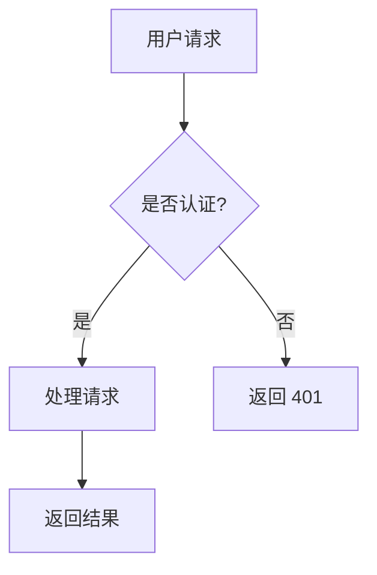
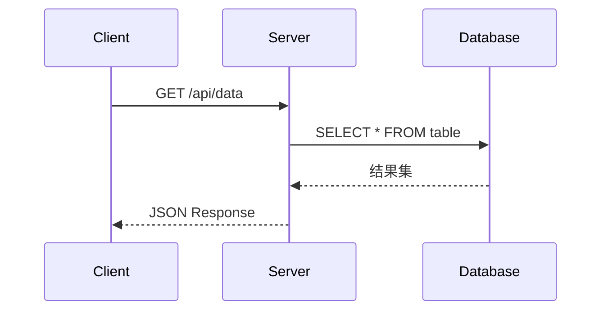
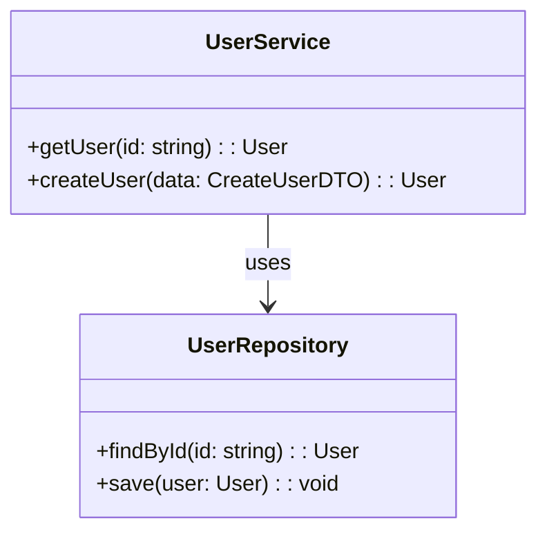

# 内容增强管道技术细节

> **版本**: v1.0.0 | **最后更新**: 2026-05-31
> **所属技能**: tutorial-writer-content | **角色**: data-layer

## 1. 增强管道概述

内容增强管道是一套 **可选的** 后处理机制，用于在构建时自动增强 Markdown 内容，添加交互能力、可视化效果和富媒体支持。

### 1.1 设计哲学

```
Markdown 原始内容
       ↓
  [增强管道处理]
       ↓
  丰富多样的最终输出
```

**核心理念**:
- **渐进增强**: 基础内容始终可用，增强按需加载
- **声明式标记**: 在 Markdown 中声明需要什么增强
- **构建时优化**: 预处理减少运行时开销
- **多格式适配**: 同一内容源适配 web/book 等不同输出

### 1.2 管道架构

```
┌─────────────────────────────────────────────┐
│              输入层 (Input)                  │
│  packages/content/src/chapters/*.md          │
└──────────────────┬──────────────────────────┘
                   ↓
┌─────────────────────────────────────────────┐
│           解析层 (Parsing)                   │
│  • YAML Frontmatter 提取                     │
│  • Markdown AST 分析                         │
│  • 增强标记检测                              │
└──────────────────┬──────────────────────────┘
                   ↓
┌─────────────────────────────────────────────┐
│          处理层 (Processors)                 │
│                                             │
│  ┌─────────────┐ ┌─────────────┐           │
│  │ Mermaid 处理器│ │ Math 处理器 │           │
│  └─────────────┘ └─────────────┘           │
│  ┌─────────────┐ ┌─────────────┐           │
│  │ 交互组件处理器│ │ 链接检查器  │           │
│  └─────────────┘ └─────────────┘           │
│  ┌─────────────┐ ┌─────────────┐           │
│  │ 图片优化器   │ │ 元数据增强  │           │
│  └─────────────┘ └─────────────┘           │
└──────────────────┬──────────────────────────┘
                   ↓
┌─────────────────────────────────────────────┐
│           输出层 (Output)                    │
│                                             │
│  → Web: HTML + JS/CSS (客户端渲染)          │
│  → Book: PDF/EPUB (预渲染静态资源)           │
│  → API: JSON (结构化数据)                    │
└─────────────────────────────────────────────┘
```

## 2. Mermaid 图表增强

### 2.1 为什么需要 Mermaid 支持？

Mermaid 是一种基于文本的图表绘制语言，非常适合技术文档：

**优势**:
- ✅ 纯文本，版本控制友好
- ✅ 语法简单，学习曲线低
- ✅ 支持多种图表类型
- ✅ 可转换为 SVG/PNG（适合离线）

**劣势**:
- ❌ 客户端渲染需要 JS 库 (~500KB)
- ❌ SSR 场景可能有兼容性问题
- ❌ 复杂图表性能较差

### 2.2 支持的图表类型

#### 流程图 (Flowchart)



**适用场景**:
- 业务流程说明
- 算法步骤展示
- 决策逻辑图解

#### 时序图 (Sequence Diagram)



**适用场景**:
- API 交互流程
- 请求生命周期
- 微服务通信

#### 类图 (Class Diagram)



**适用场景**:
- 代码架构说明
- 类关系展示
- 数据模型定义

### 2.3 渲染方案对比

| 方案 | 适用场景 | 优点 | 缺点 |
|------|---------|------|------|
| **方案 A: 客户端渲染** | Web 站点 | 动态、交互式 | 需要 JS、首屏慢 |
| **方案 B: 构建时预渲染** | PDF/电子书 | 无依赖、快速 | 静态、不可交互 |
| **方案 C: 条件加载** | 混合场景 | 按需加载、灵活 | 实现复杂度高 |

#### 方案 A: astro-mermaid 集成 (Web 推荐)

**安装**:
```bash
pnpm add astro-mermaid
```

**配置**:
```javascript
// packages/web/astro.config.mjs
import mermaid from 'astro-mermaid';

export default defineConfig({
  integrations: [
    mermaid({
      theme: 'dark',           // 主题: default/dark/neutral
      startOnLoad: true,       // 页面加载时自动渲染
      mermaidConfig: {
        themeVariables: {
          primaryColor: '#ff6b6b',
          edgeLabelBackground:'#fff',
        },
        flowchart: {
          useMaxWidth: true,
          htmlLabels: true,
          curve: 'basis',
        },
      },
    }),
  ],
});
```

**使用方式**:

在 Markdown 中正常书写 Mermaid 代码块即可自动渲染。

#### 方案 B: 构建时预渲染 (Book/PDF 推荐)

**脚本实现**:

```typescript
// scripts/pre-render-mermaid.ts
import { mermaid } from 'mermaid';
import fs from 'fs/promises';

async function preRenderMermaidInFile(filePath: string) {
  const content = await fs.readFile(filePath, 'utf-8');
  const mermaidRegex = /```mermaid\n([\s\S]*?)```/g;

  let match;
  let result = content;

  while ((match = mermaidRegex.exec(content)) !== null) {
    const [fullMatch, mermaidCode] = match;
    const id = `mermaid-${Date.now()}-${Math.random().toString(36).substr(2, 9)}`;
    
    try {
      const { svg } = await mermaid.render(id, mermaidCode.trim());
      result = result.replace(fullMatch, svg);
    } catch (error) {
      console.error(`Mermaid render error in ${filePath}:`, error.message);
      // 保留原始代码块作为降级方案
    }
  }

  await fs.writeFile(filePath, result);
}
```

**调用方式**:

```bash
node scripts/pre-render-mermaid.ts packages/content/src/chapters/*.md
```

#### 方案 C: 基于 Frontmatter 的条件加载

```astro
---
// packages/web/src/layouts/ChapterLayout.astro
const { chapter } = Astro.props;
---

<html>
  <head>
    <!-- 仅当需要时才加载 Mermaid -->
    {chapter.data.hasMermaid && (
      <>
        <script src="https://cdn.jsdelivr.net/npm/mermaid/dist/mermaid.min.js"></script>
        <script is:inline>
          mermaid.initialize({ startOnLoad: true });
        </script>
      </>
    )}
  </head>
  <!-- ... -->
</html>
```

**优势**: 减少不必要的资源加载，提升首屏性能

### 2.4 Mermaid 配置优化

#### 主题定制

```javascript
mermaidConfig: {
  theme: 'dark',
  themeVariables: {
    // 颜色定制
    primaryColor: '#6b5ce7',
    primaryTextColor: '#fff',
    primaryBorderColor: '#4c3bc9',
    lineColor: '#333',
    secondaryColor: '#f8f9fa',
    tertiaryColor: '#e9ecef',
    
    // 字体
    fontSize: '16px',
    fontFamily: '"Inter", sans-serif',
  },
  
  // 流程图配置
  flowchart: {
    useMaxWidth: true,
    htmlLabels: true,
    curve: 'basis',  // linear/basis/natural/stepAfter/stepBefore
    padding: 15,
    diagramPadding: 8,
    nodeSpacing: 50,
    rankSpacing: 50,
  },
  
  // 时序图配置
  sequence: {
    useMaxWidth: true,
    wrap: true,
    width: 150,
    marginMax: 50,
    boxMargin: 10,
  },
}
```

#### 安全配置

```javascript
mermaidConfig: {
  // 禁止潜在危险的功能
  securityLevel: 'loose',  // loose | strict | antiscript
  
  // 严格模式下限制的功能
  strict: {
    allowArrow: true,
  },
}
```

**注意**: 生产环境建议使用 `securityLevel: 'antiscript'`

## 3. 交互式组件系统

### 3.1 组件插槽标记语法

在 Markdown 中使用 HTML 注释声明交互组件插入点：

```markdown
<!-- @interactive: {component-type} [{key}="{value}" ...] -->
```

**语法组成**:

```
<!-- @interactive : component-type [options] -->
    ↑            ↑              ↑
    |            |              └── 可选参数（键值对）
    |            └── 组件类型标识
    └── 固定前缀标记
```

### 3.2 支持的组件类型

#### 代码沙盒 (Code Playground)

```markdown
<!-- @interactive: code-playground language="python" height="400px" -->
```

**功能特性**:
- 语法高亮
- 实时代码执行（WebAssembly 或 iframe）
- 输出结果展示
- 代码分享按钮

**依赖资源**:
- Monaco Editor (~2MB) 或 CodeMirror (~500KB)
- Sandpack 或 WebContainer API

**实现示例**:

```astro
---
// CodePlayground.astro
interface Props {
  language?: string;
  height?: string;
  code?: string;  // 紧跟在标记后的代码块
}

const { language = 'python', height = '400px' } = Astro.props;
---

<div class="code-playground" style={`height: ${height}`}>
  <div id="editor" data-language={language}></div>
  <div id="output"></div>
  <button id="run">▶ 运行</button>
</div>

<script>
  // 初始化代码编辑器
  // ... Monaco Editor 或 CodeMirror 配置
</script>
```

#### 测验组件 (Quiz)

```markdown
<!-- @interactive: quiz topic="rag-basics" difficulty="beginning" questions="5" -->
```

**题型支持**:
- 单选题 (Multiple Choice)
- 多选题 (Multiple Select)
- 填空题 (Fill in the Blank)
- 判断题 (True/False)
- 代码补全 (Code Completion)

**数据格式**:

```json
{
  "topic": "rag-basics",
  "questions": [
    {
      "type": "multiple-choice",
      "question": "RAG 代表什么？",
      "options": [
        "Retrieval-Augmented Generation",
        "Real-time Analytics Generator",
        "Recursive Aggregation Graph"
      ],
      "correct": 0,
      "explanation": "RAG 是 Retrieval-Augmented Generation 的缩写..."
    }
  ]
}
```

#### 交互图解 (Interactive Diagram)

```markdown
<!-- @interactive: interactive-diagram type="architecture" width="800" height="600" -->
```

**图表类型**:
- 架构图 (Architecture)
- 流程图 (Flow) - 可拖拽节点
- 网络拓扑 (Network Topology)
- 树形结构 (Tree) - 可展开/折叠
- 关系图谱 (Knowledge Graph)

**依赖资源**:
- D3.js (~100KB)
- Three.js (3D 场景 ~500KB)
- 或 Cytoscape.js (网络图 ~200KB)

#### 步骤引导 (Step-by-Step)

```markdown
<!-- @interactive: step-by-step steps="5" autoAdvance="false" -->
```

**功能特性**:
- 分步展示操作流程
- 上一步/下一步导航
- 进度指示器
- 每步可包含文字/图片/代码
- 自动播放模式

**使用场景**:
- 安装教程
- 配置向导
- 操作手册

### 3.3 组件处理流程

```
Markdown 文件
    ↓
正则扫描: /<!-- @interactive: (\w+)(\s+.*)?-->/g
    ↓
提取: componentType + options
    ↓
组件映射表查找
    ↓
找到: 替换为 <Component /> Astro 组件
未找到: 保留原始注释（降级）
    ↓
注入依赖资源 (JS/CSS)
    ↓
最终 HTML 输出
```

**实现代码**:

```typescript
// scripts/process-interactive.ts
import fs from 'fs/promises';

const COMPONENT_MAP: Record<string, string> = {
  'code-playground': './components/CodePlayground.astro',
  'quiz': './components/Quiz.astro',
  'interactive-diagram': './components/InteractiveDiagram.astro',
  'step-by-step': './components/StepByStep.astro',
};

const INTERACTIVE_REGEX = /<!-- @interactive: (\w+)(\s+(.+?))? -->/g;

async function processInteractiveComponents(content: string): Promise<string> {
  return content.replace(INTERACTIVE_REGEX, (match, type, _, optionsStr) => {
    const componentPath = COMPONENT_MAP[type];
    
    if (!componentPath) {
      console.warn(`Unknown interactive component: ${type}`);
      return match; // 保留原始标记
    }
    
    const options = parseOptions(optionsStr);
    
    return `<${type.split('-').map(capitalize).join('')} 
      client:load 
      options='${JSON.stringify(options)}' 
    />`;
  });
}

function parseOptions(str?: string): Record<string, string> {
  if (!str) return {};
  
  return Object.fromEntries(
    str.trim().split(/\s+/).map(opt => {
      const [key, ...valueParts] = opt.split('=');
      return [key, valueParts.join('=').replace(/"/g, '')];
    })
  );
}
```

## 4. 数学公式增强

### 4.1 LaTeX 支持

**行内公式**: `$...$`

```markdown
爱因斯坦的质能方程: $E = mc^2$
```

**块级公式**: `$$...$$`

$$
\mathbf{P}(w_i | w_{1:i-1}) = \text{softmax}(\mathbf{W}_h \tanh(\mathbf{W}_e \mathbf{E} \mathbf{x}_{i-1}))
$$

### 4.2 渲染引擎选择

| 引擎 | 大小 | 速度 | 功能 | 推荐场景 |
|------|------|------|------|---------|
| **KaTeX** | ~300KB | ⚡ 快 | 基础数学 | 静态站点（推荐） |
| **MathJax** | ~1MB | 🐢 慢 | 完整 LaTeX | 学术论文、复杂公式 |

#### KaTeX 配置 (推荐)

**安装**:
```bash
pnpm add @astrojs/katex
```

**Astro 配置**:
```javascript
import katex from '@astrojs/katex';

export default defineConfig({
  markdown: {
    shikiConfig: { /* ... */ },
  },
  integrations: [
    katex({
      // 配置项
    }),
  ],
});
```

**前端使用**:

```html
<link rel="stylesheet" href="https://cdn.jsdelivr.net/npm/katex@0.16.9/dist/katex.min.css">
<script src="https://cdn.jsdelivr.net/npm/katex@0.16.9/dist/katex.min.js"></script>
```

### 4.3 性能优化

**按需加载**:

```astro
---
const { chapter } = Astro.props;
---

{chapter.data.hasMath && (
  <Fragment>
    <link rel="stylesheet" href="katex.min.css">
    <script>
      // 仅在需要时初始化 KaTeX
      document.addEventListener('DOMContentLoaded', () => {
        renderMathInElement(document.body, {
          delimiters: [
            {left: '$$', right: '$$', display: true},
            {left: '$', right: '$', display: false},
          ],
        });
      });
    </script>
  </Fragment>
)}
```

**预渲染** (Book/PDF):

```typescript
// 将 LaTeX 转换为 SVG 或图片
async function preRenderMath(markdown: string): Promise<string> {
  const mathRegex = /\$\$(.*?)\$\$/gs;
  
  return markdown.replace(mathRegex, (match, latex) => {
    const svg = katex.renderToString(latex, { displayMode: true, output: 'svg' });
    return svg;
  });
}
```

## 5. 自动化增强脚本

### 5.1 脚本架构

```
scripts/
├── enhance-content.mjs           # 主入口
├── processors/
│   ├── mermaid-renderer.mjs      # Mermaid 处理器
│   ├── math-renderer.mjs         # 数学公式处理器
│   ├── interactive-parser.mjs    # 交互组件解析器
│   ├── link-checker.mjs          # 链接检查器
│   └── image-optimizer.mjs       # 图片优化器
├── utils/
│   ├── markdown-parser.mjs       # Markdown 解析工具
│   ├── frontmatter-extractor.mjs # Frontmatter 提取器
│   └── logger.mjs                # 日志工具
└── config/
    └── enhance.config.mjs        # 增强配置
```

### 5.2 主入口脚本

```javascript
#!/usr/bin/env node
/**
 * @file 内容增强主脚本
 * @description 根据 Frontmatter 标记自动增强 Markdown 内容
 */

import fs from 'fs/promises';
import path from 'path';
import { glob } from 'fs/promises';
import { fileURLToPath } from 'url';

const __filename = fileURLToPath(import.meta.url);
const __dirname = path.dirname(__filename);

const CHAPTERS_DIR = path.resolve(__dirname, '../../packages/content/src/chapters');

// 导入处理器
import { processMermaid } from './processors/mermaid-renderer.mjs';
import { processMath } from './processors/math-renderer.mjs';
import { processInteractive } from './processors/interactive-parser.mjs';
import { checkLinks } from './processors/link-checker.mjs';
import { optimizeImages } from './processors/image-optimizer.mjs';

import { extractFrontmatter } from './utils/frontmatter-extractor.mjs';
import { log } from './utils/logger.mjs';

async function enhanceContent() {
  log.info('🚀 开始内容增强...\n');
  
  const startTime = Date.now();
  
  const files = await glob('**/*.md', { cwd: CHAPTERS_DIR });
  log.info(`发现 ${files.length} 个章节文件\n`);
  
  let successCount = 0;
  let errorCount = 0;
  
  for (const file of files) {
    const filePath = path.join(CHAPTERS_DIR, file);
    
    try {
      const content = await fs.readFile(filePath, 'utf-8');
      const frontmatter = extractFrontmatter(content);
      
      log.process(`处理: ${file}`);
      
      let enhanced = content;
      
      // 根据 Frontmatter 标记决定应用哪些增强
      if (frontmatter.hasMermaid) {
        enhanced = await processMermaid(enhanced, filePath);
        log.success('  ✓ Mermaid 增强');
      }
      
      if (frontmatter.hasMath) {
        enhanced = await processMath(enhanced, filePath);
        log.success('  ✓ 数学公式增强');
      }
      
      if (frontmatter.hasInteractive) {
        enhanced = await processInteractive(enhanced, filePath);
        log.success('  ✓ 交互组件处理');
      }
      
      // 始终执行的质量检查
      await checkLinks(enhanced, filePath, files);
      await optimizeImages(enhanced, filePath);
      
      await fs.writeFile(filePath, enhanced);
      log.success('✅ 完成\n');
      
      successCount++;
    } catch (error) {
      log.error(`❌ 处理失败: ${file}`);
      log.error(`   ${error.message}\n`);
      errorCount++;
    }
  }
  
  const duration = ((Date.now() - startTime) / 1000).toFixed(2);
  
  log.summary(`
═══════════════════════════════════════
  增强完成！
  ──────────────────────────────
  成功: ${successCount} 个文件
  失败: ${errorCount} 个文件
  耗时: ${duration}s
═══════════════════════════════════════
`);
  
  process.exit(errorCount > 0 ? 1 : 0);
}

enhanceContent().catch((error) => {
  log.error('致命错误:', error.message);
  process.exit(1);
});
```

### 5.3 Turborepo 任务集成

**turbo.json 配置**:

```json
{
  "$schema": "https://turbo.build/schema.json",
  "tasks": {
    "enhance": {
      "cache": false,
      "dependsOn": [],
      "outputs": []
    },
    "build:web": {
      "cache": false,
      "dependsOn": ["@tutorial/content#build", "enhance"]
    },
    "build:book": {
      "cache": false,
      "dependsOn": ["@tutorial/content#build", "enhance"]
    }
  }
}
```

**工作流**:

```bash
# 方式 1: 手动增强后构建
turbo run enhance build:web

# 方式 2: 在 package.json 中组合脚本
{
  "scripts": {
    "build:web:full": "turbo run enhance && turbo run build:web"
  }
}

# 方式 3: CI/CD 中使用
- name: Enhance & Build
  run: |
    pnpm turbo run enhance build:web
```

## 6. 构建时钩子集成

### 6.1 Astro Integration 钩子

```typescript
// packages/web/src/enhance-plugin.ts
import type { AstroIntegration, HookParameters } from 'astro';
import { execSync } from 'child_process';

export function createEnhancePlugin(): AstroIntegration {
  let isEnhanced = false;
  
  return {
    name: 'content-enhancer',
    
    hooks: {
      'astro:build:start': async ({ logger }) => {
        if (isEnhanced) return;
        
        logger.info('开始内容增强预处理...');
        
        try {
          execSync('node scripts/enhance-content.mjs', {
            stdio: 'inherit',
            cwd: process.cwd(),
          });
          
          isEnhanced = true;
          logger.info('内容增强完成 ✓');
        } catch (error) {
          logger.error('内容增强失败:', error.message);
          
          if (process.env.STRICT_ENHANCE === 'true') {
            throw error; // 严格模式下中断构建
          } else {
            logger.warn('继续构建（可能缺少部分增强功能）');
          }
        }
      },
      
      'astro:build:done': async ({ logger }) => {
        logger.info('构建完成');
        
        // 可选：输出增强统计报告
        if (process.env.REPORT_STATS === 'true') {
          generateEnhanceReport(logger);
        }
      },
    },
  };
}

function generateEnhanceReport(logger: any) {
  // 统计增强后的内容指标
  // ...
}
```

### 6.2 使用方式

```javascript
// packages/web/astro.config.mjs
import { defineConfig } from 'astro/config';
import starlight from '@astrojs/starlight';
import { createEnhancePlugin } from '../src/enhance-plugin.ts';

export default defineConfig({
  integrations: [
    starlight({ /* ... */ }),
    createEnhancePlugin(),  // 添加增强插件
  ],
});
```

## 7. 最佳实践

### 7.1 何时启用增强？

| 项目阶段 | 推荐配置 | 原因 |
|---------|---------|------|
| 初期写作 | 全部关闭 (`hasXxx: false`) | 专注内容，减少干扰 |
| 内容稳定 | 按需开启 | 根据实际需求启用 |
| 发布准备 | 全面启用 | 确保完整体验 |
| 维护更新 | 保持现状 | 避免不必要的变更 |

### 7.2 性能考虑

**Web 端**:
- 使用懒加载（Intersection Observer）
- 按需注入 JS/CSS（基于 Frontmatter 标记）
- 预加载关键资源（preload/prefetch）

**Book/PDF 端**:
- 构建时预渲染所有动态内容
- 嵌入字体和样式（确保离线可用）
- 压缩图片和 SVG

### 7.3 降级策略

当增强失败时的后备方案：

```typescript
try {
  enhanced = await processMermaid(content);
} catch (error) {
  console.warn('Mermaid 增强失败，保留原始代码块');
  // 降级：保留 ```mermaid 代码块，让浏览器原生显示
}
```

**降级层级**:
1. 完整增强 → 正常工作
2. 部分增强 → 显示警告，其余正常
3. 无增强 → 降级为纯文本/代码块
4. 极端错误 → 显示错误提示，不影响其他内容

---

**相关文档**:
- [SKILL.md 主文档](../SKILL.md) — 增强管道概述
- [frontmatter-schema.md](./frontmatter-schema.md) — hasXxx 字段定义
- [quality-tools.md](./quality-tools.md) — 质量检查工具
