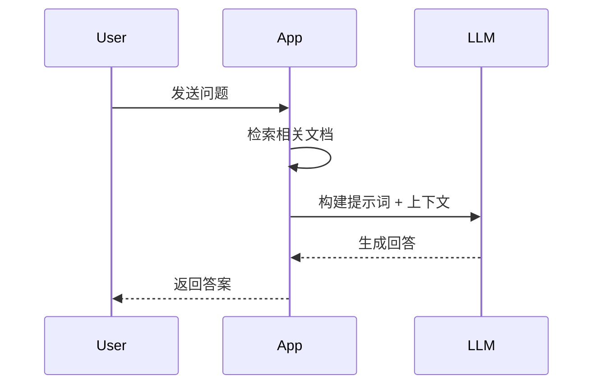

# Frontmatter Schema 字段完整定义

> **版本**: v1.0.0 | **最后更新**: 2026-05-31
> **所属技能**: tutorial-writer-content | **角色**: data-layer

## 1. Schema 概述

Frontmatter Schema 是 Tutorial Writer 内容系统的 **数据契约**，定义了每个章节 Markdown 文件必须和可以包含的元数据字段。

### 1.1 技术实现

- **验证引擎**: Zod (https://zod.dev/)
- **集成框架**: Astro Content Collections
- **文档框架**: Starlight (@astrojs/starlight)

### 1.2 Schema 位置

```
packages/content/src/config.ts
```

## 2. 完整字段定义

### 2.1 字段总览

| 分类 | 字段名 | 类型 | 必填 | 默认值 | 说明 |
|------|--------|------|------|--------|------|
| **基础** | `title` | string | ✅ | - | 章节标题 |
| | `description` | string | ❌ | - | 章节描述 |
| | `draft` | boolean | ❌ | `false` | 草稿标记 |
| | `date` | string | ❌ | - | 创建日期 |
| **扩展** | `tags` | string[] | ❌ | `[]` | 标签列表 |
| | `difficulty` | enum | ❌ | - | 难度等级 |
| | `readingTime` | number | ❌ | - | 阅读时间(分钟) |
| | `prerequisites` | string[] | ❌ | `[]` | 前置知识 |
| **增强** | `hasInteractive` | boolean | ❌ | `false` | 交互组件 |
| | `hasMermaid` | boolean | ❌ | `false` | Mermaid 图表 |
| | `hasMath` | boolean | ❌ | `false` | 数学公式 |

**总计**: 12 个字段（3 个必填 + 9 个可选）

## 3. 字段详细规格

### 3.1 title (必填)

**Zod 定义**:
```typescript
title: z.string({
  required_error: "标题不能为空",
  invalid_type_error: "标题必须是字符串",
})
```

**规格说明**:

| 属性 | 值 |
|------|-----|
| 类型 | `string` |
| 必填 | ✅ 是 |
| 可空 | ❌ 否 |
| 长度限制 | 建议 5-50 字符 |
| 支持语言 | 中文/英文/多语言 |

**用途**:
- 页面 `<title>` 标签
- 导航栏显示
- 面包屑导航
- SEO meta description
- Open Graph 标题

**最佳实践**:

```yaml
# ✅ 好：简洁明了
title: "快速开始"

# ✅ 好：包含关键信息
title: "RAG 应用性能优化指南"

# ❌ 差：过长
title: "如何在生产环境中使用向量数据库和大语言模型构建高可用的检索增强生成系统"

# ❌ 差：过短
title: "简介"
```

**验证规则** (自定义扩展):
```typescript
title: z.string()
  .min(2, "标题至少 2 个字符")
  .max(100, "标题不能超过 100 个字符")
  .trim()  // 自动去除首尾空格
```

### 3.2 description (可选)

**Zod 定义**:
```typescript
description: z.string({
  invalid_type_error: "描述必须是字符串",
}).optional()
```

**规格说明**:

| 属性 | 值 |
|------|-----|
| 类型 | `string` |
| 必填 | ❌ 否 |
| 默认值 | `undefined` |
| 长度建议 | 50-200 字符 |

**用途**:
- 搜索引擎 meta description
- 列表页卡片摘要
- 社交媒体分享描述 (Open Graph)
- RSS feed 条目描述

**SEO 优化建议**:

```yaml
# ✅ 好：包含关键词，长度适中
description: "学习如何在 5 分钟内搭建第一个 RAG 应用，涵盖环境配置到首次运行"

# ❌ 差：过短，信息量不足
description: "RAG 教程"

# ❌ 差：过长，被搜索引擎截断
description: "本教程将详细介绍 RAG（Retrieval-Augmented Generation）技术的原理和实践，包括..."
```

### 3.3 draft (可选)

**Zod 定义**:
```typescript
draft: z.boolean().default(false)
```

**规格说明**:

| 属性 | 值 |
|------|-----|
| 类型 | `boolean` |
| 必填 | ❌ 否 |
| 默认值 | `false` |
| 可选值 | `true`, `false` |

**行为影响**:

| draft 值 | 开发环境 | 生产构建 | URL 访问 |
|----------|---------|-----------|---------|
| `true` | ✅ 可见 | ❌ 不可见 | `?draft=1` 参数可见 |
| `false` | ✅ 可见 | ✅ 可见 | 正常访问 |

**典型工作流**:

```yaml
# 阶段 1: 开始写作
---
draft: true
title: "新章节（进行中）"
---

# 阶段 2: 完成初稿
---
draft: true
title: "新章节（待审稿）"
---

# 阶段 3: 通过审核
---
draft: false
title: "新章节"
---
```

### 3.4 date (可选)

**Zod 定义** (需扩展):
```typescript
date: z.string().optional()
// 或更严格的验证：
date: z.string().datetime({ message: "日期格式无效" }).optional()
```

**规格说明**:

| 属性 | 值 |
|------|-----|
| 类型 | `string` |
| 格式 | ISO 8601 (`YYYY-MM-DD` 或 `YYYY-MM-DDTHH:mm:ssZ`) |
| 必填 | ❌ 否（但强烈推荐） |

**格式示例**:

```yaml
# 仅日期
date: 2026-05-31

# 日期+时间
date: 2026-05-31T14:30:00Z

# 带时区偏移
date: 2026-05-31T22:30:00+08:00
```

**用途**:
- 时间线排序
- 最后更新时间显示
- RSS/Sitemap `<lastmod>`
- 归档页面按时间分组

### 3.5 tags (可选)

**Zod 定义**:
```typescript
tags: z.array(z.string()).default([])
```

**规格说明**:

| 属性 | 值 |
|------|-----|
| 类型 | `string[]` |
| 必填 | ❌ 否 |
| 默认值 | `[]` (空数组) |
| 元素类型 | 非空字符串 |
| 建议数量 | 3-5 个 |

**标签规范**:

```yaml
# ✅ 好：混合技术和业务标签
tags:
  - "RAG"                    # 技术术语
  - "向量数据库"              # 中文技术词
  - "LLM"                    # 缩略词
  - "实战教程"               # 内容类型
  - "入门"                   # 难度标识

# ❌ 差：过于宽泛
tags:
  - "教程"
  - "技术"
  - "文章"

# ❌ 差：过多标签
tags:
  - "RAG"
  - "向量"
  - "数据库"
  - "检索"
  - "增强"
  - "生成"
  - "AI"
  - "ML"
  - "NLP"
  - "Python"
```

**标签分类体系** (推荐):

| 类别 | 示例 | 用途 |
|------|------|------|
| 技术 | `RAG`, `React`, `Docker` | 技术栈筛选 |
| 难度 | `入门`, `进阶`, `高级` | 学习路径 |
| 类型 | `实战`, `理论`, `参考` | 内容分类 |
| 状态 | `已废弃`, `实验性` | 特殊标记 |

### 3.6 difficulty (可选)

**Zod 定义**:
```typescript
difficulty: z.enum([
  'beginner',
  'intermediate',
  'advanced'
]).optional()
```

**规格说明**:

| 属性 | 值 |
|------|-----|
| 类型 | `enum` |
| 必填 | ❌ 否（强烈推荐） |
| 可选值 | `beginner`, `intermediate`, `advanced` |

**难度等级定义**:

#### beginner (初级)

```yaml
difficulty: "beginner"
```

**目标读者**:
- 该领域的新手
- 有基本编程经验但不熟悉本技术
- 希望快速上手的实践者

**典型内容**:
- What/Why/How 的基础介绍
- Hello World 级别的示例
- 环境安装和配置
- 核心概念通俗解释

**前置时间**: 0-10 小时

**示例章节**:
- "快速开始"
- "核心概念入门"
- "安装与配置"

#### intermediate (中级)

```yaml
difficulty: "intermediate"
```

**目标读者**:
- 已掌握基础知识
- 有实际项目经验
- 希望深入理解原理

**典型内容**:
- 实战案例分析
- 性能优化技巧
- 架构设计方案
- 最佳实践总结

**前置时间**: 10-50 小时

**示例章节**:
- "构建生产级应用"
- "性能调优实战"
- "架构设计模式"

#### advanced (高级)

```yaml
difficulty: "advanced"
```

**目标读者**:
- 深度使用者或贡献者
- 希望掌握底层原理
- 解决复杂问题的专家

**典型内容**:
- 源码级分析
- 底层原理解析
- 极限性能优化
- 前沿技术探索

**前置时间**: 100+ 小时

**示例章节**:
- "源码解析：检索算法实现"
- "极限优化：毫秒级响应"
- "定制化开发：扩展核心功能"

### 3.7 readingTime (可选)

**Zod 定义**:
```typescript
readingTime: z.number({
  invalid_type_error: "阅读时间必须是数字",
}).optional()
```

**规格说明**:

| 属性 | 值 |
|------|-----|
| 类型 | `number` |
| 必填 | ❌ 否 |
| 单位 | 分钟 |
| 建议范围 | 1-120 |

**计算公式** (参考实现):

```typescript
function calculateReadingTime(content: string): number {
  const chineseChars = (content.match(/[\u4e00-\u9fa5]/g) || []).length;
  const englishWords = content.split(/\s+/).length;
  
  const readingTime = Math.ceil(
    (chineseChars / 400) + (englishWords / 200)
  );
  
  const codeBlocks = (content.match(/```[\s\S]*?```/g) || []).length;
  const imageCount = (content.match(/!\[.*?\]\(.*?\)/g) || []).length;
  
  const adjustedTime = readingTime + (codeBlocks * 3) + (imageCount * 1);
  
  return adjustedTime;
}
```

**估算基准**:

| 内容类型 | 每 X 单位 ≈ 1 分钟 |
|---------|-------------------|
| 中文文本 | 400 字 |
| 英文文本 | 200 词 |
| 代码块 | 1 个代码块 |
| 图片/图表 | 2-3 张 |

**显示效果示例**:

```html
<span class="reading-time">
  📖 阅读时间约 15 分钟
</span>
```

### 3.8 prerequisites (可选)

**Zod 定义**:
```typescript
prerequisites: z.array(z.string()).default([])
```

**规格说明**:

| 属性 | 值 |
|------|-----|
| 类型 | `string[]` |
| 必填 | ❌ 否 |
| 默认值 | `[]` |
| 建议数量 | 2-5 条 |

**编写原则**:

```yaml
# ✅ 好：具体、可验证
prerequisites:
  - "熟悉 Python 3.8+ 基础语法"
  - "了解 HTTP 协议的基本概念"
  - "有命令行使用经验"
  - "完成过至少一个 Web 项目"

# ❌ 差：模糊、无法验证
prerequisites:
  - "会编程"
  - "懂计算机"
```

**与 difficulty 的配合**:

| difficulty | prerequisites 示例 |
|------------|-------------------|
| beginner | "无特殊要求" 或 "基本的编程概念" |
| intermediate | 具体的技术栈经验 |
| advanced | 深厚的领域知识和实践经验 |

### 3.9 hasInteractive (可选)

**Zod 定义**:
```typescript
hasInteractive: z.boolean().default(false)
```

**规格说明**:

| 属性 | 值 |
|------|-----|
| 类型 | `boolean` |
| 必填 | ❌ 否 |
| 默认值 | `false` |
| 触发条件 | 章节包含 `<!-- @interactive: XXX -->` 标记 |

**支持的交互组件**:

| 标记 | 组件 | 说明 |
|------|------|------|
| `@interactive: code-playground` | 代码沙盒 | 可运行的代码编辑器 |
| `@interactive: quiz` | 测验 | 选择题/填空题 |
| `@interactive: interactive-diagram` | 交互图解 | 可操作的图表 |
| `@interactive: step-by-step` | 分步演示 | 引导式流程 |
| `@interactive: live-preview` | 实时预览 | 结果即时反馈 |
| `@interactive: comparison` | 对比工具 | 并排对比视图 |

**标记语法**:

```markdown
<!-- @interactive: code-playground language="python" -->
<!-- 上面的标记将被替换为交互式代码编辑器 -->

<!-- @interactive: quiz topic="rag-basics" questions="5" -->
<!-- 这里将插入测验组件 -->
```

### 3.10 hasMermaid (可选)

**Zod 定义**:
```typescript
hasMermaid: z.boolean().default(false)
```

**规格说明**:

| 属性 | 值 |
|------|-----|
| 类型 | `boolean` |
| 必填 | ❌ 否 |
| 默认值 | `false` |
| 触发条件 | 章节包含 ```mermaid 代码块 |

**支持的 Mermaid 图表类型**:


**使用示例**:

```markdown

```

**渲染方式**:
- **Web**: astro-mermaid 集成（客户端渲染）
- **Book**: 预渲染为 SVG/PNG（构建时）

### 3.11 hasMath (可选)

**Zod 定义**:
```typescript
hasMath: z.boolean().default(false)
```

**规格说明**:

| 属性 | 值 |
|------|-----|
| 类型 | `boolean` |
| 必填 | ❌ 否 |
| 默认值 | `false` |
| 触发条件 | 章节包含 LaTeX 公式 |

**LaTeX 公式语法**:

**行内公式** (单个 `$`):

```markdown
质能方程: $E = mc^2$

向量点积: $\vec{a} \cdot \vec{b}$
```

**块级公式** (双个 `$$`):

$$
\text{相似度} = \cos(\theta) = \frac{\vec{A} \cdot \vec{B}}{\|\vec{A}\| \|\vec{B}\|}
$$

$$
P(w_i | w_{1:i-1}) = \text{softmax}(E_c x_{i-1})
$$

**常用数学符号**:

| 符号 | LaTeX | 渲染效果 |
|------|-------|---------|
| 求和 | `\sum_{i=1}^{n}` | $\sum_{i=1}^{n}$ |
| 积分 | `\int_{a}^{b}` | $\int_{a}^{b}$ |
| 分数 | `\frac{a}{b}` | $\frac{a}{b}$ |
| 根号 | `\sqrt{x}` | $\sqrt{x}$ |
| 向量 | `\vec{v}` | $\vec{v}$ |
| 矩阵 | `\mathbf{M}` | $\mathbf{M}$ |

**渲染引擎选项**:
- **KaTeX** (推荐): 更快，适合静态站点
- **MathJax**: 功能更多，支持更复杂的公式

## 4. 自定义字段扩展

### 4.1 扩展机制

Schema 设计为可扩展，允许添加项目特定字段：

```typescript
schema: z.object({
  // ... 标准字段 ...

  // 自定义字段示例
  version: z.string().optional(),
  author: z.string().optional(),
  order: z.number().optional(),
  lastUpdated: z.date().optional(),
})
```

### 4.2 推荐的自定义字段

| 字段名 | 类型 | 适用场景 |
|--------|------|---------|
| `version` | string | 针对特定软件版本的章节 |
| `author` | string | 多作者教程的作者归属 |
| `order` | number | 显式排序权重 |
| `videoUrl` | string | 视频配套内容链接 |
| `repoUrl` | string | 示例代码仓库地址 |
| `partOfSeries` | string | 系列教程标识 |
| `isPremium` | boolean | 付费内容标记 |

### 4.3 扩展注意事项

⚠️ **重要原则**:

1. **向后兼容**: 新字段必须有默认值或 optional
2. **文档同步**: 更新此文档和 SKILL.md
3. **避免冗余**: 不添加可计算得出的字段
4. **团队对齐**: 确保所有成员了解新字段

## 5. 验证错误处理

### 5.1 常见错误及消息

| 错误类型 | 示例 | Zod 错误消息 |
|---------|------|-------------|
| 缺少必填字段 | 无 title | `"Field \"title\" is required"` |
| 类型错误 | readingTime: "10" | `"Expected number, received string"` |
| 枚举值错误 | difficulty: "expert" | `"Invalid enum value"` |
| 数组元素类型错误 | tags: 123 | `"Expected string, received number"` |

### 5.2 验证时机

- **开发模式启动**: Astro 启动时验证所有文件
- **文件保存**: 热更新时重新验证
- **构建时**: `astro build` 强制验证
- **CI/CD**: 可添加单独的验证步骤

## 6. 完整 Schema 代码

参见根路由器 SKILL.md "🚀 项目初始化" 章节 Step 6.1 中的完整 Schema 代码示例

---

**相关文档**:
- [SKILL.md 主文档](../SKILL.md) — Content Collections 配置和使用
- [naming-conventions.md](./naming-conventions.md) — 文件命名规范
- [enhancement-pipeline.md](./enhancement-pipeline.md) — 增强管道配置
