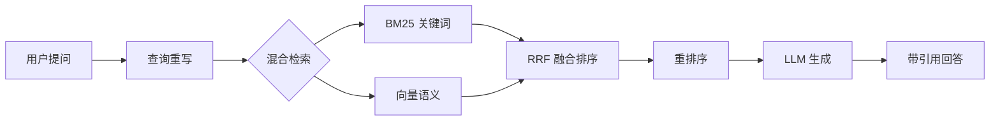
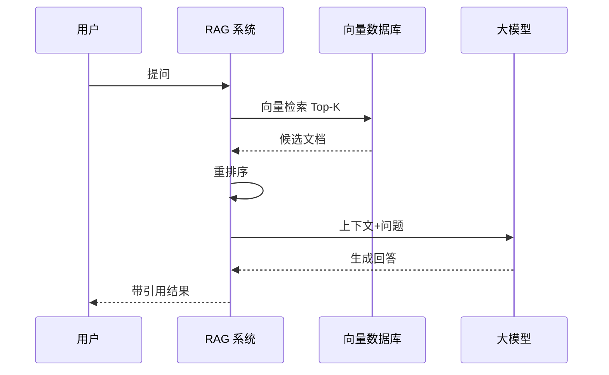

# 网页发布指南 — Web Publishing

> 本文档定义了将教程内容转换为交互式网页的完整方法论，涵盖：`uv` + MkDocs Material 搭建、Mermaid 图解集成、自定义 JS 交互组件、GitHub Pages 自动化部署。

## 1. 整体架构

### 1.1 三层模型

```
┌──────────────────────────────────────────────┐
│          表示层 (Presentation)                 │
│  MkDocs Material 主题 + 自定义 CSS/JS         │
│  导航 / 搜索 / 响应式 / 暗色模式              │
├──────────────────────────────────────────────┤
│          内容层 (Content)                     │
│  Markdown (.md) 章节文件                      │
│  Mermaid 图表 / 表格 / 代码块 / 交互组件      │
├──────────────────────────────────────────────┤
│          构建层 (Build)                       │
│  uv + MkDocs build → 静态 HTML               │
│  GitHub Actions → GitHub Pages                │
└──────────────────────────────────────────────┘
```

### 1.2 技术栈速查

| 层 | 技术 | 作用 |
|----|------|------|
| 包管理 | `uv` | Python 依赖管理，替代 pip/poetry |
| SSG | MkDocs + Material 主题 | 将 Markdown 编译为静态网站 |
| 图解 | Mermaid.js | 流程图/时序图/架构图/甘特图 |
| 交互 | 自定义 JS (D3.js / vanilla) | 可拖拽时间轴等动态组件 |
| 部署 | GitHub Actions + Pages | 推送即自动构建发布 |
| 自定义 | extra_css / extra_javascript | 主题覆盖和脚本注入 |

## 2. 快速启动（5 分钟）

### 2.1 初始化

```bash
# 使用 uv 初始化项目（已有 Python 项目则跳过）
uv init tutorial-web
cd tutorial-web

# 添加核心依赖
uv add mkdocs-material

# 创建标准目录结构
mkdir -p docs/chapters docs/assets docs/js docs/overrides
```

### 2.2 目录结构规范

```
{项目根目录}/
├── mkdocs.yml                     # 核心配置文件
├── pyproject.toml                 # uv 依赖管理
├── uv.lock                        # 锁定版本
├── docs/
│   ├── index.md                   # 首页（教程简介）
│   ├── chapters/                  # 各章节 Markdown
│   │   ├── ch01-概述.md
│   │   ├── ch02-架构演进.md
│   │   └── ...
│   ├── assets/                    # 静态资源
│   │   ├── images/                # 截图/示意图
│   │   └── diagrams/              # 复杂 SVG/图表
│   ├── js/                        # 自定义 JavaScript
│   │   ├── timeline.js            # 时间轴交互组件
│   │   ├── timeline-data.json     # 时间轴数据
│   │   └── extra.js               # 其他增强脚本
│   ├── css/                       # 自定义样式覆盖
│   │   └── extra.css
│   └── overrides/                 # 主题模板覆盖
└── .github/
    └── workflows/
        └── deploy.yml             # GitHub Actions 工作流
```

### 2.3 最小配置 mkdocs.yml

```yaml
site_name: RAG 从入门到生产实践
site_description: 检索增强生成全链路学习指南
site_url: https://你的用户名.github.io/仓库名/
repo_url: https://github.com/你的用户名/仓库名

theme:
  name: material
  palette:
    - scheme: default
      primary: indigo
      accent: indigo
      toggle:
        icon: material/brightness-7
        name: 切换至暗色模式
    - scheme: slate
      primary: indigo
      accent: indigo
      toggle:
        icon: material/brightness-4
        name: 切换至亮色模式
  features:
    - navigation.tabs
    - navigation.sections
    - navigation.top
    - navigation.tracking
    - search.suggest
    - search.highlight
    - content.code.copy
    - content.code.annotate
  language: zh

nav:
  - 首页: index.md
  - 第1章 RAG概述: chapters/ch01-概述.md
  - 第2章 架构演进: chapters/ch02-架构演进.md
  - ...

markdown_extensions:
  - pymdownx.highlight:
      anchor_linenums: true
  - pymdownx.inlinehilite
  - pymdownx.snippets
  - admonition
  - pymdownx.details
  - pymdownx.superfences:
      custom_fences:
        - name: mermaid
          class: mermaid
          format: !!python/name:pymdownx.superfences.fence_code_format
  - pymdownx.tabbed:
      alternate_style: true
  - attr_list
  - pymdownx.emoji:
      emoji_index: !!python/name:material.extensions.emoji.twemoji
      emoji_generator: !!python/name:material.extensions.emoji.to_svg
  - toc:
      permalink: true

plugins:
  - search

extra_css:
  - css/extra.css

extra_javascript:
  - js/extra.js
```

### 2.4 本地开发

```bash
# 启动开发服务器（自动热更新）
uv run mkdocs serve

# 构建静态站点
uv run mkdocs build
```

## 3. Mermaid 图解集成

### 3.1 支持的图表类型

在 Markdown 中直接写 mermaid 代码块，Material 主题自动渲染：

| 类型 | Mermaid 名称 | 教程使用场景 |
|------|-------------|-------------|
| 流程图 | flowchart | RAG 管线架构、数据处理流程 |
| 时序图 | sequenceDiagram | 检索→生成交互时序 |
| 状态图 | stateDiagram-v2 | Chunking 策略决策 |
| 类图 | classDiagram | 代码数据结构 |
| 甘特图 | gantt | 项目规划时间线 |
| 饼图 | pie | 数据分布对比 |

### 3.2 流程图示例



### 3.3 时序图示例



### 3.4 自定义 Mermaid 加载（使用 CDN 版本锁定）

```yaml
# mkdocs.yml
extra_javascript:
  - https://cdn.jsdelivr.net/npm/mermaid@11/dist/mermaid.min.js
```

## 4. 可拖拽时间轴组件

### 4.1 适用场景

教程中涉及"技术演进历程"时（如 RAG 五代架构 Naive→Advanced→Modular→Graph→Agentic），可利用可拖拽时间轴展示不同阶段的关键指标变化。

### 4.2 数据驱动设计

时间轴的数据定义在独立的 JSON 文件中，方便修改和维护。

完整数据文件见 [examples/timeline-component/timeline-data.json](../examples/timeline-component/timeline-data.json)。

### 4.3 轻量组件模板（无框架依赖）

纯 vanilla JS 实现，无外部依赖。在任意 Markdown 页面中通过 `<div id="rag-timeline"></div>` 嵌入。

完整组件代码见 [examples/timeline-component/timeline.js](../examples/timeline-component/timeline.js)。

### 4.4 组件样式（extra.css）

配套样式见 [examples/timeline-component/extra.css](../examples/timeline-component/extra.css)。

### 4.5 在 Markdown 中嵌入

```markdown
## RAG 五代架构演进

拖动下方时间轴查看各阶段的关键指标和核心技术差异：

<div id="rag-timeline"></div>

<script src="js/timeline.js"></script>
```

确保 `mkdocs.yml` 的 `extra_javascript` 包含 `js/timeline.js`，`extra_css` 包含 `css/extra.css`。

## 5. GitHub Actions 自动化部署

### 5.1 完整工作流

```yaml
# .github/workflows/deploy.yml
name: Deploy MkDocs to GitHub Pages

on:
  push:
    branches: [main]
  workflow_dispatch:

permissions:
  contents: read
  pages: write
  id-token: write

concurrency:
  group: pages
  cancel-in-progress: true

jobs:
  build:
    runs-on: ubuntu-latest
    steps:
      - uses: actions/checkout@v4
      - uses: astral-sh/setup-uv@v5
        with:
          enable-cache: true
      - uses: actions/setup-python@v5
        with:
          python-version-file: .python-version
      - run: uv sync
      - run: uv run mkdocs build
      - uses: actions/upload-pages-artifact@v3
        with:
          path: ./site

  deploy:
    environment:
      name: github-pages
      url: ${{ steps.deployment.outputs.page_url }}
    runs-on: ubuntu-latest
    needs: build
    steps:
      - uses: actions/deploy-pages@v4
```

### 5.2 手动部署姿势

```bash
# 构建并推送到 gh-pages 分支（一步到位）
uv run mkdocs gh-deploy --force

# 或先构建再手动推送
uv run mkdocs build --clean
# 然后将 site/ 目录内容部署到目标服务器
```

### 5.3 GitHub Pages 配置

```
仓库 Settings → Pages:
  Source: 选择 "GitHub Actions"（推荐）
  或: 选择 "Deploy from a branch" → gh-pages / (root)
```

## 6. 网页写作规范

### 6.1 图片路径管理

```markdown
<!-- 正确：引用 docs/assets/images/ 下的图片 -->


<!-- 正确：引用绝对路径（网站部署后） -->


<!-- 错误：引用项目外部路径 -->

```

### 6.2 响应式设计注意事项

| 元素 | 注意事项 |
|------|---------|
| 表格 | 列数 ≤ 5，避免窄屏横向滚动 |
| 代码块 | 行宽 ≤ 80 字符，超出自动换行 |
| 图片 | 分辨率 800-1200px，使用 WebP 格式 |
| Mermaid | 避免过于复杂的图（节点 ≤ 15） |
| 交互组件 | 触屏支持（touch 事件 + 足够大的点击区域） |

### 6.3 跨章节链接

```markdown
<!-- 使用相对路径引用其他章节 -->
详见 [第3章：环境准备](../chapters/ch03-环境准备.md)

<!-- 使用 MkDocs 的页面路径（推荐） -->
详见 [第3章：环境准备](../../ch03-环境准备/index.md)
```

### 6.4 网页独有的内容增强

```markdown
<!-- Admonition 提示框 -->
!!! tip "实践建议"

    首次运行建议使用小规模数据集（100 条），验证流程无误后再全量执行。

!!! warning "注意事项"

    Chroma 默认使用 HNSW 索引，在数据量 > 1M 时建议切换到 IVF。

<!-- 可折叠详情 -->
??? example "点击展开完整代码"

    ```python
    def rag_pipeline(query):
        ...
    ```

<!-- 代码注释标注（content.code.annotate） -->
```python
def search(query: str) -> list[Document]:  # (1)
    ...
```

1. 返回结果包含 `page_content` 和 `metadata` 两个字段
```

## 7. 质量检查（发布前必检）

| # | 检查项 | 标准 |
|---|--------|------|
| W1 | 所有图片可访问 | 图片路径在构建后有效，不出现 404 |
| W2 | Mermaid 图正常渲染 | 所有 mermaid 代码块在浏览器中可见 |
| W3 | 导航结构完整 | 所有章节在导航树中可达 |
| W4 | 跨章链接有效 | 内部链接不指向不存在页面 |
| W5 | 交互组件功能正常 | 时间轴拖拽、点击、切换无障碍 |
| W6 | 响应式布局 | 在 375px / 768px / 1280px 断点均可用 |
| W7 | 暗色模式兼容 | 组件在暗色模式下文字/背景对比度达标 |
| W8 | 构建无警告 | `mkdocs build` 无 error/warning |

## 8. 附录：常用命令速查

```bash
# 依赖管理
uv add mkdocs-material              # 添加依赖
uv add mkdocs-git-revision-date-localized-plugin  # 最后更新插件
uv sync                             # 同步依赖
uv sync --upgrade                   # 升级全部

# 本地开发
uv run mkdocs serve                 # 启动开发服务器（默认 :8000）
uv run mkdocs serve -a 0.0.0.0:8080 # 自定义端口
uv run mkdocs build                 # 构建到 site/
uv run mkdocs build --clean         # 清理后构建

# 部署
uv run mkdocs gh-deploy --force     # 一键部署到 GitHub Pages
```

---

> **参考资源**：
> - [Material for MkDocs 官方文档](https://squidfunk.github.io/mkdocs-material/)
> - [Mermaid.js 官方文档](https://mermaid.js.org/)
> - [D3.js 官方文档](https://d3js.org/)
> - [uv 官方文档](https://docs.astral.sh/uv/)
