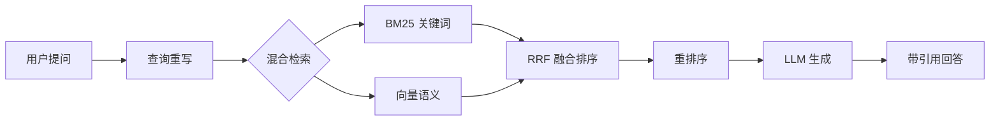
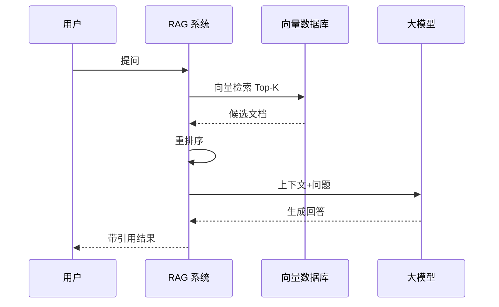

# 网页发布指南 — Web Publishing

> **版本**: v3.1.0 — 新增网页优先内容设计、CSS 动效、代码沙盒、3D 可视化、交互测验、动画数据仪表盘
>
> 本文档定义了将教程内容转换为**富交互网页**的完整方法论，涵盖：`uv` + MkDocs Material 搭建、Mermaid 图解集成、自定义 JS 交互组件、CSS 动效、3D 可视化、代码沙盒、交互测验、GitHub Pages 自动化部署。
>
> **核心理念**：教程的网页版不是 Markdown 的静态投影，而是一个可交互、可探索、可参与的学习体验空间。

## 0. 网页优先内容设计哲学

### 0.1 为什么网页版需要不同的创作思维

传统教程写作面向"纸"或"PDF"——内容线性、静态、读者被动接收。**网页是全新的媒介**，它允许：

| 纸媒/PDF | 网页 |
|---------|------|
| 线性阅读 | 非线性探索（导航/搜索/锚点跳转） |
| 静态图示 | 动态图解（Mermaid 动画/可交互图表） |
| 文字描述 | 可运行的代码示例（嵌入式沙盒） |
| 读者反馈作者 | 读者即参与（交互测验/可拖拽实验） |
| 单一呈现 | 多模呈现（亮/暗模式、响应式布局） |

### 0.2 网页优先创作清单

撰写每一节内容时，自问以下问题：

- [ ] 这里的概念能否用**交互式图解**代替静态截图？
- [ ] 这里的代码能否做成**读者可直接运行/修改的沙盒**？
- [ ] 这里的数据能否用**动画图表**展示变化趋势？
- [ ] 这里能否插入一个**快速测验**来检验读者理解？
- [ ] 这里的技术演进能否用**时间轴/可拖拽组件**呈现？
- [ ] 这里的架构图能否用**3D 可视化**来展示层次关系？
- [ ] 这里的步骤能否用**滚动触发动画**逐步展开？

> 不需要每个节都塞满交互组件。**原则**：核心概念至少 1 个交互元素，次要内容保持简洁。

### 0.3 交互组件的选择参考

| 内容类型 | 推荐交互方式 | 实现技术 | 适合场景 |
|---------|-------------|---------|---------|
| 架构/流程图 | 可缩放/可点击图解 | Mermaid + 自定义交互 | 系统架构、数据流水线 |
| 代码示例 | 可运行沙盒 | CodePen / Monaco 编辑器 | API 使用、算法实现 |
| 技术演进 | 可拖拽时间轴 | Vanilla JS + CSS 过渡 | 框架版本、架构演变 |
| 数据对比 | 动画图表 | Chart.js / D3.js | 基准测试、性能对比 |
| 3D 概念 | 可旋转 3D 模型 | Three.js | 向量空间、神经网络 |
| 知识检验 | 交互测验 | Vanilla JS 卡片 | 每节末尾、章节回顾 |
| 步骤流程 | 滚动触发动画 | Intersection Observer | 分步教程、搭建指南 |

## 1. 整体架构

### 1.1 三层模型

```
┌──────────────────────────────────────────────┐
│          表示层 (Presentation)                 │
│  MkDocs Material 主题 + 自定义 CSS/JS         │
│  导航 / 搜索 / 响应式 / 暗色模式              │
├──────────────────────────────────────────────┤
│          内容层 (Content)                     │
│  Markdown (.md) 章节文件                      │
│  Mermaid 图表 / 表格 / 代码块 / 交互组件      │
├──────────────────────────────────────────────┤
│          构建层 (Build)                       │
│  uv + MkDocs build → 静态 HTML               │
│  GitHub Actions → GitHub Pages                │
└──────────────────────────────────────────────┘
```

### 1.2 技术栈速查

| 层 | 技术 | 作用 |
|----|------|------|
| 包管理 | `uv` | Python 依赖管理，替代 pip/poetry |
| SSG | MkDocs + Material 主题 | 将 Markdown 编译为静态网站 |
| 图解 | Mermaid.js | 流程图/时序图/架构图/甘特图 |
| 交互 | 自定义 JS (D3.js / vanilla) | 可拖拽时间轴等动态组件 |
| 部署 | GitHub Actions + Pages | 推送即自动构建发布 |
| 自定义 | extra_css / extra_javascript | 主题覆盖和脚本注入 |

## 2. 快速启动（5 分钟）

### 2.1 初始化

```bash
# 使用 uv 初始化项目（已有 Python 项目则跳过）
uv init tutorial-web
cd tutorial-web

# 添加核心依赖
uv add mkdocs-material

# 创建标准目录结构
mkdir -p docs/chapters docs/assets docs/js docs/overrides
```

### 2.2 目录结构规范

```
{项目根目录}/
├── mkdocs.yml                     # 核心配置文件
├── pyproject.toml                 # uv 依赖管理
├── uv.lock                        # 锁定版本
├── docs/
│   ├── index.md                   # 首页（教程简介）
│   ├── chapters/                  # 各章节 Markdown
│   │   ├── ch01-概述.md
│   │   ├── ch02-架构演进.md
│   │   └── ...
│   ├── assets/                    # 静态资源
│   │   ├── images/                # 截图/示意图
│   │   └── diagrams/              # 复杂 SVG/图表
│   ├── js/                        # 自定义 JavaScript
│   │   ├── timeline.js            # 时间轴交互组件
│   │   ├── timeline-data.json     # 时间轴数据
│   │   └── extra.js               # 其他增强脚本
│   ├── css/                       # 自定义样式覆盖
│   │   └── extra.css
│   └── overrides/                 # 主题模板覆盖
└── .github/
    └── workflows/
        └── deploy.yml             # GitHub Actions 工作流
```

### 2.3 最小配置 mkdocs.yml

```yaml
site_name: RAG 从入门到生产实践
site_description: 检索增强生成全链路学习指南
site_url: https://你的用户名.github.io/仓库名/
repo_url: https://github.com/你的用户名/仓库名

theme:
  name: material
  palette:
    - scheme: default
      primary: indigo
      accent: indigo
      toggle:
        icon: material/brightness-7
        name: 切换至暗色模式
    - scheme: slate
      primary: indigo
      accent: indigo
      toggle:
        icon: material/brightness-4
        name: 切换至亮色模式
  features:
    - navigation.tabs
    - navigation.sections
    - navigation.top
    - navigation.tracking
    - search.suggest
    - search.highlight
    - content.code.copy
    - content.code.annotate
  language: zh

nav:
  - 首页: index.md
  - 第1章 RAG概述: chapters/ch01-概述.md
  - 第2章 架构演进: chapters/ch02-架构演进.md
  - ...

markdown_extensions:
  - pymdownx.highlight:
      anchor_linenums: true
  - pymdownx.inlinehilite
  - pymdownx.snippets
  - admonition
  - pymdownx.details
  - pymdownx.superfences:
      custom_fences:
        - name: mermaid
          class: mermaid
          format: !!python/name:pymdownx.superfences.fence_code_format
  - pymdownx.tabbed:
      alternate_style: true
  - attr_list
  - pymdownx.emoji:
      emoji_index: !!python/name:material.extensions.emoji.twemoji
      emoji_generator: !!python/name:material.extensions.emoji.to_svg
  - toc:
      permalink: true

plugins:
  - search

extra_css:
  - css/extra.css

extra_javascript:
  - js/extra.js
```

### 2.4 本地开发

```bash
# 启动开发服务器（自动热更新）
uv run mkdocs serve

# 构建静态站点
uv run mkdocs build
```

## 3. Mermaid 图解集成

### 3.1 支持的图表类型

在 Markdown 中直接写 mermaid 代码块，Material 主题自动渲染：

| 类型 | Mermaid 名称 | 教程使用场景 |
|------|-------------|-------------|
| 流程图 | flowchart | RAG 管线架构、数据处理流程 |
| 时序图 | sequenceDiagram | 检索→生成交互时序 |
| 状态图 | stateDiagram-v2 | Chunking 策略决策 |
| 类图 | classDiagram | 代码数据结构 |
| 甘特图 | gantt | 项目规划时间线 |
| 饼图 | pie | 数据分布对比 |

### 3.2 流程图示例



### 3.3 时序图示例



### 3.4 自定义 Mermaid 加载（使用 CDN 版本锁定）

```yaml
# mkdocs.yml
extra_javascript:
  - https://cdn.jsdelivr.net/npm/mermaid@11/dist/mermaid.min.js
```

## 4. 可拖拽时间轴组件

### 4.1 适用场景

教程中涉及"技术演进历程"时（如 RAG 五代架构 Naive→Advanced→Modular→Graph→Agentic），可利用可拖拽时间轴展示不同阶段的关键指标变化。

### 4.2 数据驱动设计

时间轴的数据定义在独立的 JSON 文件中，方便修改和维护。

完整数据文件见 [examples/timeline-component/timeline-data.json](../examples/timeline-component/timeline-data.json)。

### 4.3 轻量组件模板（无框架依赖）

纯 vanilla JS 实现，无外部依赖。在任意 Markdown 页面中通过 `<div id="rag-timeline"></div>` 嵌入。

完整组件代码见 [examples/timeline-component/timeline.js](../examples/timeline-component/timeline.js)。

### 4.4 组件样式（extra.css）

配套样式见 [examples/timeline-component/extra.css](../examples/timeline-component/extra.css)。

### 4.5 在 Markdown 中嵌入

```markdown
## RAG 五代架构演进

拖动下方时间轴查看各阶段的关键指标和核心技术差异：

<div id="rag-timeline"></div>

<script src="js/timeline.js"></script>
```

确保 `mkdocs.yml` 的 `extra_javascript` 包含 `js/timeline.js`，`extra_css` 包含 `css/extra.css`。

## 5. uv 项目初始化

> 教程网站是一个独立的 Python 项目，使用 `uv` 管理依赖。**所有教程仓库必须通过 uv 初始化**，确保构建环境可复现。

### 5.1 一键初始化命令

```bash
# 创建项目目录
mkdir tutorial-web && cd tutorial-web

# 使用 uv 初始化 Python 项目（生成 pyproject.toml + uv.lock）
uv init --python 3.12

# 添加 MkDocs Material 核心依赖
uv add mkdocs-material

# 添加可选插件
uv add mkdocs-git-revision-date-localized-plugin  # 最后更新日期

# 创建标准目录结构
mkdir -p docs/chapters docs/assets/images docs/js docs/css docs/overrides

# 创建 GitHub Actions 目录
mkdir -p .github/workflows

# 创建 .python-version 锁定 Python 版本
echo "3.12" > .python-version
```

### 5.2 pyproject.toml 示例

```toml
[project]
name = "tutorial-web"
version = "0.1.0"
description = "技术教程网站"
requires-python = ">=3.12"
dependencies = [
    "mkdocs-material>=9.6",
]

[build-system]
requires = ["setuptools>=75"]
build-backend = "setuptools.build_meta"

[tool.uv]
dev-dependencies = []
```

### 5.3 依赖更新策略

```bash
# 添加新依赖
uv add mkdocs-glightbox          # 图片灯箱

# 升级全部依赖
uv sync --upgrade

# 锁定精确版本（生产构建推荐）
uv sync --frozen
```

## 6. Tag 驱动自动部署

> **核心策略**：每次推送符合语义化版本规范的 Git Tag（如 `v1.2.3`）时，自动构建并部署到 GitHub Pages。Branch push 不触发部署，仅做预览构建校验。

### 6.1 完整工作流

```yaml
# .github/workflows/deploy.yml
name: Deploy MkDocs to GitHub Pages

on:
  push:
    tags:
      - 'v*'
  workflow_dispatch:
    inputs:
      version:
        description: '发布版本号 (如 v1.2.3)'
        required: true
        type: string

permissions:
  contents: read
  pages: write
  id-token: write

concurrency:
  group: pages
  cancel-in-progress: true

env:
  PYTHON_VERSION: '3.12'

jobs:
  validate:
    runs-on: ubuntu-latest
    steps:
      - uses: actions/checkout@v4
      - uses: astral-sh/setup-uv@v5
        with:
          enable-cache: true
      - name: Setup Python ${{ env.PYTHON_VERSION }}
        uses: actions/setup-python@v5
        with:
          python-version: ${{ env.PYTHON_VERSION }}
      - name: Verify uv project integrity
        run: uv sync --frozen
      - name: Build preview
        run: uv run mkdocs build --strict
      - name: Check no broken links
        run: |
          uv run mkdocs build --strict 2>&1 | grep -E "(WARNING|ERROR)" && exit 1 || exit 0

  build:
    runs-on: ubuntu-latest
    needs: validate
    steps:
      - uses: actions/checkout@v4
      - uses: astral-sh/setup-uv@v5
        with:
          enable-cache: true
      - name: Setup Python ${{ env.PYTHON_VERSION }}
        uses: actions/setup-python@v5
        with:
          python-version: ${{ env.PYTHON_VERSION }}
      - name: Sync dependencies
        run: uv sync --frozen
      - name: Extract version from tag
        id: version
        run: echo "tag=${GITHUB_REF_NAME#v}" >> $GITHUB_OUTPUT
      - name: Inject version into site
        run: |
          mkdir -p docs/assets
          echo '{"version": "${{ steps.version.outputs.tag }}", "buildDate": "${{ github.event.repository.updated_at }}"}' > docs/assets/version.json
      - name: Build site
        run: uv run mkdocs build --strict
      - name: Upload artifact
        uses: actions/upload-pages-artifact@v3
        with:
          path: ./site

  deploy:
    environment:
      name: github-pages
      url: ${{ steps.deployment.outputs.page_url }}
    runs-on: ubuntu-latest
    needs: build
    steps:
      - name: Deploy to GitHub Pages
        id: deployment
        uses: actions/deploy-pages@v4
      - name: Create Release
        uses: softprops/action-gh-release@v2
        with:
          name: Release v${{ needs.build.outputs.version }}
          generate_release_notes: true
```

### 6.2 发布工作流说明

```
作者工作流：
  ┌──────────────────────────────────────────────────────┐
  │  ① 完成章节内容，本地验证通过                          │
  │  ② git add . && git commit -m "feat: 完成第X章"      │
  │  ③ git tag v1.2.3     ← 语义化版本号                  │
  │  ④ git push && git push --tags                        │
  │  ⑤ GitHub Actions 自动：                              │
  │     ├─ validate: uv sync --frozen + mkdocs build      │
  │     ├─ build: 注入版本号 → 构建 site/                  │
  │     └─ deploy: 部署到 Pages + 创建 Release             │
  └──────────────────────────────────────────────────────┘
```

### 6.3 Tag 命名规范

| 类型 | 格式 | 示例 | 触发部署 |
|------|------|------|---------|
| 正式发布 | `v{major}.{minor}.{patch}` | `v2.1.0` | ✅ |
| 候选版 | `v{major}.{minor}.{patch}-rc.{n}` | `v2.1.0-rc.1` | ✅ |
| Beta | `v{major}.{minor}.{patch}-beta.{n}` | `v2.1.0-beta.1` | ✅ |
| 仅构建验证 | 任意非 `v*` tag | `build-test-01` | ❌ |

### 6.4 推送 tag 命令速查

```bash
# 创建并推送 tag
git tag v1.0.0
git push origin v1.0.0

# 一次性推送所有 tag
git push --tags

# 删除 tag（本地 + 远程）
git tag -d v1.0.0
git push origin :refs/tags/v1.0.0

# 查看 tag 列表
git tag -l 'v*'
```

### 6.5 手动触发部署

通过 GitHub Actions 的 `workflow_dispatch` 可手动触发，输入版本号：

```bash
# 或通过 gh CLI
gh workflow run deploy.yml -f version=v1.0.0
```

### 6.6 部署验证

部署完成后，检查以下要点：

- [ ] 网站可访问：`https://{user}.github.io/{repo}/`
- [ ] 版本号正确：访问 `/assets/version.json`
- [ ] 导航结构完整：所有章节可达
- [ ] 交互组件正常：时间轴/沙盒/测验功能可用
- [ ] GitHub Release 已创建：`https://github.com/{user}/{repo}/releases`

### 6.7 GitHub Pages 配置

```
仓库 Settings → Pages:
  Source: 选择 "GitHub Actions"（推荐）
  或: 选择 "Deploy from a branch" → gh-pages / (root)
```

## 7. 网页写作规范

### 7.1 图片路径管理

```markdown
<!-- 正确：引用 docs/assets/images/ 下的图片 -->


<!-- 正确：引用绝对路径（网站部署后） -->


<!-- 错误：引用项目外部路径 -->

```

### 7.2 响应式设计注意事项

| 元素 | 注意事项 |
|------|---------|
| 表格 | 列数 ≤ 5，避免窄屏横向滚动 |
| 代码块 | 行宽 ≤ 80 字符，超出自动换行 |
| 图片 | 分辨率 800-1200px，使用 WebP 格式 |
| Mermaid | 避免过于复杂的图（节点 ≤ 15） |
| 交互组件 | 触屏支持（touch 事件 + 足够大的点击区域） |

### 7.3 跨章节链接

```markdown
<!-- 使用相对路径引用其他章节 -->
详见 [第3章：环境准备](../chapters/ch03-环境准备.md)

<!-- 使用 MkDocs 的页面路径（推荐） -->
详见 [第3章：环境准备](../../ch03-环境准备/index.md)
```

### 7.4 网页独有的内容增强

```markdown
<!-- Admonition 提示框 -->
!!! tip "实践建议"

    首次运行建议使用小规模数据集（100 条），验证流程无误后再全量执行。

!!! warning "注意事项"

    Chroma 默认使用 HNSW 索引，在数据量 > 1M 时建议切换到 IVF。

<!-- 可折叠详情 -->
??? example "点击展开完整代码"

    ```python
    def rag_pipeline(query):
        ...
    ```

<!-- 代码注释标注（content.code.annotate） -->
```python
def search(query: str) -> list[Document]:  # (1)
    ...
```

1. 返回结果包含 `page_content` 和 `metadata` 两个字段
```

## 8. CSS 动效与滚动触发动画

> 适度的动效能引导读者注意力、解释状态变化、提升阅读沉浸感。MkDocs Material 默认无动画，需通过自定义 CSS 和 JS 注入。

### 8.1 原则：克制而有意

| ✅ 建议 | ❌ 避免 |
|---------|---------|
| 动效服务于内容理解（如渐进式步骤揭示） | 纯装饰性动画分散注意力 |
| 单次、短暂的过渡（200-500ms） | 无限循环闪烁或旋转 |
| 尊重 `prefers-reduced-motion` | 强迫所有用户观看动画 |
| 仅在可视区域内触发 | 页面加载时全量触发 |

### 8.2 渐进式步骤揭示（Scroll-Triggered Reveal）

适合分步教程、搭建指南，读者滚动时逐步展示下一步。

```css
/* css/extra.css */
.step-reveal {
  opacity: 0;
  transform: translateY(20px);
  transition: opacity 0.5s ease, transform 0.5s ease;
}
.step-reveal.visible {
  opacity: 1;
  transform: translateY(0);
}
```

```javascript
// js/extra.js — Intersection Observer 驱动
document.addEventListener('DOMContentLoaded', () => {
  const observer = new IntersectionObserver((entries) => {
    entries.forEach(entry => {
      if (entry.isIntersecting) {
        entry.target.classList.add('visible');
      }
    });
  }, { threshold: 0.15 });

  document.querySelectorAll('.step-reveal').forEach(el => observer.observe(el));
});
```

在 Markdown 中使用：

```markdown
<div class="step-reveal">

### 步骤 1：安装依赖

```bash
pip install chromadb
```

</div>

<div class="step-reveal">

### 步骤 2：初始化客户端

```python
import chromadb
client = chromadb.Client()
```

</div>
```

### 8.3 数字滚动动画（Count-Up）

适合数据展示、基准测试结果。

```javascript
// js/extra.js
function animateCounter(el, target, duration = 1000) {
  const start = performance.now();
  const from = 0;
  const step = (now) => {
    const progress = Math.min((now - start) / duration, 1);
    const eased = 1 - Math.pow(1 - progress, 3); // ease-out cubic
    el.textContent = Math.floor(from + (target - from) * eased);
    if (progress < 1) requestAnimationFrame(step);
  };
  requestAnimationFrame(step);
}

// 配合 Intersection Observer 使用
function setupCounters() {
  const observer = new IntersectionObserver((entries) => {
    entries.forEach(entry => {
      if (entry.isIntersecting) {
        const target = parseInt(entry.target.dataset.target);
        animateCounter(entry.target, target);
        observer.unobserve(entry.target);
      }
    });
  }, { threshold: 0.5 });
  document.querySelectorAll('.count-up').forEach(el => observer.observe(el));
}
```

```css
/* css/extra.css */
.count-up {
  font-size: 2.5em;
  font-weight: 700;
  color: var(--md-primary-fg-color);
}
```

### 8.4 代码块渐进高亮

配合 `content.code.annotate`，让代码行随滚动依次高亮显示——适合逐步解释复杂代码。

```css
/* css/extra.css — 代码行逐行动画 */
.highlight-line {
  opacity: 0.3;
  transition: opacity 0.3s ease;
}
.highlight-line.active {
  opacity: 1;
}
```

```javascript
// js/extra.js
document.querySelectorAll('.highlight-line').forEach((line, i) => {
  setTimeout(() => line.classList.add('active'), i * 300);
});
```

### 8.5 页面切换过渡动画

MkDocs 默认页面切换无过渡。通过自定义 overlay 可增加淡入淡出效果：

```css
/* css/extra.css */
.page-transition {
  position: fixed;
  inset: 0;
  background: var(--md-default-bg-color);
  z-index: 9999;
  opacity: 0;
  pointer-events: none;
  transition: opacity 0.25s ease;
}
.page-transition.active {
  opacity: 1;
}
```

```javascript
// js/extra.js — 需适配 MkDocs instant loading
// 通过监听 MkDocs 的导航事件实现
document.addEventListener('DOMContentLoaded', () => {
  const overlay = document.createElement('div');
  overlay.className = 'page-transition';
  document.body.appendChild(overlay);
});
```

### 8.6 动效无障碍

```css
/* 尊重用户系统设置 */
@media (prefers-reduced-motion: reduce) {
  .step-reveal { opacity: 1 !important; transform: none !important; }
  *, *::before, *::after {
    animation-duration: 0.01ms !important;
    transition-duration: 0.01ms !important;
  }
}
```

## 9. 交互式代码沙盒

> 让读者在教程页面内直接运行、修改代码——从"看代码"变为"玩代码"。

### 9.1 CodePen Embed（零配置）

适合单文件 HTML/CSS/JS 示例：

```markdown
<!-- 嵌入 CodePen（需先发布到 CodePen） -->
<p class="codepen" data-height="400" data-default-tab="result" data-slug-hash="{PEN_ID}">
  <a href="https://codepen.io/{USER}/pen/{PEN_ID}">查看示例</a>
</p>
<script async src="https://cpwebassets.codepen.io/assets/embed/ei.js"></script>
```

### 9.2 Monaco Editor 沙盒（自托管）

适合多文件 Python/JS 教程示例，读者可修改代码并查看输出。

**文件结构**：
```
docs/js/
├── monaco-editor/          ← 可托管在 CDN 或本地
│   ├── vs/                 ← Monaco editor 核心
│   └── ...
└── code-playground.js      ← 自定义沙盒初始化
```

**组件模板**：

```javascript
// js/code-playground.js
class CodePlayground {
  constructor(containerId, { code, language = 'python', readOnly = false }) {
    this.container = document.getElementById(containerId);
    this.code = code;
    this.language = language;
    this.readOnly = readOnly;
    this.init();
  }

  async init() {
    // 加载 Monaco（CDN 方式）
    if (!window.require) {
      const script = document.createElement('script');
      script.src = 'https://cdn.jsdelivr.net/npm/monaco-editor@0.52/min/vs/loader.js';
      script.onload = () => this.createEditor();
      document.head.appendChild(script);
    } else {
      this.createEditor();
    }
  }

  createEditor() {
    require.config({ paths: { vs: 'https://cdn.jsdelivr.net/npm/monaco-editor@0.52/min/vs' } });
    require(['vs/editor/editor.main'], () => {
      this.editor = monaco.editor.create(this.container, {
        value: this.code,
        language: this.language,
        theme: 'vs-dark',
        readOnly: this.readOnly,
        minimap: { enabled: false },
        fontSize: 14,
        lineNumbers: 'on',
        scrollBeyondLastLine: false,
        automaticLayout: true,
      });

      if (!this.readOnly) {
        const runBtn = document.createElement('button');
        runBtn.className = 'md-button md-button--primary';
        runBtn.textContent = '▶ 运行';
        runBtn.style.marginTop = '8px';
        runBtn.onclick = () => this.run();
        this.container.parentNode.insertBefore(runBtn, this.container.nextSibling);
      }
    });
  }

  async run() {
    // Python 代码通过 Pyodide 在浏览器中执行
    if (this.language === 'python') {
      await this.loadPyodide();
      try {
        const output = await this.pyodide.runPythonAsync(this.editor.getValue());
        this.showOutput(output);
      } catch (err) {
        this.showOutput(`❌ 错误: ${err.message}`, true);
      }
    }
  }

  async loadPyodide() {
    if (!this.pyodide) {
      const script = document.createElement('script');
      script.src = 'https://cdn.jsdelivr.net/pyodide/v0.27.0/full/pyodide.js';
      await new Promise(resolve => { script.onload = resolve; document.head.appendChild(script); });
      this.pyodide = await loadPyodide();
    }
  }

  showOutput(text, isError = false) {
    let out = this.container.parentNode.querySelector('.playground-output');
    if (!out) {
      out = document.createElement('pre');
      out.className = 'playground-output';
      out.style.cssText = 'background:var(--md-code-bg-color);padding:1em;border-radius:4px;margin-top:8px;overflow-x:auto;';
      this.container.parentNode.appendChild(out);
    }
    out.textContent = text;
    out.style.borderLeft = isError ? '3px solid #ff5252' : '3px solid #69f0ae';
  }
}
```

在 Markdown 中使用：

```markdown
## 动手试试：向量检索

修改下面的代码，尝试不同的距离度量方式：

<div id="playground-01" style="height: 300px; border: 1px solid var(--md-default-fg-color--lightest); border-radius: 4px;"></div>

<script>
document.addEventListener('DOMContentLoaded', () => {
  if (typeof CodePlayground !== 'undefined') {
    new CodePlayground('playground-01', {
      code: `from chromadb import Client\\nclient = Client()\\ncollection = client.create_collection(name="demo")\\ncollection.add(documents=["hello", "world"], ids=["1", "2"])\\nresults = collection.query(query_texts=["hi"], n_results=2)\\nprint(results)`,
      language: 'python',
      readOnly: false
    });
  }
});
</script>
```

> **注意**：Pyodide 加载约 2-3 秒，首次加载后会缓存。对于非 Python 语言，可改用 WebContainer（Node.js）或 ttyd（通用）。

### 9.3 代码对比组件（Diff View）

适合展示重构前后、优化前后的代码对比：

```javascript
// js/code-playground.js — Diff 模式
class CodeDiff {
  constructor(containerId, { original, modified, language = 'python' }) {
    this.container = document.getElementById(containerId);
    this.original = original;
    this.modified = modified;
    this.language = language;
    this.init();
  }

  init() {
    require.config({ paths: { vs: 'https://cdn.jsdelivr.net/npm/monaco-editor@0.52/min/vs' } });
    require(['vs/editor/editor.main'], () => {
      this.editor = monaco.editor.createDiffEditor(this.container, {
        enableSplitViewResizing: true,
        renderSideBySide: true,
        originalEditable: false,
        fontSize: 13,
        minimap: { enabled: false },
      });
      this.editor.setModel({
        original: monaco.editor.createModel(this.original, language),
        modified: monaco.editor.createModel(this.modified, language),
      });
    });
  }
}
```

## 10. 3D 可视化

> 适合展示向量空间、神经网络结构、知识图谱、架构层次等抽象概念。

### 10.1 Three.js 基础集成

```html
<!-- 在 Markdown 中嵌入 3D 场景容器 -->
<div id="3d-vis-01" style="height: 400px; border-radius: 8px; overflow: hidden;"></div>

<script type="importmap">
{
  "imports": {
    "three": "https://cdn.jsdelivr.net/npm/three@0.170/build/three.module.js",
    "three/addons/": "https://cdn.jsdelivr.net/npm/three@0.170/examples/jsm/"
  }
}
</script>
<script type="module">
import * as THREE from 'three';
import { OrbitControls } from 'three/addons/controls/OrbitControls.js';
import { CSS2DRenderer, CSS2DObject } from 'three/addons/renderers/CSS2DRenderer.js';

// --- 初始化场景 ---
const container = document.getElementById('3d-vis-01');
const scene = new THREE.Scene();
scene.background = new THREE.Color(0x1a1a2e);

// --- 相机 ---
const camera = new THREE.PerspectiveCamera(45, container.clientWidth / container.clientHeight, 0.1, 1000);
camera.position.set(6, 4, 8);

// --- WebGL 渲染器 ---
const renderer = new THREE.WebGLRenderer({ antialias: true });
renderer.setSize(container.clientWidth, container.clientHeight);
renderer.setPixelRatio(Math.min(window.devicePixelRatio, 2));
container.appendChild(renderer.domElement);

// --- CSS2D 渲染器（文字标签） ---
const labelRenderer = new CSS2DRenderer();
labelRenderer.setSize(container.clientWidth, container.clientHeight);
labelRenderer.domElement.style.position = 'absolute';
labelRenderer.domElement.style.top = '0';
labelRenderer.domElement.style.pointerEvents = 'none';
container.appendChild(labelRenderer.domElement);

// --- 轨道控制器（用户可拖拽旋转） ---
const controls = new OrbitControls(camera, renderer.domElement);
controls.enableDamping = true;
controls.dampingFactor = 0.05;
controls.autoRotate = true;
controls.autoRotateSpeed = 1.5;

// --- 灯光 ---
const ambientLight = new THREE.AmbientLight(0x404060);
scene.add(ambientLight);
const directionalLight = new THREE.DirectionalLight(0xffffff, 1);
directionalLight.position.set(5, 10, 7);
scene.add(directionalLight);

// --- 构建 RAG 架构 3D 层次 ---
const layers = [
  { name: '用户层', color: 0x00bcd4, y: 3, items: ['Web UI', 'API', 'CLI'] },
  { name: '应用层', color: 0x4caf50, y: 1.5, items: ['编排引擎', '会话管理'] },
  { name: 'RAG 核心', color: 0xff9800, y: 0, items: ['检索器', '生成器', '重排序'] },
  { name: '数据层', color: 0x9c27b0, y: -1.5, items: ['向量库', '文档库', '缓存'] },
  { name: '基础设施', color: 0x607d8b, y: -3, items: ['GPU', '存储', '网络'] },
];

layers.forEach((layer, li) => {
  // 层次平面
  const planeGeo = new THREE.BoxGeometry(6, 0.08, 1.5);
  const planeMat = new THREE.MeshPhongMaterial({
    color: layer.color,
    transparent: true,
    opacity: 0.3,
    emissive: layer.color,
    emissiveIntensity: 0.1,
  });
  const plane = new THREE.Mesh(planeGeo, planeMat);
  plane.position.y = layer.y;
  scene.add(plane);

  // 层标签
  const labelDiv = document.createElement('div');
  labelDiv.textContent = layer.name;
  labelDiv.style.color = '#fff';
  labelDiv.style.fontSize = '14px';
  labelDiv.style.fontWeight = 'bold';
  labelDiv.style.textShadow = '0 0 8px rgba(0,0,0,0.8)';
  const label = new CSS2DObject(labelDiv);
  label.position.set(-3.2, layer.y, 0);
  scene.add(label);

  // 子项小球
  layer.items.forEach((item, ii) => {
    const sphereGeo = new THREE.SphereGeometry(0.25, 16, 16);
    const sphereMat = new THREE.MeshPhongMaterial({
      color: layer.color,
      emissive: layer.color,
      emissiveIntensity: 0.2,
    });
    const sphere = new THREE.Mesh(sphereGeo, sphereMat);
    sphere.position.set(-1.5 + ii * 1.5, layer.y, 0);
    scene.add(sphere);

    // 子项标签
    const itemDiv = document.createElement('div');
    itemDiv.textContent = item;
    itemDiv.style.color = '#ccc';
    itemDiv.style.fontSize = '11px';
    const itemLabel = new CSS2DObject(itemDiv);
    itemLabel.position.set(-1.5 + ii * 1.5, layer.y - 0.4, 0);
    scene.add(itemLabel);
  });

  // 连接线（层间）
  if (li < layers.length - 1) {
    const points = [
      new THREE.Vector3(0, layer.y - 0.04, 0),
      new THREE.Vector3(0, layers[li + 1].y + 0.04, 0),
    ];
    const lineGeo = new THREE.BufferGeometry().setFromPoints(points);
    const lineMat = new THREE.LineBasicMaterial({
      color: layer.color,
      transparent: true,
      opacity: 0.2,
    });
    const line = new THREE.Line(lineGeo, lineMat);
    scene.add(line);
  }
});

// --- 动画循环 ---
function animate() {
  requestAnimationFrame(animate);
  controls.update();
  renderer.render(scene, camera);
  labelRenderer.render(scene, camera);
}
animate();

// --- 窗口自适应 ---
window.addEventListener('resize', () => {
  const w = container.clientWidth;
  const h = container.clientHeight;
  camera.aspect = w / h;
  camera.updateProjectionMatrix();
  renderer.setSize(w, h);
  labelRenderer.setSize(w, h);
});
</script>
```

### 10.2 3D 组件选择建议

| 场景 | 推荐方案 | 复杂度 | 文件大小 |
|------|---------|--------|---------|
| 简单几何体（球体/立方体表示概念） | Three.js 原生 | 低 | ~150KB |
| 向量空间/Embedding 可视化 | Three.js + OrbitControls | 中 | ~200KB |
| 知识图谱网络 | Three.js + Force Graph | 高 | ~300KB |
| 复杂架构图 | Three.js + CSS2DRenderer | 中 | ~200KB |
| 模型展示（GLTF/GLB） | Three.js + GLTFLoader | 中 | 取决于模型 |

### 10.3 3D 嵌入最佳实践

- **降级方案**：提供静态截图 fallback（用 `<noscript>` 或图片兜底）
- **性能**：限制面数，使用 `setPixelRatio(Math.min(devicePixelRatio, 2))`
- **交互提示**：首次渲染时显示"🔄 拖拽旋转 · 滚轮缩放"的轻提示
- **懒加载**：仅当 3D 容器进入视口时才初始化 Three.js
- **暗色模式适配**：根据 MkDocs 的 `data-md-color-scheme` 属性调整 `scene.background`

## 11. 交互测验与知识检验

> 在每节末尾嵌入快速测验，帮助读者检验理解——从"被动阅读"变为"主动回忆"。

### 11.1 选择题卡片组件

```javascript
// js/quiz.js
class QuizCard {
  constructor(containerId, { question, options, correctIndex, explanation }) {
    this.container = document.getElementById(containerId);
    this.question = question;
    this.options = options;
    this.correctIndex = correctIndex;
    this.explanation = explanation;
    this.answered = false;
    this.render();
  }

  render() {
    this.container.innerHTML = `
      <div class="quiz-card">
        <div class="quiz-question">${this.question}</div>
        <div class="quiz-options">
          ${this.options.map((opt, i) => `
            <div class="quiz-option" data-index="${i}">
              <span class="quiz-option-marker">${'ABCD'[i]}</span>
              <span class="quiz-option-text">${opt}</span>
            </div>
          `).join('')}
        </div>
        <div class="quiz-feedback" style="display:none;"></div>
      </div>
    `;

    this.container.querySelectorAll('.quiz-option').forEach(el => {
      el.addEventListener('click', () => this.check(parseInt(el.dataset.index)));
    });
  }

  check(index) {
    if (this.answered) return;
    this.answered = true;

    const options = this.container.querySelectorAll('.quiz-option');
    options.forEach(el => el.style.cursor = 'default');

    const correct = options[this.correctIndex];
    const selected = options[index];

    if (index === this.correctIndex) {
      selected.classList.add('correct');
    } else {
      selected.classList.add('wrong');
      correct.classList.add('correct');
    }

    const feedback = this.container.querySelector('.quiz-feedback');
    feedback.style.display = 'block';
    feedback.innerHTML = `
      <div class="quiz-result ${index === this.correctIndex ? 'result-pass' : 'result-fail'}">
        ${index === this.correctIndex ? '✅ 正确！' : '❌ 不正确'}
      </div>
      <div class="quiz-explanation">${this.explanation}</div>
    `;
  }
}
```

```css
/* css/extra.css */
.quiz-card {
  border: 1px solid var(--md-default-fg-color--lightest);
  border-radius: 8px;
  padding: 1.5em;
  margin: 1.5em 0;
  background: var(--md-code-bg-color);
}

.quiz-question {
  font-weight: 600;
  font-size: 1.05em;
  margin-bottom: 1em;
}

.quiz-option {
  display: flex;
  align-items: center;
  gap: 0.75em;
  padding: 0.75em 1em;
  margin: 0.4em 0;
  border-radius: 6px;
  cursor: pointer;
  transition: background 0.2s, transform 0.15s;
  border: 1px solid transparent;
}

.quiz-option:hover {
  background: var(--md-default-fg-color--lightest);
  transform: translateX(4px);
}

.quiz-option.correct {
  background: rgba(105, 240, 174, 0.15);
  border-color: #69f0ae;
}

.quiz-option.wrong {
  background: rgba(255, 82, 82, 0.15);
  border-color: #ff5252;
}

.quiz-option-marker {
  display: inline-flex;
  align-items: center;
  justify-content: center;
  width: 28px;
  height: 28px;
  border-radius: 50%;
  background: var(--md-primary-fg-color);
  color: #fff;
  font-size: 0.85em;
  font-weight: 600;
  flex-shrink: 0;
}

.quiz-feedback {
  margin-top: 1em;
  padding: 1em;
  border-radius: 6px;
}

.result-pass { color: #69f0ae; font-weight: 600; margin-bottom: 0.5em; }
.result-fail { color: #ff5252; font-weight: 600; margin-bottom: 0.5em; }

.quiz-explanation {
  font-size: 0.9em;
  color: var(--md-default-fg-color--light);
  line-height: 1.6;
}
```

在 Markdown 中使用：

```markdown
??? question "检验理解"

    <div id="quiz-01"></div>
    <script>
    document.addEventListener('DOMContentLoaded', () => {
      if (typeof QuizCard !== 'undefined') {
        new QuizCard('quiz-01', {
          question: 'RRF（倒数排序融合）的主要作用是什么？',
          options: [
            '对检索结果进行去重',
            '将多个检索器的结果按权重融合排序',
            '将用户查询翻译为向量',
            '对生成结果进行重写',
          ],
          correctIndex: 1,
          explanation: 'RRF 通过公式 RRF(d) = Σ 1/(k + rᵢ(d)) 将来自不同检索器的排名结果进行融合，适用于多路检索场景。',
        });
      }
    });
    </script>
```

### 11.2 代码填空挑战

在沙盒中预留空白，让读者填入关键代码：

```markdown
## 动手补全：MMR 排序

补全下面的 `mmr_rerank` 函数：

<div id="playground-fill-01" style="height: 250px;"></div>
<script>
document.addEventListener('DOMContentLoaded', () => {
  if (typeof CodePlayground !== 'undefined') {
    new CodePlayground('playground-fill-01', {
      code: `def mmr_rerank(docs, query_emb, lambda_param=0.7):\\n    selected = []\\n    candidates = docs[:]\\n    while candidates and len(selected) < 5:\\n        # TODO: 实现 MMR 选择逻辑\\n        # 提示：score = λ × sim(d, q) - (1-λ) × max(sim(d, d'))\\n        pass\\n    return selected`,
      language: 'python',
      readOnly: false,
    });
  }
});
</script>

<details>
<summary>点击查看参考答案</summary>

```python
def mmr_rerank(docs, query_emb, lambda_param=0.7):
    selected = []
    candidates = docs[:]
    while candidates and len(selected) < 5:
        best = None
        best_score = -float('inf')
        for i, d in enumerate(candidates):
            sim_query = cosine_similarity(d.embedding, query_emb)
            sim_selected = max([cosine_similarity(d.embedding, s.embedding) for s in selected], default=0)
            score = lambda_param * sim_query - (1 - lambda_param) * sim_selected
            if score > best_score:
                best_score = score
                best = i
        selected.append(candidates.pop(best))
    return selected
```

</details>

## 12. 动画数据仪表盘

> 将基准测试结果、性能对比数据渲染为可交互图表，比静态表格直观 10 倍。

### 12.1 Chart.js 集成

```markdown
<!-- Chart.js CDN -->
<script src="https://cdn.jsdelivr.net/npm/chart.js@4"></script>

<!-- 图表容器 -->
<canvas id="benchmark-chart" height="300"></canvas>

<script>
document.addEventListener('DOMContentLoaded', () => {
  const ctx = document.getElementById('benchmark-chart').getContext('2d');
  new Chart(ctx, {
    type: 'radar',
    data: {
      labels: ['检索精度', '幻觉率', '时延', '上下文利用率', '可扩展性', '维护成本'],
      datasets: [
        {
          label: 'Naive RAG',
          data: [65, 25, 80, 40, 50, 90],
          borderColor: '#e0e0e0',
          backgroundColor: 'rgba(224,224,224,0.1)',
        },
        {
          label: 'Graph RAG',
          data: [88, 8, 25, 85, 70, 50],
          borderColor: '#ff9800',
          backgroundColor: 'rgba(255,152,0,0.1)',
        },
        {
          label: 'Agentic RAG',
          data: [92, 5, 30, 90, 85, 40],
          borderColor: '#4caf50',
          backgroundColor: 'rgba(76,175,80,0.1)',
        },
      ]
    },
    options: {
      responsive: true,
      plugins: {
        title: { display: true, text: 'RAG 架构多维度对比' },
      },
      scales: {
        r: {
          beginAtZero: true,
          max: 100,
          ticks: { stepSize: 20 },
        }
      }
    }
  });
});
</script>
```

### 12.2 数据表格 → 图表转换指南

| 原始数据形式 | 推荐图表类型 | Chart.js 类型 |
|-------------|-------------|-------------|
| 多方案多维度对比 | 雷达图 | `radar` |
| 时间序列（版本演进） | 折线图 | `line` |
| 分类占比 | 饼图/环形图 | `doughnut` |
| 单维排序 | 条形图 | `bar` |
| 相关关系 | 散点图 | `scatter` |
| 多层构成 | 堆叠面积图 | `line` (fill) |

## 13. 自适应交互策略

### 13.1 按设备能力降级

| 设备类型 | 推荐交互级别 | 说明 |
|---------|-------------|------|
| 桌面 (≥1024px) | **完整**：3D + 沙盒 + 动效 + 图表 | 全功能体验 |
| 平板 (≥768px) | **中等**：沙盒 + 动效 + 图表，关闭 3D | 触屏友好 |
| 手机 (<768px) | **精简**：动效 + 简单测验，关闭 3D/沙盒 | 流畅优先 |

```javascript
// js/adaptive.js — 设备能力检测
const deviceTier = (() => {
  const width = window.innerWidth;
  const memory = navigator.deviceMemory || 4;
  if (width < 768 || memory <= 2) return 'low';
  if (width < 1024 || memory <= 4) return 'medium';
  return 'high';
})();

// 按级别加载功能
if (deviceTier === 'high') {
  // 加载 Three.js 3D 场景
} else if (deviceTier === 'medium') {
  // 仅加载 Chart.js 图表
} else {
  // 仅加载 CSS 动效
}
```

### 13.2 渐进增强策略

```
基础内容（纯 HTML + Markdown）
  ↓ 所有设备可见
CSS 动效（淡入/过渡/悬停）
  ↓ 现代浏览器支持
交互组件（测验/沙盒/图表）
  ↓ JS 可用时
3D 可视化（Three.js）
  ↓ 高性能设备 + WebGL 支持
```

> **构建时区分**：在 `mkdocs.yml` 的 `extra_javascript` 中按需加载，不将所有 JS 打包到每个页面。

## 14. 质量检查（发布前必检）

| # | 检查项 | 标准 |
|---|--------|------|
| W1 | 所有图片可访问 | 图片路径在构建后有效，不出现 404 |
| W2 | Mermaid 图正常渲染 | 所有 mermaid 代码块在浏览器中可见 |
| W3 | 导航结构完整 | 所有章节在导航树中可达 |
| W4 | 跨章链接有效 | 内部链接不指向不存在页面 |
| W5 | 交互组件功能正常 | 时间轴拖拽、点击、切换无障碍 |
| W6 | 响应式布局 | 在 375px / 768px / 1280px 断点均可用 |
| W7 | 暗色模式兼容 | 组件在暗色模式下文字/背景对比度达标 |
| W8 | 3D 场景渲染无白屏 | WebGL 初始化正常，fallback 图片备选 |
| W9 | 代码沙盒可运行 | Monaco 编辑器加载正常，Pyodide 可执行 |
| W10 | 动效无障碍 | `prefers-reduced-motion` 时动效关闭 |
| W11 | 交互测验功能完整 | 选项点击反馈、正确答案展示、解析文字显示 |
| W12 | 动画图表渲染正常 | Chart.js/D3.js 数据加载后图表正常展示 |
| W13 | 构建无警告 | `mkdocs build` 无 error/warning |

## 15. 附录：常用命令速查

```bash
# 依赖管理
uv add mkdocs-material              # 添加依赖
uv add mkdocs-git-revision-date-localized-plugin  # 最后更新插件
uv sync                             # 同步依赖
uv sync --upgrade                   # 升级全部

# 本地开发
uv run mkdocs serve                 # 启动开发服务器（默认 :8000）
uv run mkdocs serve -a 0.0.0.0:8080 # 自定义端口
uv run mkdocs build                 # 构建到 site/
uv run mkdocs build --clean         # 清理后构建

# 部署
uv run mkdocs gh-deploy --force     # 一键部署到 GitHub Pages
```

---

> **参考资源**：
> - [Material for MkDocs 官方文档](https://squidfunk.github.io/mkdocs-material/)
> - [Mermaid.js 官方文档](https://mermaid.js.org/)
> - [Three.js 官方文档](https://threejs.org/docs/)
> - [Chart.js 官方文档](https://www.chartjs.org/docs/)
> - [Monaco Editor 官方文档](https://microsoft.github.io/monaco-editor/)
> - [Pyodide 官方文档](https://pyodide.org/)
> - [D3.js 官方文档](https://d3js.org/)
> - [uv 官方文档](https://docs.astral.sh/uv/)
> - [CodePen Embeds](https://blog.codepen.io/documentation/embeds/)
