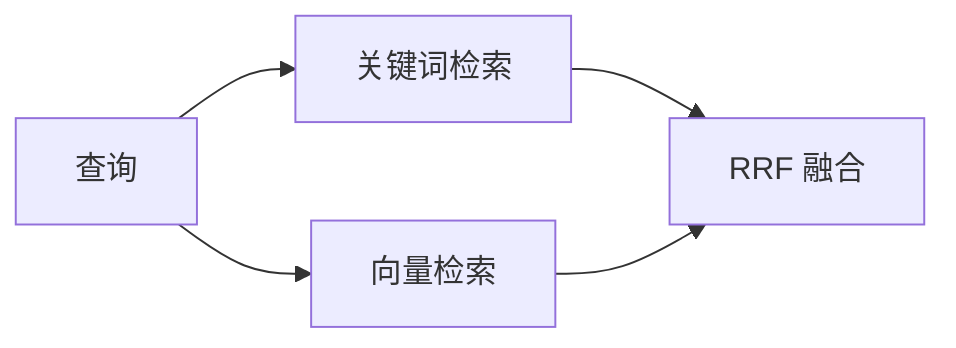

# 🌐 Tutorial Writer Web — Monorepo Web 包配置指南 v1.0

> **父技能**: [tutorial-writer](../SKILL.md)
> **独立可用**: ✅ 可通过 `/web` 或 `/tutorial-writer/web` 直接触发（L1 直达）
> **架构**: L1 独立子技能 — **Monorepo Web 包专用**
> **基于版本**: Astro 6.3（2026年5月最新版）+ Starlight 最新版
> **使用频率**: 🔴 **高频** — 开发过程中反复迭代调用
> **前置依赖**: 需要先使用官方工具完成项目初始化（见根路由器"🚀 项目初始化"章节 Step 1-3）

---

## 前置条件

- [ ] Monorepo 项目已初始化（含 `turbo.json`, `pnpm-workspace.yaml`）
  详见根路由器 SKILL.md **Step 1**
- [ ] `packages/web/` 已通过 Starlight 模板创建
  - 推荐命令: 在 `packages/web/` 下运行
    `bunx create astro@latest . --template starlight`
  - 详见根路由器 SKILL.md **Step 3**
- [ ] `@<project>/content` 包存在且已在 web/package.json 中声明依赖
  ```json
  { "dependencies": { "@<project>/content": "workspace:*" } }
  ```

> **注意**: 本子技能专注于 **Astro + Starlight 配置和组件开发**，
> **不包含**项目创建逻辑。
>
> 项目初始化请参考根路由器的 **"🚀 项目初始化"** 章节。

### Monorepo 目录结构概览

```
tutorial-project/
├── packages/
│   ├── content/                  ← 📝 内容包（由 content 子技能管理）
│   │   ├── chapters/
│   │   ├── config.ts
│   │   └── package.json
│   └── web/                      ← 🌐 Web 包（本技能聚焦）
│       ├── src/
│       │   ├── components/
│       │   ├── layouts/
│       │   ├── styles/
│       ├── astro.config.mjs
│       └── package.json
├── pnpm-workspace.yaml
└── package.json
```

### 与 Content 包的集成

```typescript
// packages/web/astro.config.mjs
import { defineConfig } from 'astro/config';
import starlight from '@astrojs/starlight';

export default defineConfig({
  // 引用 content 包的内容目录
  contentDir: '../../packages/content',
  
  integrations: [
    starlight({
      sidebar: [
        { label: '首页', slug: 'index' },
        {
          label: '章节',
          autogenerate: { directory: 'chapters' },
        },
      ],
    }),
  ],
});
```

**关键集成点**：

| 集成项 | 说明 | 配置位置 |
|--------|------|---------|
| 内容源 | 引用 `packages/content/` 目录 | `contentDir` 字段 |
| Schema 定义 | 由 content 包的 `config.ts` 管理 | 无需重复定义 |
| Workspace 依赖 | `@tutorial/content` 在 `package.json` 声明 | `dependencies` |

---

## 🎯 职责范围

| ✅ 负责 | ❌ 不负责 |
|---------|----------|
| Astro + Starlight 配置与定制 | 项目初始化 → 官方工具链 (create-astro) |
| 组件开发（Islands + 静态，按功能分组） | Content Collections schema → content 子技能 |
| 内容增强管道（Mermaid 预渲染、组件注入） | 部署配置 → `/publish` |
| 样式系统（全局样式、主题变量、响应式） | CI/CD 流水线 → `/publish` |
| 构建优化（性能调优、图片优化、Lighthouse） | 多格式发布 → 可选 |
| 本地开发和调试（Dev Server、HMR、DevTools） | 文件命名规范 → content 子技能 |

**设计理念**: 本技能是 Tutorial Writer 流程中**调用频率最高**的子技能之一，专注于 Web 包的技术实现细节。

---

## 🔧 核心配置：Astro + Starlight（Monorepo 版）

### astro.config.mjs 完整示例

```javascript
// packages/web/astro.config.mjs
import { defineConfig } from 'astro/config';
import starlight from '@astrojs/starlight';

export default defineConfig({
  site: 'https://username.github.io',
  base: '/repo-name/',
  trailingSlash: 'always',

  // 指向 Monorepo 中的 content 包
  contentDir: '../../packages/content',

  integrations: [
    starlight({
      title: '教程标题',
      description: '教程描述',

      social: {
        github: 'https://github.com/username/repo',
      },

      sidebar: [
        { label: '首页', slug: 'index' },
        {
          label: '章节',
          autogenerate: { directory: 'chapters' },
        },
      ],

      editLink: {
        baseUrl: 'https://github.com/username/repo/edit/main/',
      },
      lastUpdated: true,
      pagination: true,
      search: { mode: 'auto' },
    }),
  ],
});
```

**Monorepo 特有配置项**：

| 配置项 | 值 | 说明 |
|--------|-----|------|
| `contentDir` | `'../../packages/content'` | 相对路径指向 content 包 |
| `site` | 完整 URL | 影响 SEO、sitemap、OG 图片路径 |
| `base` | `'/repo-name/'` | GitHub Pages 项目站点必填 |
| `trailingSlash` | `'always'` | 避免 GitHub Pages 404 |

### package.json（Workspace 依赖）

```json
{
  "name": "@tutorial/web",
  "version": "1.0.0",
  "type": "module",
  "scripts": {
    "dev": "astro dev",
    "build": "astro build",
    "preview": "astro preview",
    "enhance": "mmd2svg -i ../../packages/content/chapters -o .enhanced"
  },
  "dependencies": {
    "@astrojs/starlight": "^0.30.0",
    "astro": "^6.3.0",
    "@tutorial/content": "workspace:*"
  }
}
```

---

## 🎨 组件开发：按功能分组

### 推荐的组件目录结构

```
packages/web/src/components/
├── interactive/              ← 🎮 3D、可视化、交互式组件
│   ├── Architecture3D.tsx    # 3D 架构展示
│   ├── DataPipeline3D.tsx    # 数据流 3D 动画
│   ├── ChunkComparison3D.tsx # 分块策略对比 3D
│   └── KnowledgeGraph3D.tsx  # 知识图谱 3D
│
├── charts/                   ← 📊 图表、仪表盘、指标
│   ├── PerformanceDashboard.tsx
│   ├── MetricGauge.tsx
│   └── ComparisonChart.tsx
│
├── code/                     ← 💻 代码相关组件
│   ├── InteractiveCodeDemo.tsx  # 运行时代码沙盒
│   ├── CodeComparison.tsx      # 代码对比展示
│   └── TerminalEmulator.tsx     # 终端模拟器
│
└── ui/                        ← 🎨 通用 UI 组件
    ├── FeatureGrid.astro
    ├── DifficultyBadge.astro
    └── ReadingTime.astro
```

**分组原则**：

| 分组 | 包含 | 使用频率 | Islands/Static |
|------|------|---------|----------------|
| `interactive/` | 3D、动画、复杂可视化 | 中（特定章节使用）| ✅ Islands（需要 JS）|
| `charts/` | 图表、数据展示 | 中（数据密集章节）| ✅ Islands（需要 JS）|
| `code/` | 代码演示、沙盒 | 高（技术章节常用）| ✅ Islands（需要 JS）|
| `ui/` | 通用 UI 元素 | 高（全局复用）| ⚡ Static（零 JS）|

---

## ⚡ Islands Architecture 最佳实践

### 核心原则

```
┌─────────────────────────────────────────┐
│           HTML/CSS（零 JavaScript）        │
│  ┌─────────┐  ┌─────────┐  ┌─────────┐   │
│  │ Static  │  │ Static  │  │ Static  │   │
│  │ Component│  │ Component│  │ Component│   │
│  └─────────┘  └─────────┘  └─────────┘   │
│                                           │
│  ┌─────────────┐  ┌─────────────┐         │
│  │   Island    │  │   Island    │         │
│  │ ( hydrated) │  │ ( hydrated) │         │
│  └─────────────┘  └─────────────┘         │
└─────────────────────────────────────────┘
```

### 使用指南

**✅ 应该使用 Islands 的场景**：
- 3D 可视化（Three.js、React Three Fiber）
- 交互式图表（Chart.js、D3.js）
- 代码沙盒（CodeMirror、Monaco Editor）
- 复杂表单验证
- 实时数据更新

**❌ 不应该使用 Islands 的场景**：
- 纯展示性 UI（卡片、徽章）
- 导航栏、侧边栏
- 页脚、版权信息
- 静态文本内容

### 示例：Island vs Static 对比

```astro
---
// ✅ 正确：静态组件使用 .astro 扩展名
import FeatureGrid from '../components/ui/FeatureGrid.astro';
import DifficultyBadge from '../components/ui/DifficultyBadge.astro';

// ✅ 正确：交互组件使用 .tsx 并添加 client:* 指令
import InteractiveDemo from '../components/code/InteractiveCodeDemo.tsx';
---

<article>
  <!-- 静态渲染，零 JavaScript -->
  <FeatureGrid features={features} />
  <DifficultyBadge difficulty="intermediate" />

  <!-- 仅此部分 hydrate 为 React -->
  <InteractiveDemo client:load />
</article>
```

**Hydration 指令选择**：

| 指令 | 行为 | 适用场景 |
|------|------|---------|
| `client:load` | 页面加载时立即 hydrate | 首屏关键交互元素 |
| `client:idle` | 浏览器空闲时 hydrate | 非首屏但重要的交互 |
| `client:visible` | 进入视口时 hydrate | 折叠内容、长页面底部 |
| `client:media` | 匹配媒体查询时 hydrate | 响应式特定组件 |

---

## 🎨 样式系统

### 全局样式结构

```
packages/web/src/styles/
├── global.css              ← 全局重置和基础样式
├── variables.css            ← CSS 自定义属性（主题变量）
├── typography.css           ← 排版系统
└── responsive.css           ← 响应式断点工具类
```

### 主题变量（CSS Custom Properties）

```css
/* variables.css */
:root {
  /* 颜色系统 */
  --color-primary: #3b82f6;
  --color-secondary: #64748b;
  --color-accent: #06b6d4;
  --color-background: #ffffff;
  --color-text: #1e293b;

  /* 排版 */
  --font-sans: 'Inter', system-ui, sans-serif;
  --font-mono: 'JetBrains Mono', monospace;
  --font-size-base: 16px;
  --line-height: 1.6;

  /* 间距 */
  --spacing-unit: 0.25rem;
  --container-max: 1200px;

  /* 圆角 */
  --radius-sm: 4px;
  --radius-md: 8px;
  --radius-lg: 12px;
}

/* Dark mode */
[data-theme='dark'] {
  --color-background: #0f172a;
  --color-text: #e2e8f0;
}
```

### 响应式断点

```css
/* responsive.css */

/* Mobile first approach */
.container {
  width: 100%;
  padding: 0 var(--spacing-4);
  margin: 0 auto;
}

/* Tablet */
@media (min-width: 768px) {
  .container {
    max-width: 720px;
  }
}

/* Desktop */
@media (min-width: 1024px) {
  .container {
    max-width: var(--container-max);
  }
}

/* Large desktop */
@media (min-width: 1280px) {
  .grid-cols-4 {
    grid-template-columns: repeat(4, 1fr);
  }
}
```

**断点速查表**：

| 断点 | 宽度 | 设备类型 |
|------|------|---------|
| `sm` | ≥640px | 大屏手机/小平板 |
| `md` | ≥768px | 平板竖屏 |
| `lg` | ≥1024px | 平板横屏/小笔记本 |
| `xl` | ≥1280px | 桌面显示器 |
| `2xl` | ≥1536px | 大屏桌面 |

---

## ⚡ 内容增强管道（Build-time Enhancement）

### 什么是增强管道？

在构建时自动处理 Markdown 内容，注入交互组件、预渲染图表等。

### 核心功能 1：插槽标记系统

**在 Markdown 中使用标记**：

```markdown
<!-- packages/content/chapters/06-retrieval-optimization.md -->

# 第六章：检索质量优化

## 分块策略对比

| 策略 | Token 数 | 召回率 |
|-------|---------|--------|
| 固定 512 | 512 | **78%** |
| 语义分块 | ~43 | **70%** |

<!-- @interactive: ChunkComparison3D -->
<!-- 同步后此处自动插入 3D 对比可视化组件 -->

## RRF 公式

$$ \text{RRF}(d) = \sum_{i=1}^{k} \frac{1}{k + r_i(d)} $$

<!-- @mermaid -->

<!-- @mermaid-end -->
```

**构建时处理** (`packages/web/src/scripts/enhance-content.mts`)：

```typescript
// packages/web/src/scripts/enhance-content.mts
import type { AstroConfig } from 'astro/config';

export default function enhanceContent(astroConfig: AstroConfig) {
  return {
    name: 'content-enhancer',
    hooks: {
      'astro:build:start': () => {
        console.log('🔄 开始内容增强...');
      },
      'astro:build:done': ({ dir }) => {
        console.log('✅ 内容增强完成:', dir);
      },
    },
  };
}
```

### 核心功能 2：Mermaid 预渲染

**为什么需要预渲染？**
- ❌ 浏览器端渲染 mermaid.js 会增加加载时间
- ✅ 构建时预渲染为 SVG，零运行时开销

**实现方式**：

```bash
# 安装 mermaid CLI
pnpm add -D @mermaid-js/mermaid-cli --filter @tutorial/web

# 在 packages/web/package.json 中添加脚本
{
  "scripts": {
    "enhance": "mmd2svg -i ../../packages/content/chapters -o .enhanced",
    "prebuild": "pnpm run enhance && astro build"
  }
}
```

### 核心功能 3：组件自动注入

**布局级别处理** (`packages/web/src/layouts/BaseLayout.astro`)：

```astro
---
// 自动检测并替换插槽标记
import ChunkComparison3D from '../components/interactive/ChunkComparison3D.tsx';
---

<!doctype html>
<html>
  <head><title>{title}</title></head>
  <body>
    <!-- 使用 slot 渲染原始内容 -->
    <slot />

    <!-- 后处理：查找并替换插槽标记为实际组件 -->
    <script define:vars={{}} is:inline>
      document.querySelectorAll('[data-enhance-slot]').forEach(el => {
        const componentName = el.dataset.enhanceSlot;
        // 动态导入并渲染对应组件
      });
    </script>
  </body>
</html>
```

---

## 📖 Content Collections 查询（Monorepo 版）

### 查询内容

```astro
---
import { getCollection } from 'astro:content';

// 获取所有章节（从 content 包）
const allChapters = await getCollection('chapters');

// 过滤：排除草稿
const publishedChapters = allChapters.filter(ch => !ch.data.draft);

// 排序：按文件名数字前缀
const sortedChapters = publishedChapters.sort((a, b) => {
  const numA = parseInt(a.slug.split('-')[0]) || 999;
  const numB = parseInt(b.slug.split('-')[0]) || 999;
  return numA - numB;
});
---

<h2>所有章节 ({sortedChapters.length})</h2>
{sortedChapters.map(chapter => (
  <article>
    <h3><a href={chapter.slug}>{chapter.data.title}</a></h3>
    <p>{chapter.data.description}</p>
    {chapter.data.difficulty && (
      <span class={`badge badge--${chapter.data.difficulty}`}>
        {chapter.data.difficulty}
      </span>
    )}
  </article>
))}
```

> **注意**: Schema 定义由 `packages/content/config.ts` 管理，Web 包无需重复定义。

---

## 🌐 i18n 多语言配置（可选）

如果需要多语言支持：

```
packages/content/
├── chapters/                     ← 默认语言（如中文）
│   ├── 01-overview.md
│   └── ...
└── en/                          ← 英文版本
    ├── chapters/
    │   ├── 01-overview.md
    │   └── ...
    └── index.mdx
```

**packages/web/astro.config.mjs**：

```javascript
starlight({
  locales: {
    root: {
      label: '简体中文',
      lang: 'zh-CN',
    },
    en: {
      label: 'English',
      lang: 'en',
    },
  },
  defaultLocale: 'root',
}),
```

---

## 🛠️ 本地开发和调试

### 开发服务器启动

```bash
# 在项目根目录
pnpm --filter @tutorial/web dev

# 或进入 web 包目录
cd packages/web
pnpm dev
```

**访问地址**: http://localhost:4321

### HMR（热模块替换）

Astro 内置 HMR 支持：
- ✅ CSS 修改即时生效（无需刷新）
- ✅ Astro 组件修改即时更新
- ✅ Islands 组件状态保持（尽可能保留）
- ⚠️ `astro.config.mjs` 修改需重启 dev server

### DevTools 调试技巧

#### 1. Vue/React DevTools

对于 Islands 组件（React/Vue/Svelte）：
```bash
# 安装浏览器扩展
# React Developer Tools
# Vue.js devtools
# Svelte DevTools
```

#### 2. Astro Dev Toolbar

Astro 6.x 内置开发工具栏：
- 显示组件边界（Component boundaries）
- 性能指标（Performance metrics）
- 可访问性检查（A11y audit）

启用方法：
```javascript
// astro.config.mjs
export default defineConfig({
  devToolbar: {
    enabled: true,
  },
});
```

#### 3. 构建产物分析

```bash
# 安装分析工具
pnpm add -D rollup-plugin-visualizer --filter @tutorial/web
```

```javascript
// astro.config.mjs
vite: {
  plugins: [visualizer({ open: true, gzipSize: true })],
},
```

运行 `pnpm --filter @tutorial/web build` 后自动打开可视化报告。

---

## 🚀 构建优化

### 性能调优策略

#### 1. 图片优化

```astro
---
import { Image } from 'astro:assets';
---

<!-- 自动优化：WebP/AVIF 格式转换、响应式尺寸、懒加载 -->
<Image
  src={coverImage}
  alt={title}
  widths={[400, 800, 1200]}
  loading="lazy"
/>
```

**配置项**：

| 参数 | 说明 | 推荐值 |
|------|------|--------|
| `widths` | 生成多个尺寸 | `[400, 800, 1200]` |
| `loading` | 加载策略 | 首屏 `"eager"`，其余 `"lazy"` |
| `formats` | 输出格式 | 默认 `['avif', 'webp']` |

#### 2. 代码分割

```javascript
// astro.config.mjs
build: {
  inlineStylesheets: 'auto',  // 小于 4KB 的 CSS 内联
},
vite: {
  build: {
    cssCodeSplit: true,       // CSS 按路由分割
    rollupOptions: {
      output: {
        manualChunks: {
          // 将第三方库分离到独立 chunk
          vendor: ['react', 'react-dom'],
          charts: ['chart.js'],
        },
      },
    },
  },
},
```

#### 3. 字体优化（Astro 6.0+ Fonts API）

```javascript
// astro.config.mjs
import { fontProviders } from 'astro/config';

export default defineConfig({
  fonts: [
    {
      name: 'Inter',
      cssVariable: '--font-inter',
      provider: fontProviders.fontsource(),  // 自托管（推荐）
    },
  ],
});
```

**优势**：
- ✅ 自动优化字体加载
- ✅ 支持自托管（隐私友好）
- ✅ 生成 `<link rel="preload">`
- ✅ 设置 1 年 HTTP 缓存

#### 4. Lighthouse 优化目标

| 指标 | 目标值 | 优化策略 |
|------|--------|---------|
| **Performance** | ≥ 90 | 代码分割、图片优化、字体预加载 |
| **Accessibility** | ≥ 90 | 语义化 HTML、ARIA 标签、颜色对比度 |
| **Best Practices** | ≥ 95 | HTTPS、安全头、无控制台错误 |
| **SEO** | ≥ 90 | Meta 标签、结构化数据、sitemap |

**运行 Lighthouse**：

```bash
# 方式 1：Chrome DevTools（推荐）
# 打开 DevTools → Lighthouse 标签页 → Generate report

# 方式 2：CLI
npx lighthouse http://localhost:4321 --output html --output-path ./lighthouse-report.html
```

---

## 📂 Monorepo 工作流示例

### 日常开发流程

```bash
# 1. 启动开发服务器（监听 content 和 web 包的变化）
pnpm --filter @tutorial/web dev

# 2. 编辑内容（在 packages/content/ 中）
# vim packages/content/chapters/01-overview.md

# 3. 编辑组件（在 packages/web/src/components/ 中）
# vim packages/web/src/components/ui/FeatureGrid.astro

# 4. HMR 自动刷新，无需重启

# 5. 构建验证
pnpm --filter @tutorial/web build

# 6. 预览构建结果
pnpm --filter @tutorial/web preview
```

### 从根目录运行命令

```json
// package.json（根目录）
{
  "scripts": {
    "dev": "pnpm --filter @tutorial/web dev",
    "build": "pnpm --filter @tutorial/web build",
    "preview": "pnpm --filter @tutorial/web preview",
    "build:all": "pnpm -r build"
  }
}
```

**常用命令速查**：

| 操作 | 命令 | 说明 |
|------|------|------|
| 启动开发 | `pnpm dev` | 监听所有包变化 |
| 构建 Web | `pnpm --filter @tutorial/web build` | 仅构建 web 包 |
| 构建全部 | `pnpm -r build` | 构建所有包 |
| 添加依赖 | `pnpm add <pkg> --filter @tutorial/web` | 添加到 web 包 |
| 清理缓存 | `pnpm --filter @tutorial/web exec astro clean` | 清除 .astro 缓存 |

---

## 🔗 与发布阶段的衔接

构建完成后，进入 **发布阶段** → 调用 `/publish`

**构建阶段交付物**：

| 交付物 | 说明 | 验证方式 |
|--------|------|---------|
| ✅ `packages/dist/` 目录 | 构建产物（HTML/CSS/JS）| `pnpm --filter @tutorial/web build` 成功 |
| ✅ 无构建错误 | 终端返回 exit 0 | CI 自动检查 |
| ✅ 无内部死链 | 所有页面可互相访问 | Starlink links-validator |
| ✅ 响应式布局 | 375px / 768px / 1280px 可用 | 浏览器 DevTools |
| ✅ Lighthouse 评分 | Perf ≥ 90, A11y ≥ 90 | Chrome DevTools |

**触发发布的条件**：

```bash
# 本地验证通过后
pnpm --filter @tutorial/web build     # ✅ 成功
pnpm --filter @tutorial/web preview   # ✅ 预览正常

# 准备就绪，调用发布技能
→ /publish               # 进入 GitHub Pages 部署流程
```

---

## 📂 本子技能结构

```
skills/tutorial-writer-web/
├── SKILL.md                              ← 本文件（~700行）
└── references/
    └── astro-development.md              ← Astro 6.x 深度开发指南
```

---

## 📚 参考文档索引

| 文档 | 内容 | 何时读取 |
|------|------|---------|
| [astro-development.md](references/astro-development.md) | Astro 6.x 新特性、API 参考、调试技巧 | 需要高级功能或排查问题时 |
| [tutorial-writer-suggest.md](../../../../.trae/documents/tutorial-writer-suggest.md) | Monorepo 架构设计理念 | 需要深入理解整体架构时 |

---

## 🔗 相关资源

| 资源 | 路径/链接 | 用途 |
|------|----------|------|
| 父技能 | [../SKILL.md](../SKILL.md) | Tutorial Writer 主路由器 |
| Content 子技能 | [../skills/tutorial-writer-content/SKILL.md](../skills/tutorial-writer-content/SKILL.md) | 内容包管理与 Schema 定义 |
| 发布子技能 | [../skills/tutorial-writer-publish/SKILL.md](../skills/tutorial-writer-publish/SKILL.md) | GitHub Pages 发布流程 |
| 架构设计文档 | [.trae/documents/tutorial-writer-suggest.md](.trae/documents/tutorial-writer-suggest.md) | Monorepo 架构完整设计 |
| Astro 官方文档 | https://docs.astro.build/ | 框架权威指南 |
| Starlight 文档 | https://starlight.astro.build/ | 主题完整参考 |

---

## 版本历史

| 版本 | 日期 | 变更 |
|------|------|------|
| **v1.0.0** | 2026-05-31 | **🔄 Monorepo 架构重构 (Plan D)**: 从 build 重命名为 web；移除项目初始化逻辑（→ 官方工具链 create-turbo + create-astro）；移除 Content-First 架构详细说明（→ content 子技能）；新增 Monorepo 前置条件检查；新增与 content 包集成说明；新增 Monorepo 工作流示例；聚焦纯 Astro/Starlight 配置和组件开发；版本号重置为 1.0.0 |
| v2.1.0 | 2026-05-31 | Content-First v2 升级（前版本，已废弃）— 包含项目创建、迁移脚本、包管理器对比等内容 |
| v2.0.0 | 2026-05-30 | 内容优先架构升级（前版本，已废弃）— 基于「内容优先 + 增强层分离」模式 |
| v1.0.0 | 2026-05-30 | 初始版本（前版本，已废弃）— 传统 src/content/ 结构 |
