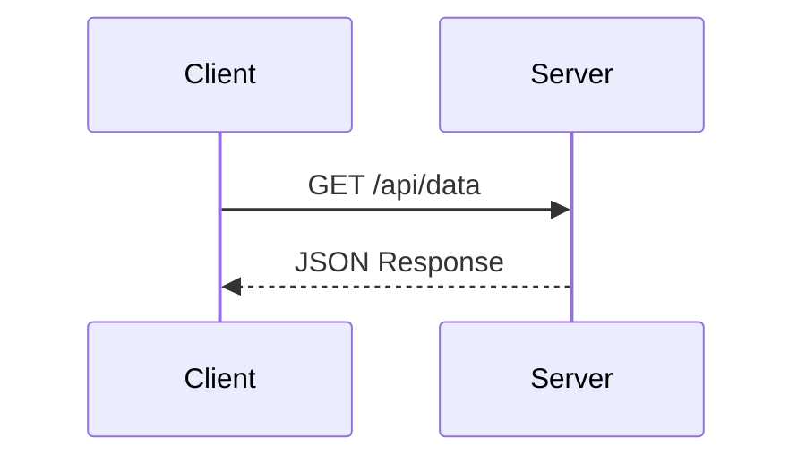

# Tutorial Writer — ✍️ 撰写执行

## 技能定位

本子技能负责教程创作的 **中期撰写执行阶段**（PRWRD+D 中的 WRITE），按已确认的规划产出高质量章节内容。

**核心理念切换**: 传统教程写作输出的是"静态文档"，网页优先写作输出的是**交互式学习体验的蓝本**。每写一段内容，都要思考它在网页上如何呈现、如何交互、如何引导读者探索。

**输入**: 已确认的章节执行计划 + 归档资料
**输出**: 完成的初稿章节 Markdown 文件（包含交互组件占位标记）

## 前置条件

- [ ] 已使用官方工具创建 Monorepo 项目（详见根路由器"🚀 项目初始化"章节）
- [ ] packages/content/src/chapters/ 目录存在
- [ ] 了解文件命名规范（详见 `/content` 技能）
- [ ] 了解 Frontmatter schema（详见 `/content` 技能）

> ⚠️ 本技能专注于"怎么写"，不关心"文件放在哪"。
> 文件组织和 schema 定义由 `/content` 子技能负责。

## 与 /content 子技能的分工

| 关注点 | 本技能 (/writing) | /content 技能 |
|--------|------------------|-------------|
| 怎么写？ | ✅ 负责 | ❌ 不关心 |
| 写什么风格？ | ✅ 负责 | ❌ 不关心 |
| 文件放哪？ | ❌ 不关心 | ✅ 负责 |
| Frontmatter 字段？ | ❌ 只需知道有哪些 | ✅ 定义完整 schema |
| 命名规范？ | ❌ 只需遵循即可 | ✅ 定义规则并验证 |

## 核心写作流程

```
① 按规划逐节撰写（先讲原理再给实践）
    │
    ├── ② 写作过程收集资料：
    │   ├── 截图 → 统一 PNG/WebP 格式，800-1200px 宽度
    │   ├── 代码运行结果 → 内嵌在代码块后
    │   ├── 对比数据 → 内嵌表格或独立归档
    │   └── 架构图/Mermaid 代码 → 验证语法后写入章节
    │
    ├── ③ 遵循写作规范
    │   ├── R1: 使用目标语言（中文为主，术语保留英文）
    │   ├── R2: 无注释性文字（删除"注意"、"切记"等元叙述）
    │   ├── R3: 关键数据标注来源
    │   ├── R4: 代码块标注语言
    │   └── R5: 内容对齐大纲
    │
    ├── ④ 实时感知累计行数
    │   ├── 60% → 正常继续
    │   ├── 80% → 开始收尾
    │   └── 120% → 触发过长预警
    │
    ├── ⑤ **网页优先增强**：检查每个核心概念能否用交互组件增强
    │   ├── 概念能否用交互式图解替代静态截图？
    │   ├── 代码能否做成可运行沙盒？
    │   ├── 数据能否用动画图表呈现？
    │   ├── 知识检验能否插入快速测验？
    │   └── 步骤流程能否用滚动触发动画逐步揭示？
    │
    ├── ⑥ 每小节完成后的自检
    │   ├── 逻辑连贯性
    │   ├── 数据准确性
    │   └── 见质量自检清单
    │
    └── ⑦ 整章完成后交付初稿
```

## 语言表达规范

### 中文技术写作最佳实践

| 规则 | 说明 | 示例 |
|------|------|------|
| 目标语言 | 正文使用中文，技术术语保留英文原文 | 使用 `Promise` 而非"承诺" |
| 无注释性文字 | 删除"注意"、"切记"、"请记住"等元叙述 | ❌ "请注意：async 会返回 Promise" → ✅ "`async` 函数返回 `Promise` 对象" |
| 数据来源 | 关键数据必须标注出处 | "V8 8.0 提升 23%（来源：V8 Blog 2020Q3）" |
| 主动语态 | 优先使用主动语态，避免被动 | ✅ "调用 API 获取数据" ← ❌ "数据被 API 获取" |

### 术语一致性

- 首次出现时给出中文解释 + 英文原文：**异步 JavaScript (Async JavaScript)**
- 后续统一使用英文术语：`async/await`、`Promise`、`Event Loop`
- 禁止中英混造词：❌ "回调地狱化" → ✅ "Callback Hell"

### 语气和风格指南

- **专业但不生硬**：像资深工程师给同事讲解，不像教科书
- **结论先行**：每段第一句说清楚要点，再展开细节
- **可操作**：每个知识点紧跟可运行的示例

## 代码示例书写规范

### 代码块语法

````markdown
```javascript
// 使用具体、有意义的变量名
const getUserById = async (userId) => {
  const response = await fetch(`/api/users/${userId}`);
  return response.json();
};
```
````

**要求**：
- 始终标注语言标识符（`javascript`、`typescript`、`bash` 等）
- 使用有意义的变量名，禁止 `foo`、`bar`、`tmp`
- 包含必要的注释说明意图（非逐行翻译）

### 注释规范

```javascript
// ✅ 好：说明"为什么"
const TIMEOUT = 30000; // 30s 超时，平衡用户体验与网络波动

// ❌ 差：重复"做什么"
const timeout = 30000; // 设置超时时间为 30000 毫秒
```

### 长代码处理

超过 20 行的代码：
1. 先展示核心逻辑（10-15 行）
2. 用 `<!-- 折叠 -->` 或引用标记完整版本位置
3. 关键行添加行内注释高亮

## 图表和插图使用指南

### 图片格式选择

| 场景 | 推荐格式 | 说明 |
|------|---------|------|
| 截图 | PNG/WebP | 保持清晰度，800-1200px 宽度 |
| 示意图 | SVG 优先 | 可缩放，文件小 |
| 照片类 | WebP | 最佳压缩比 |
| 图标 | 内联 SVG 或 Icon Font | 避免图片图标 |

### Mermaid 图表（写作时使用）

写作时直接嵌入 Mermaid 代码，渲染由构建管道处理：

````markdown

````

**常用图表类型**：
- `flowchart` — 流程图、架构图
- `sequenceDiagram` — 时序图、API 调用流程
- `classDiagram` — 类关系、数据模型
- `stateDiagram-v2` — 状态机、生命周期

### 表格格式

- 表头使用名词短语，首字母大写
- 数值列右对齐，文本列左对齐
- 避免空单元格，用 `—` 或 `N/A` 占位

## 引用和参考文献格式

### 内部链接

```markdown
// 章节间引用
详见 [第 3 章：异步基础](../ch03-async-basics.md)

// 锚点引用（如果支持）
见 [事件循环机制](../ch03-async-basics.md#event-loop)
```

### 外部引用

```markdown
// 正式引用（带标题）
根据 [MDN: Promise](https://developer.mozilla.org/docs/Web/JavaScript/Reference/Global_Objects/Promise) 定义...

// 行内链接
使用 `fetch()` API（[WHATWG Living Standard](https://fetch.spec.whatwg.org/)）
```

### 参考文献列表

章末统一列出（如有）：

```markdown
## 参考文献

1. V8 Team. "Improving V8 Performance". *V8 Blog*, 2020.
2. Mozilla Developer Network. "Promise". Retrieved 2024.
```

## 素材管理（写作视角）

### 图片使用

- 截图保持统一宽度（800-1200px）
- 使用描述性文件名（由 `/content` 技能定义具体命名规则）
- 优先使用相对路径引用

### 代码片段管理

- 短片段（< 15 行）直接内嵌
- 长片段考虑抽取为独立文件，用路径引用
- 所有代码必须可在本地运行通过

### 外部链接管理

- 优先引用官方文档和权威来源
- 避免链接到可能失效的个人博客
- 定期检查外部链接可用性（发布前）

## 写作工具推荐

### 编辑器插件

- **VS Code**: Markdown Preview Enhanced、Markdown All in One
- **Neovim**: markdown-preview.nvim

### Markdown 扩展

- 支持的语法：GFM（GitHub Flavored Markdown）、Mermaid、数学公式（`$...$`）
- 不依赖非标准扩展

### 校对工具

- 中文：写匠、秘塔写作猫
- 英文：Grammarly、Hemingway Editor
- 技术术语：维护项目级术语表

## 参考文件

- [写作规范](references/writing-standards.md) — R1-R5 强制规则 + S1-S5 推荐惯例
- [写作中自检清单](references/quality-self-check.md) — 每小节完成后的即时检查
- [本阶段决策细则](references/decision-record-rules.md) — writing 阶段涉及的决策项

## 版本历史

| 版本 | 日期 | 变更 |
|------|------|------|
| **v1.0.0** | 2026-05-31 | **🔄 Monorepo 架构精简**: 移除内容管理部分（文件组织、命名规范、Frontmatter schema、Content Collections 配置、同步命令）→ 全部迁移至 /content 子技能；保留纯写作流程、文风规范、代码示例规范、图表指南；新增前置条件检查；新增与 /content 的分工说明表 |
| v3.2.0 | (旧版) | 原始版本，包含完整的内容管理和写作流程 |
